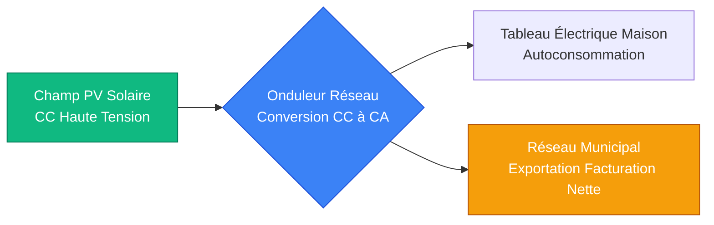
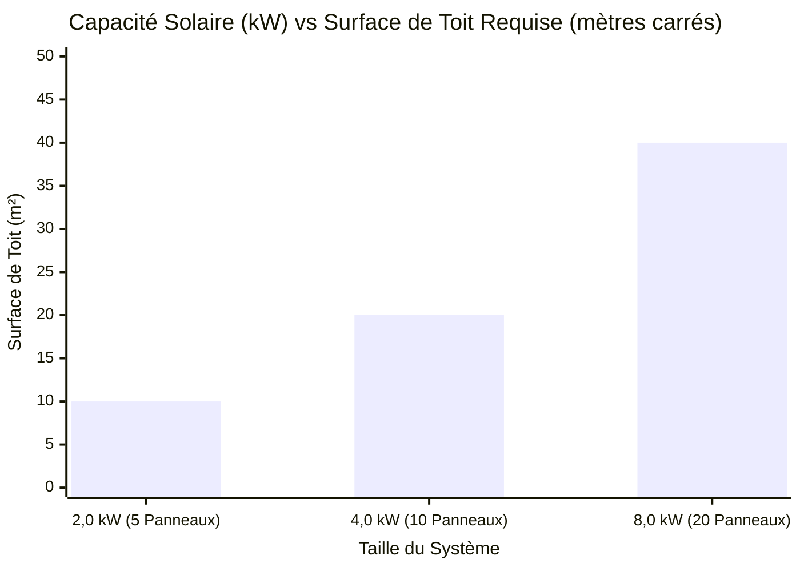
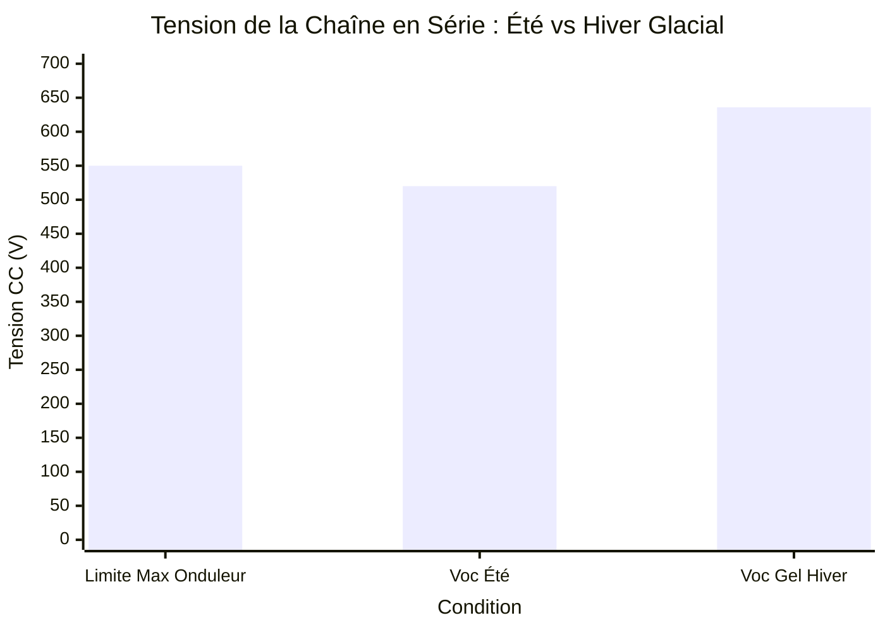
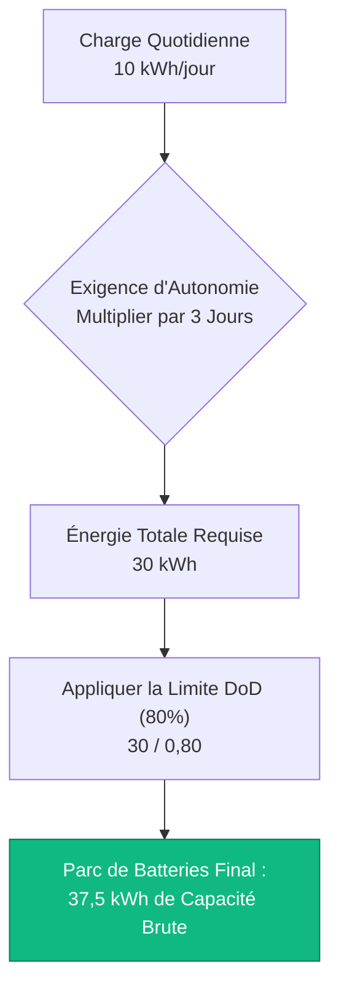
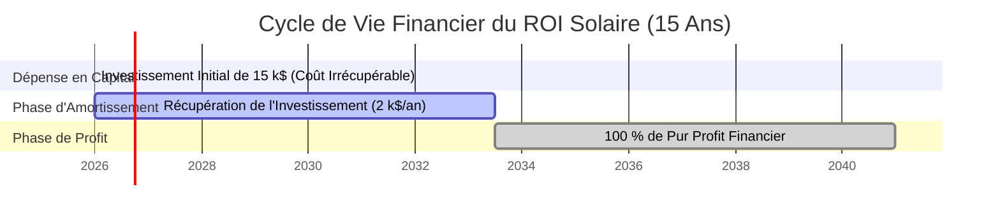

# Le Calculateur de Panneaux Solaires Définitif : Dimensionnement, Câblage MPPT et Rentabilité Financière

Bienvenue dans l'ultime **Calculateur de Panneaux Solaires** et le guide d'ingénierie photovoltaïque (PV) complet. Que vous soyez un propriétaire essayant d'éliminer une facture d'électricité mensuelle massive, un constructeur de chalets hors réseau concevant un îlot d'alimentation indépendant, ou un gestionnaire d'installations commerciales calculant le retour sur investissement financier sur 25 ans d'un champ solaire sur toit de 50 000 $, la maîtrise de la physique solaire est absolument essentielle.

Un système d'énergie solaire est une matrice incroyablement complexe de variables interdépendantes. Si vous calculez mal votre charge quotidienne en kWh, vous achèterez trop peu de panneaux et continuerez à payer la compagnie d'électricité. Si vous comprenez mal la physique de la tension en circuit ouvert (Voc) par temps de gel, vous connecterez trop de panneaux en série et incinérerez définitivement votre coûteux onduleur MPPT. Si vous ignorez le concept d'Heures d'Ensoleillement Maximal, vous surestimerez considérablement votre production d'énergie.

Dans cette masterclass SEO exhaustive de plus de 4 000 mots, nous allons déconstruire les mathématiques fondamentales de la production d'énergie solaire, exposer les dangers cachés des pics de tension dépendant de la température, prouver mathématiquement comment un système de facturation nette raccordé au réseau accélère l'amortissement financier, et décoder les formules exactes nécessaires pour dimensionner un parc de batteries pour une autonomie hors réseau complète. Pour garantir une compréhension absolue, nous avons inclus cinq diagrammes interactifs Mermaid.js méticuleusement détaillés et compatibles avec les analyseurs.

---

## 1. La Physique du Dimensionnement Solaire (Heures d'Ensoleillement Maximal & Rendement)

Le concept absolu le plus critique en ingénierie solaire est de comprendre qu'un panneau solaire de 400W ne produit PAS 400W de puissance tout au long de la journée. 

La production solaire est régie par les **Heures d'Ensoleillement Maximal (PSH - Peak Sun Hours)**. 
- Les PSH ne signifient pas "combien de temps le soleil est dans le ciel." (Heures de lumière du jour).
- Les PSH sont une métrique d'ingénierie qui quantifie l'énergie solaire totale reçue en une journée, exprimée en heures d'irradiance solaire complète de $1000\text{ W/m}^2$.
- En Arizona, vous pourriez obtenir 6,5 Heures d'Ensoleillement Maximal. À Londres, vous pourriez obtenir 2,5 Heures d'Ensoleillement Maximal en hiver.

**L'Équation de Production :**
$$\text{Énergie Quotidienne (kWh)} = \text{Taille du Champ (kWc)} \times \text{Heures d'Ensoleillement Maximal} \times \text{Rendement du Système}$$

**Rendement du Système (Facteur de Déclassement) :**
Les panneaux solaires ne fonctionnent jamais à $100 \%$ de rendement dans le monde réel. Un système standard raccordé au réseau fonctionne à environ $80 \%$ à $85 \%$ de rendement en raison de :
- **Déclassement Thermique ($10 \%$ de perte) :** Les panneaux solaires perdent de la puissance lorsqu'ils chauffent au soleil.
- **Conversion de l'Onduleur ($4 \%$ de perte) :** La conversion de CC à CA gaspille de l'énergie sous forme de chaleur.
- **Chute de Tension du Câblage ($2 \%$ de perte) :** Les câbles en cuivre résistent naturellement au flux de courant.
- **Poussière et Salissure ($4 \%$ de perte) :** Le pollen et la saleté bloquent la lumière du soleil.

**Exemple de Calcul :**
Si vous installez un champ solaire de $5\text{ kWc}$ dans un endroit avec $5,0$ Heures d'Ensoleillement Maximal, en supposant un rendement de $80 \%$ :
$5\text{ kW} \times 5,0\text{ Heures} \times 0,80 = \mathbf{20\text{ kWh/jour}}$ d'énergie électrique CA utilisable.

---

## 2. Démystifier le Câblage en Série MPPT (Voc vs Vmp)

L'erreur la plus courante commise par les installateurs solaires amateurs (DIY) est de faire exploser leur contrôleur de charge solaire en dépassant la tension d'entrée maximale.

Les panneaux solaires ont deux valeurs de tension critiques :
1. **Vmp (Tension à la puissance maximale) :** La tension de fonctionnement lorsque le panneau produit sa pleine puissance sous charge (par ex., $40\text{V}$).
2. **Voc (Tension en circuit ouvert) :** La tension maximale possible que le panneau génère lorsqu'aucune charge n'est connectée (par ex., $50\text{V}$).

Lorsque vous câblez des panneaux solaires en **Série** (connexion du câble positif d'un panneau au câble négatif du suivant), la **Tension s'additionne**, tandis que le courant (Ampères) reste le même.
- $10$ panneaux en série avec une Voc de $50\text{V}$ = $\mathbf{500\text{V} \text{ CC}}$ tension totale de la chaîne.

**Le Danger du Temps de Gel :**
La tension des panneaux solaires se comporte de manière contre-intuitive : à mesure que la température physique de la cellule en silicium baisse, la tension AUGMENTE. Si votre onduleur a une limite d'entrée MPPT maximale de $500\text{V}$, et que vous concevez une chaîne qui produit exactement $490\text{V}$ en été, vous détruirez votre onduleur le premier matin de gel de l'hiver lorsque le silicium froid fera grimper la Voc à $530\text{V}$. 

Les ingénieurs exigent strictement d'utiliser le **Coefficient de Température de la Voc** (par ex., $-0,3 \%/^\circ\text{C}$) pour calculer la tension absolue maximale dans le pire des cas à la température historique la plus basse enregistrée pour le site d'installation.

---

## 3. ROI Financier, Facturation Nette et Délai d'Amortissement

Pour les propriétaires raccordés au réseau, l'installation d'un champ solaire est un investissement financier évalué par son **Délai d'Amortissement** et son **Retour sur Investissement (ROI)**.

**Facturation Nette (NEM) :**
La facturation nette est un accord de facturation des services publics où votre compteur électrique tourne physiquement à l'envers lorsque vos panneaux solaires génèrent plus d'énergie que votre maison n'en consomme. 
- Pendant la journée, vous générez de l'énergie solaire excédentaire et l'exportez vers le réseau, gagnant un crédit.
- La nuit, lorsque le soleil est couché, vous consommez de l'énergie du réseau, en utilisant vos crédits.
- Si votre système est dimensionné pour une compensation (Offset) de $100 \%$, votre facture d'électricité annuelle chute théoriquement à $0$.

**La Formule de l'Amortissement Simple :**
$$\text{Délai d'Amortissement (Années)} = \frac{\text{Coût Net du Système Installé}}{\text{Économies Annuelles d'Électricité}}$$

Si un système de $6\text{ kW}$ coûte $15 000 \$$ (après les remises fiscales) et élimine une facture d'électricité annuelle de $2 000 \$$, le système s'amortit en exactement $7,5\text{ ans}$. Étant donné que les panneaux solaires de niveau 1 de haute qualité sont garantis 25 ans, les $17,5\text{ ans}$ restants représentent un pur profit financier non imposé.

---

## 4. Concevoir l'Autonomie de la Batterie Hors Réseau

Si vous construisez un chalet hors réseau, vous n'avez pas le luxe d'utiliser le réseau municipal comme une gigantesque batterie infinie. Vous devez stocker physiquement suffisamment d'énergie dans des batteries à décharge profonde pour survivre aux jours nuageux et aux nuits sombres.

**La Formule de l'Autonomie :**
$$\text{Parc de Batteries (kWh)} = \frac{\text{Charge Quotidienne (kWh)} \times \text{Jours d'Autonomie}}{\text{Profondeur de Décharge (DoD)} \times \text{Rendement de l'Onduleur}}$$

- **Jours d'Autonomie :** Le nombre de jours continus pendant lesquels le parc de batteries peut faire fonctionner la maison avec absolument aucune entrée solaire (généralement $2$ à $3$ jours).
- **Profondeur de Décharge (DoD) :** Vous ne pouvez jamais vider une batterie à $0 \%$. Les batteries au Plomb-Acide ne doivent être vidées qu'à $50 \%$ de DoD. Les batteries au Lithium Fer Phosphate (LiFePO4) peuvent être vidées en toute sécurité à $80 \%$ de DoD.

Si votre chalet consomme $10\text{ kWh/jour}$, et que vous voulez $2\text{ jours}$ d'autonomie en utilisant un parc de batteries au Lithium ($80 \%$ de DoD) et un onduleur efficace à $90 \%$ :
$\text{Capacité de Batterie Requise} = (10 \times 2) / (0,80 \times 0,90) = \mathbf{27,7\text{ kWh}}$.
Vous aurez besoin d'un parc de batteries massif de $48\text{V} \ 600\text{Ah}$ pour survivre à l'hiver.

---

## 5. Cinq Scénarios d'Ingénierie Conceptuels avec Visualisations 2D

Pour maîtriser pleinement les relations physiques régissant les systèmes PV solaires, nous explorerons cinq scénarios d'ingénierie distincts visuellement décomposés à l'aide de diagrammes Mermaid.js personnalisés.

### Exemple 1 : Le Pipeline d'Énergie Raccordé au Réseau

**Le Scénario :**
Un propriétaire doit comprendre le flux physique de l'énergie depuis le soleil, à travers l'onduleur, et vers le réseau public municipal.

**Visualisation 2D :**
Cet organigramme logique cartographie le processus de conversion d'énergie de haut niveau, démontrant comment l'onduleur hybride agit comme le policier de la circulation intelligent dirigeant l'énergie vers la maison en premier, et le réseau en second.

---

### Exemple 2 : Taille du Champ vs Surface du Toit

**Le Scénario :**
Un architecte alloue de l'espace sur le toit pour une installation solaire et a besoin de savoir exactement combien de surface physique est consommée à mesure que la capacité en kilowatts du champ augmente.

**Les Mathématiques :**
Un panneau solaire moderne de $400\text{W}$ mesure environ $2,0$ mètres carrés. Pour générer $4\text{ kW}$, vous avez besoin de $10$ panneaux, nécessitant $20$ mètres carrés de toit non ombragé, orienté au sud.

**Visualisation 2D :**
Ce graphique trace la corrélation linéaire directe entre la capacité électrique souhaitée et l'espace immobilier physique requis.

---

### Exemple 3 : Le Danger de Surcharge de Tension MPPT

**Le Scénario :**
Un installateur amateur câble douze panneaux solaires de $50\text{V}$ (Voc) en série. L'onduleur a une limite stricte de tension d'entrée maximale de $550\text{V}$. Pendant l'été, le champ fonctionne très bien. Lors d'un gel hivernal à $-10^\circ\text{C}$, la tension grimpe en flèche et incinère l'onduleur.

**Les Mathématiques :**
Tension estivale : $12 \times 46\text{V} = 552\text{V}$ (Déjà dangereusement proche).
Tension hivernale avec coefficient de température de $-0,3 \%$ : $12 \times 53\text{V} = 636\text{V}$ (Défaillance catastrophique).

**Visualisation 2D :**
Ce graphique prouve visuellement la nécessité de concevoir les chaînes solaires pour la température historique la plus froide possible.

---

### Exemple 4 : Architecture de Dimensionnement de Batterie Hors Réseau

**Le Scénario :**
Un ingénieur solaire calcule la capacité du parc de batteries requise pour maintenir en fonctionnement une clinique médicale hors réseau pendant 3 jours d'autonomie lors d'une mousson.

**Visualisation 2D :**
Cet organigramme de haut en bas cartographie les mathématiques strictes requises pour évaluer la charge quotidienne, multiplier par les jours d'autonomie, et diviser par la limite de Profondeur de Décharge pour donner la taille finale de la batterie.

---

### Exemple 5 : Le ROI Financier et le Calendrier d'Amortissement

**Le Scénario :**
Un propriétaire paie $15 000 \$ $ comptant pour un système solaire qui permet d'économiser $2 000 \$ $ par an en électricité. Il souhaite visualiser le moment exact où le système devient un pur profit sur un horizon de 15 ans.

**Visualisation 2D :**
Ce diagramme de Gantt visualise le cycle de vie financier d'un champ solaire, traçant le seuil de rentabilité de 7,5 ans et les décennies ultérieures d'économies d'électricité non imposées.

---

## 7. Conclusion et Défi d'Ingénierie

La maîtrise du dimensionnement des panneaux solaires est le fondement de toute l'ingénierie des énergies renouvelables. Comprendre la différence entre les Heures de Lumière du Jour et les Heures d'Ensoleillement Maximal, respecter la réalité brutale des pics de tension par temps froid, et modéliser mathématiquement le ROI financier garantira que votre système solaire fonctionnera exactement comme prévu pour les 25 prochaines années.

Si vous ignorez ces principes mathématiques, votre champ sous-produira considérablement en hiver, vos chaînes en série dépasseront les limites de tension de l'onduleur et annuleront votre garantie, et votre chalet hors réseau sera à court d'énergie de batterie à 20h00 chaque nuit.

Pour vous assurer d'avoir maîtrisé ces concepts critiques, démarrez notre Simulateur interactif et tentez de résoudre ces défis finaux :
1. **La Contrainte de Surface :** Vous disposez exactement de $30\text{ m}^2$ d'espace de toit non ombragé. En supposant que vous utilisiez des panneaux de $400\text{W}$ mesurant $2,0\text{ m}^2$ chacun, quelle est la capacité maximale absolue en kWc que vous pouvez physiquement installer ?
2. **Le Piège de la Tension :** Vous câblez des panneaux de $40\text{V}$ (Voc) en série dans un contrôleur de charge avec une limite maximale absolue de $250\text{V}$. En supposant un multiplicateur par temps froid de $1,15\times$, quel est le nombre maximum absolu de panneaux que vous pouvez câbler en toute sécurité dans une seule chaîne ?
3. **Le Calcul de l'Amortissement :** Votre système coûte $24 000 \$ $. Il produit $10 000\text{ kWh/an}$. Votre service public facture $0,30 \$ \text{ par kWh}$. Dans combien d'années exactement le système s'amortisera-t-il de lui-même ?

Fiez-vous à ce calculateur pour vérifier les devis de votre installateur, justifier mathématiquement les mises à niveau de stockage sur batterie, et éliminer définitivement votre facture d'électricité.
