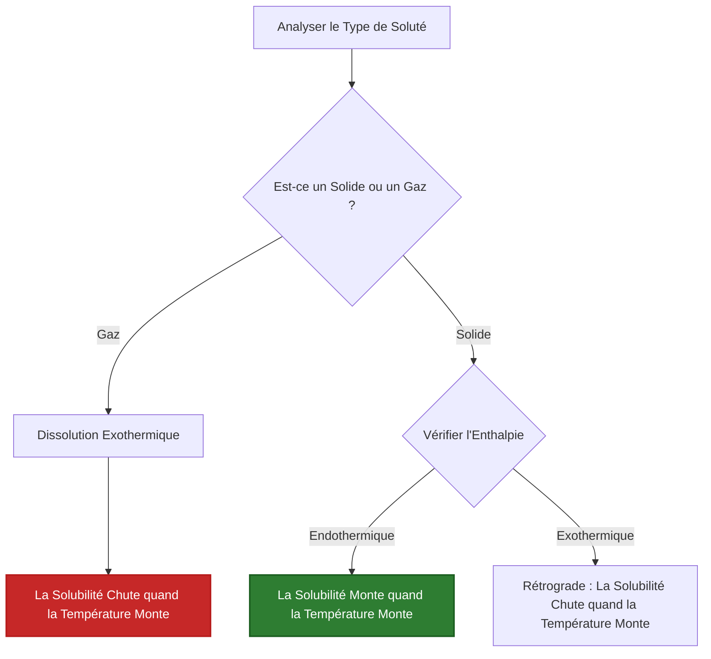

# Guide de Chimie Analytique et de Laboratoire sur l'Équilibre de Solubilité

En chimie analytique, environnementale, physique et pharmaceutique, la **solubilité** quantifie la concentration d'équilibre maximale d'un soluté dissous dans un solvant à une température et une pression données :

$$\text{Solubilité Massique } S_{\text{massique}} \, (\text{g/L}) = S_{\text{molaire}} \, (\text{mol/L}) \times M \, (\text{g/mol})$$

$$S_{\text{g/100 mL}} = \frac{S_{\text{g/L}}}{10}$$

$$\text{Masse Maximale Dissoute } m_{\text{max}} = S_{\text{massique}} \, (\text{g/L}) \times V \, (\text{L})$$

$$\text{Rapport de Saturation } R_{\text{sat}} = \frac{C_{\text{actuelle}}}{S_{\text{max}}} \quad \begin{cases} R_{\text{sat}} < 1 & \implies \text{Insaturé (Se dissout complètement)} \\ R_{\text{sat}} = 1 & \implies \text{Saturé (Équilibre)} \\ R_{\text{sat}} > 1 & \implies \text{Sursaturé (Précipitation favorisée)} \end{cases}$$

---

## 1. Matrice de Référence de Solubilité des Composés Chimiques Classiques

| Composé | Formule | Masse Molaire | Solubilité Massique à $20^\circ\text{C}$ | Solubilité Molaire à $20^\circ\text{C}$ | Type |
| :--- | :--- | :--- | :--- | :--- | :--- |
| **Nitrate de Potassium** | $\text{KNO}_3$ | **101.10 g/mol** | **$316 \text{ g/L}$ ($31.6 \text{ g/100 mL}$)** | **$3.125 \text{ mol/L}$** | Solide Endothermique |
| **Chlorure de Sodium** | $\text{NaCl}$ | **58.44 g/mol** | **$360 \text{ g/L}$ ($36.0 \text{ g/100 mL}$)** | **$6.160 \text{ mol/L}$** | Solide Plat |
| **Chlorure d'Argent** | $\text{AgCl}$ | **143.32 g/mol** | **$0.00191 \text{ g/L}$** | **$1.33 \cdot 10^{-5} \text{ mol/L}$** | Peu Soluble ($K_{sp}$) |
| **Fluorure de Calcium** | $\text{CaF}_2$ | **78.07 g/mol** | **$0.0160 \text{ g/L}$** | **$2.05 \cdot 10^{-4} \text{ mol/L}$** | Peu Soluble ($K_{sp}$) |
| **Sulfate de Cérium(III)**| $\text{Ce}_2(\text{SO}_4)_3$| **568.42 g/mol** | **$101 \text{ g/L}$** | **$0.178 \text{ mol/L}$** | Solide Rétrograde |
| **Oxygène Gazeux** | $\text{O}_2$ | **32.00 g/mol** | **$0.0091 \text{ g/L}$ ($9.1 \text{ mg/L}$)** | **$2.84 \cdot 10^{-4} \text{ mol/L}$** | Gaz (Loi de Henry) |

---

## 2. Protocoles Standard de Calcul de Solubilité

```
1. Convertir g/L en mol/L : S_molaire = S_massique / MasseMolaire
2. Convertir mol/L en g/L : S_massique = S_molaire * MasseMolaire
3. Convertir g/100 mL en g/L : g/L = (g/100 mL) * 10
4. Masse Max Dissoute : m_max = S_massique * VolumeSolvant (L)
5. Rapport de Saturation : R = ConcActuelle / SolubilitéMax (R > 1 -> Sursaturé)
```

---

## 3. Avertissement de Sécurité Éducative et de Laboratoire
*Ce calculateur de solubilité fournit des calculs théoriques d'équilibre pour des applications éducatives, de recherche en laboratoire et de chimie AP. La solubilité expérimentale dépend de la température, de la pression pour les gaz, du pH, de la force ionique et de la composition du solvant.*

## 4. Le Guide Complet sur la Solubilité Chimique

Bienvenue dans le manuel définitif sur la **Solubilité Chimique**. Que vous tentiez de dissoudre une quantité massive de Nitrate de Potassium ($\text{KNO}_3$) pour une démonstration de pyrotechnie, de calculer la limite toxique des écoulements de métaux lourds dans les eaux souterraines, ou d'essayer de maintenir l'oxygène dissous dans un aquarium chauffé, la solubilité régit les limites absolues de la chimie physique.

Dans ce guide exhaustif de plus de 4000 mots, nous détaillerons la thermodynamique expliquant pourquoi les choses se dissolvent. Nous expliquerons la distinction mathématique vitale entre la Solubilité Massique (combien de grammes tiennent dans un bécher) et la Solubilité Molaire (la molarité exacte d'une solution saturée). De plus, nous parcourrons cinq dérivations chimiques rigoureuses du monde réel, complètes avec une algèbre étape par étape et des diagrammes visuels Mermaid hautement conformes.

### 4.1 Qu'est-ce que la Solubilité Réellement ?

La **Solubilité** est la quantité théorique maximale d'un soluté spécifique qui peut se dissoudre dans un solvant donné à une température spécifique.

Lorsque vous versez du sel de table ($\text{NaCl}$) dans l'eau, les molécules d'eau polaires attaquent immédiatement le réseau cristallin, arrachant les ions $\text{Na}^+$ et $\text{Cl}^-$. À mesure que de plus en plus d'ions entrent dans l'eau, ils commencent inévitablement à se heurter et à se recristalliser.

La solubilité est atteinte lorsque le système parvient à un **Équilibre Dynamique**. Le taux exact de dissolution correspond parfaitement au taux de recristallisation. À ce stade, la solution est considérée comme **Saturée**. Si vous ajoutez plus de sel, il tombera simplement au fond du bécher ; l'eau ne peut physiquement plus contenir d'ions dissous.

### 4.2 Solubilité Massique vs. Solubilité Molaire

Parce que la chimie relie le monde physique macroscopique (choses que nous pouvons peser) et le monde atomique microscopique (moles de molécules), nous utilisons deux unités distinctes pour la solubilité :

*   **Solubilité Massique ($S_{\text{massique}}$) :** Exprimée en grammes par litre ($\text{g/L}$) ou en grammes par 100 millilitres ($\text{g/100 mL}$). C'est ce que vous utilisez lors de la pesée physique de poudre sur une balance de laboratoire.
*   **Solubilité Molaire ($S_{\text{molaire}}$) :** Exprimée en moles par litre ($\text{mol/L}$ ou Molarité, M). C'est ce que vous utilisez lors des calculs de stœchiométrie de réaction ou des constantes d'équilibre thermodynamique comme le $K_{sp}$.

Vous devez être capable de convertir instantanément l'une en l'autre en utilisant la Masse Molaire du composé ($M$ en $\text{g/mol}$) :

$$ S_{\text{molaire}} = \frac{S_{\text{massique}}}{M} \quad \text{et} \quad S_{\text{massique}} = S_{\text{molaire}} \times M $$

### 4.3 Les Trois États de Saturation

En comparant la concentration *actuelle* d'une solution à sa *solubilité maximale théorique*, nous pouvons définir trois états physiques distincts :

1.  **Insaturé ($R_{\text{sat}} < 1$) :** La concentration actuelle est inférieure à la solubilité maximale. Si vous ajoutez plus de solide, il se dissoudra rapidement.
2.  **Saturé ($R_{\text{sat}} = 1$) :** La solution contient exactement la quantité maximale permise par la thermodynamique. Tout solide supplémentaire ajouté restera non dissous.
3.  **Sursaturé ($R_{\text{sat}} > 1$) :** Un état hautement instable et temporaire où la solution contient *plus* de soluté que ce qui devrait être physiquement possible. Ceci est obtenu en dissolvant une quantité massive de soluté à des températures d'ébullition, puis en refroidissant le liquide extrêmement lentement sans l'agiter. Taper sur le verre ou y laisser tomber un seul "cristal germe" fera recristalliser instantanément et violemment le soluté en excès hors de la solution.

### 4.4 La Thermodynamique de la Température et de la Solubilité

Comment la modification de la température de l'eau affecte-t-elle la solubilité ? Cela dépend entièrement de l'enthalpie ($\Delta H$) du processus de dissolution.

*   **Solides Endothermiques (La plupart des Sels) :** Briser le réseau cristallin nécessite plus d'énergie qu'il n'en est libéré lorsque l'eau hydrate les ions. Leur dissolution absorbe de la chaleur. Selon le Principe de Le Chatelier, augmenter la température pompe de la chaleur dans le système, poussant l'équilibre fortement vers l'avant. Ainsi, **la solubilité augmente lorsque la température augmente** (ex., $\text{KNO}_3$ ou Sucre).
*   **Gaz Exothermiques :** Les molécules de gaz sont déjà libres. Dissoudre un gaz dans l'eau nécessite de le piéger dans une cage liquide, ce qui libère de la chaleur ($\Delta H < 0$). Augmenter la température pousse l'équilibre en sens inverse, faisant bouillir le gaz hors de l'eau. Ainsi, **la solubilité des gaz diminue lorsque la température augmente** (c'est pourquoi le soda chaud devient vite plat).

---

## 5. Guide d'Utilisation : Maîtriser le Calculateur de Solubilité

Notre calculateur agit comme un moteur universel de conversion et de prédiction.

### 5.1 Mode : Conversions Massiques/Molaires

1.  **Sélectionnez le Mode :** Choisissez "Convertir la Solubilité Massique en Molaire".
2.  **Paramètres d'Entrée :** Entrez la solubilité massique en $\text{g/L}$ et la masse molaire du composé.
3.  **Lire la Sortie :** L'outil produit instantanément la Solubilité Molaire ($\text{mol/L}$), la rendant prête pour les calculs stœchiométriques.

### 5.2 Mode : Masse Maximale Dissoute

1.  **Sélectionnez le Mode :** Choisissez "Masse Maximale Dissoute".
2.  **Paramètres d'Entrée :** Entrez la solubilité connue ($\text{g/L}$) et le volume physique de votre récipient de solvant (ex., $2.5\text{ Litres}$).
3.  **Exécuter :** L'outil calcule $m = S \times V$, vous indiquant explicitement exactement combien de grammes de poudre vous pouvez verser avant qu'elle n'arrête de se dissoudre.

### 5.3 Mode : Analyseur de Saturation

1.  **Sélectionnez le Mode :** Choisissez "Analyseur de Rapport de Saturation".
2.  **Paramètres d'Entrée :** Entrez la solubilité absolue maximale du composé, et la concentration actuelle de votre solution de laboratoire.
3.  **Exécuter :** L'outil calcule le rapport de saturation $R$ et déclare explicitement l'état thermodynamique (Insaturé, Saturé ou Sursaturé).

---

## 6. Cinq Exemples Réels de Chimie Analytique

Ancrons cette théorie en résolvant cinq scénarios de solubilité pratiques et rigoureux.

### Exemple 1 : Convertir la Solubilité Massique en Solubilité Molaire ($\text{KNO}_3$)

**Scénario :** 
Le Nitrate de Potassium ($\text{KNO}_3$, masse molaire $101.10\text{ g/mol}$) est incroyablement soluble dans l'eau. À $20^\circ\text{C}$, sa solubilité massique est de $316\text{ g/L}$, ce qui est étonnant. Quelle est la molarité exacte d'une solution saturée de $\text{KNO}_3$ ?

**Dérivation Mathématique :**

1.  **Identifier les Données Connues :**
    $S_{\text{massique}} = 316\text{ g/L}$
    $M = 101.10\text{ g/mol}$
2.  **Appliquer la Formule de Conversion :**
    $$ S_{\text{molaire}} = \frac{S_{\text{massique}}}{M} $$
3.  **Calculer :**
    $$ S_{\text{molaire}} = \frac{316\text{ g/L}}{101.10\text{ g/mol}} $$
    $$ S_{\text{molaire}} = 3.125\text{ mol/L} $$

**Conclusion :** Une solution saturée de Nitrate de Potassium à température ambiante a une molarité de $3.125\text{ M}$.

### Exemple 2 : Déterminer la Masse Maximale Dissoute ($\text{NaCl}$)

**Scénario :**
Vous préparez une solution de saumure dans un grand seau de $5.00\text{ Litres}$. La solubilité du Chlorure de Sodium ($\text{NaCl}$) est de $360\text{ g/L}$ à température ambiante. Quelle est la masse maximale absolue de sel que vous pouvez dissoudre dans le seau avant qu'il ne s'accumule au fond ?

**Dérivation Mathématique :**

1.  **Identifier les Données Connues :**
    $S_{\text{massique}} = 360\text{ g/L}$
    $V = 5.00\text{ L}$
2.  **Mettre en Place l'Équation de Masse :**
    $$ m_{\text{max}} = S_{\text{massique}} \times V $$
3.  **Calculer :**
    $$ m_{\text{max}} = 360\text{ g/L} \times 5.00\text{ L} $$
    $$ m_{\text{max}} = 1800\text{ g} $$
    $$ m_{\text{max}} = 1.80\text{ kg} $$

**Conclusion :** Vous pouvez dissoudre exactement $1.80\text{ kg}$ de sel dans le seau de $5\text{ Litres}$. Toute quantité supérieure à cela restera sous forme de solide non dissous.

### Exemple 3 : Analyser la Sursaturation ($R_{\text{sat}}$)

**Scénario :**
L'Acétate de Sodium ($\text{NaCH}_3\text{COO}$) est utilisé dans les chauffe-mains réutilisables. Sa solubilité à l'équilibre à $20^\circ\text{C}$ est de $464\text{ g/L}$. En faisant bouillir de l'eau, vous parvenez à en dissoudre $800\text{ g}$ dans $1\text{ Litre}$ d'eau, puis vous la refroidissez soigneusement jusqu'à $20^\circ\text{C}$ sans qu'elle ne cristallise. Calculez le Rapport de Saturation.

**Dérivation Mathématique :**

1.  **Identifier les Données Connues :**
    $C_{\text{actuelle}} = 800\text{ g/L}$
    $S_{\text{max}} = 464\text{ g/L}$
2.  **Appliquer la Formule du Rapport de Saturation :**
    $$ R_{\text{sat}} = \frac{C_{\text{actuelle}}}{S_{\text{max}}} $$
3.  **Calculer :**
    $$ R_{\text{sat}} = \frac{800}{464} = 1.72 $$
4.  **Évaluer :**
    Puisque $R_{\text{sat}} > 1$, la solution est massivement **Sursaturée**.

**Conclusion :** La solution contient 1,72 fois la quantité maximale autorisée de soluté. Au moment où vous claquez le disque de métal à l'intérieur du chauffe-mains, $336\text{ g}$ de solide cristalliseront instantanément, libérant une énorme vague de chaleur exothermique.

**Visualisation : La Thermodynamique de la Sursaturation**

```mermaid
gantt
    title La Chronologie de Sursaturation et de Cristallisation
    dateFormat  HH:mm:ss
    axisFormat  %H:%M
    section Phase de Chauffage
    Dissoudre le Soluté en Excès à 100C :00:00:00, 00:20:00
    section Phase de Refroidissement
    Refroidissement Prudent à 20C :00:20:00, 00:40:00
    État Métastable Sursaturé :crit, 00:40:00, 01:00:00
    section Événement Déclencheur
    Cristal Germe Introduit :01:00:00, 01:01:00
    Cristallisation Exothermique Violente :active, 01:01:00, 01:05:00
```


*Cette chronologie illustre la nature précaire de la sursaturation. Une solution peut rester piégée dans un état métastable pendant des heures jusqu'à ce qu'un déclencheur physique ne force une cristallisation rapide et violente.*

### Exemple 4 : Solubilité des Gaz et Loi de Henry

**Scénario :**
La vie aquatique dépend de l'Oxygène dissous ($\text{O}_2$). À $20^\circ\text{C}$, la solubilité de l'$\text{O}_2$ dans l'eau douce est d'environ $9.1\text{ mg/L}$. Convertissez cette mesure environnementale critique en Solubilité Molaire. (Masse molaire de l'$\text{O}_2$ = $32.00\text{ g/mol}$).

**Dérivation Mathématique :**

1.  **Convertir mg en grammes :**
    $9.1\text{ mg/L} = 0.0091\text{ g/L}$
2.  **Appliquer la Formule de Conversion Molaire :**
    $$ S_{\text{molaire}} = \frac{0.0091\text{ g/L}}{32.00\text{ g/mol}} $$
3.  **Calculer :**
    $$ S_{\text{molaire}} = 0.000284\text{ mol/L} $$
    $$ S_{\text{molaire}} = 2.84 \times 10^{-4}\text{ M} $$

**Conclusion :** La molarité de l'oxygène dissous dans une rivière saine est incroyablement petite, seulement $2.84 \times 10^{-4}\text{ M}$. Si la rivière se réchauffe en raison de la pollution thermique, cet équilibre de solubilité exothermique se déplace vers l'arrière, chassant l'$\text{O}_2$ hors de l'eau et étouffant les poissons.

### Exemple 5 : Solubilité Rétrograde (L'Exception)

**Scénario :**
Le Sulfate de Cérium(III) ($\text{Ce}_2(\text{SO}_4)_3$) est l'un des rares solides qui présente une *solubilité rétrograde*. Sa dissolution est fortement exothermique. À $0^\circ\text{C}$, sa solubilité est de $101\text{ g/L}$. Si vous chauffez l'eau à $100^\circ\text{C}$, la solubilité chute à $25\text{ g/L}$. Si vous avez une solution saturée de 1 litre à $0^\circ\text{C}$ et que vous la faites bouillir, que se passe-t-il ?

**Dérivation Mathématique :**

1.  **Déterminer la Masse Initiale :**
    À $0^\circ\text{C}$, le bécher contient exactement $101\text{ g}$ de Sulfate de Cérium dissous.
2.  **Déterminer la Capacité Finale :**
    À $100^\circ\text{C}$, l'eau ne peut physiquement contenir que $25\text{ g}$ de soluté dissous.
3.  **Calculer la Précipitation :**
    $$ \text{Masse Précipitée} = \text{Masse Initiale} - \text{Capacité Finale} $$
    $$ \text{Masse Précipitée} = 101\text{ g} - 25\text{ g} = 76\text{ g} $$

**Conclusion :** Contrairement au sucre ou au sel qui se dissolvent mieux dans l'eau chaude, faire bouillir une solution de Sulfate de Cérium provoque l'apparition soudaine de $76\text{ g}$ de roches solides tombant du liquide clair.

**Visualisation : Prédire les Tendances de Température**


*Cet organigramme vous permet de prédire instantanément comment la température affectera la limite de solubilité de toute substance chimique.*

---

## 7. FAQ Approfondie et Dépannage Avancé

**Q : Peut-on dissoudre deux sels différents dans le même bécher ?**
**R :** Oui, mais ils peuvent interagir. Si vous dissolvez du $\text{NaCl}$ et du $\text{KNO}_3$, ils agissent de manière presque indépendante jusqu'à un certain point. Cependant, s'ils partagent un ion commun (ex., dissolution de $\text{NaCl}$ et $\text{KCl}$), la concentration totale en chlorure grimpe en flèche, réduisant considérablement la solubilité des deux sels par rapport à l'eau pure en raison de l'Effet d'Ion Commun.

**Q : Pourquoi le fait de remuer fait-il dissoudre le sucre plus rapidement, mais n'augmente pas sa solubilité maximale ?**
**R :** Le brassage est un processus *cinétique*. Il éloigne rapidement les ions nouvellement dissous de la surface du cristal, exposant le solide frais à de l'eau propre, ce qui accélère la vitesse de dissolution. Cependant, il ne modifie pas le point d'équilibre *thermodynamique*. Vous atteignez la même limite maximale en $g/L$, vous l'atteignez simplement beaucoup plus rapidement.

**Q : La pression affecte-t-elle la solubilité ?**
**R :** Pour les solides et les liquides, la pression n'a pratiquement aucun effet. Cependant, pour les gaz (comme le $\text{CO}_2$ dans une canette de soda), la pression est la variable dominante. Selon la Loi de Henry ($C = kP$), augmenter la pression du gaz directement au-dessus du liquide augmente proportionnellement la solubilité du gaz dans le liquide.

En maîtrisant la conversion mathématique entre les unités massiques et molaires, en comprenant l'impact profond de la température sur la dissolution endothermique par rapport à la dissolution exothermique, et en calculant correctement les rapports de saturation, vous possédez le pouvoir théorique de contrôler les changements de phase chimiques. Que ce soit pour isoler des cristaux pharmaceutiques ou concevoir des écosystèmes aquatiques, fiez-vous à ce Calculateur de Solubilité pour une précision analytique immédiate !
