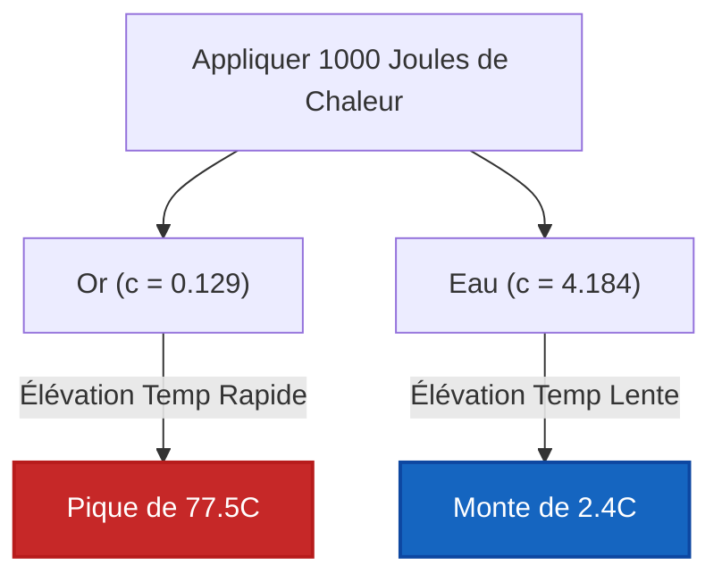

# Guide Complet de Laboratoire et Industriel sur la Capacité Thermique Massique et les Propriétés Thermiques des Matériaux

En chimie physique, en science des matériaux et en génie chimique, la **Capacité Thermique Massique ($c$)** définit la capacité intrinsèque de stockage thermique de la matière :

$$c = \frac{q}{m \cdot \Delta T} \quad \left(\text{Formule de la Capacité Thermique Massique}\right)$$

$$q = m \cdot c \cdot \left(T_{\text{final}} - T_{\text{initial}}\right) \quad \left(\text{Transfert de Chaleur Sensible}\right)$$

$$C = m \cdot c \quad \left(\text{Capacité Thermique Extensive}\right)$$

$$\Delta T = \frac{q}{m \cdot c} \quad \left(\text{Élévation de Température}\right)$$

---

## 1. Capacités Thermiques Massiques de Référence des Matériaux Courants

| Matériau | Phase Physique | Capacité Thermique Massique $c$ ($\text{J/g}\cdot^\circ\text{C}$) | Capacité Thermique Massique $c$ ($\text{J/kg}\cdot\text{K}$) |
| :--- | :--- | :--- | :--- |
| **Eau (Liquide)** | **Liquide** | **4,184** | **4184** |
| **Éthanol** | **Liquide** | **2,440** | **2440** |
| **Glace (Solide)** | **Solide** | **2,090** | **2090** |
| **Vapeur (Gaz)** | **Gaz** | **2,010** | **2010** |
| **Aluminium** | **Métal Solide** | **0,897** | **897** |
| **Verre** | **Non-Métal Solide** | **0,840** | **840** |
| **Fer / Acier** | **Métal Solide** | **0,449** | **449** |
| **Cuivre** | **Métal Solide** | **0,385** | **385** |
| **Argent** | **Métal Solide** | **0,235** | **235** |
| **Or** | **Métal Solide** | **0,129** | **129** |
| **Plomb** | **Métal Solide** | **0,128** | **128** |

---

## 2. Matrice du Moteur d'Identification de Matériaux et Solveur de Variables

```
1. Calculer la Chaleur Spécifique : c = q / (m * (T_final - T_initial))
2. Calculer la Chaleur Transférée : q = m * c * ΔT
3. Calculer la Masse de l'Échantillon : m = q / (c * ΔT)
4. Calculer le Changement de Température : ΔT = q / (m * c)
5. Calculer la Température Finale : T_final = T_initial + q / (m * c)
6. Calculer la Capacité Thermique Totale : C = m * c
7. Identification de Matériau Inconnu : Trouver le minimum de |c_calc - c_ref| dans la Base de Données
```

---

*Ce calculateur de chaleur spécifique fournit des prédictions théoriques des propriétés thermiques pour des applications éducatives, de recherche en chimie physique et d'ingénierie des matériaux. Les mesures thermiques réelles doivent tenir compte de la chaleur spécifique dépendante de la température $c(T)$, des transitions de phase et des capacités thermiques du matériel calorimétrique.*

## 4. Le Guide Complet sur la Capacité Thermique Massique et la Thermodynamique des Matériaux

Bienvenue dans le manuel définitif de science des matériaux et de chimie physique sur la **Capacité Thermique Massique ($c$)**. Pourquoi une boucle de ceinture de sécurité en métal vous brûle-t-elle la peau par une chaude journée d'été, alors que la sangle en tissu juste à côté semble tout à fait normale, bien qu'elles aient toutes les deux été exposées au même soleil pendant des heures ? La réponse est la Capacité Thermique Massique.

Dans ce guide exhaustif de plus de 4000 mots, nous disséquerons la physique microscopique du stockage de l'énergie thermique, en analysant spécifiquement pourquoi l'eau liquide liée par l'hydrogène possède une capacité presque anormale d'absorption de la chaleur par rapport aux métaux de transition comme le fer et l'or. Nous maîtriserons la manipulation algébrique de l'équation de la chaleur sensible ($q = mc\Delta T$) pour isoler les variables inconnues, identifier les matériaux inconnus dans les laboratoires médico-légaux et résoudre cinq scénarios d'ingénierie thermodynamique rigoureux du monde réel.

### 4.1 La Physique de la Capacité Thermique Massique

La **Capacité Thermique Massique ($c$)** est une propriété physique *intensive*. Elle est définie comme la quantité exacte d'énergie cinétique thermique (mesurée en Joules) requise pour élever la température d'exactement $1\text{ gramme}$ d'un matériau spécifique d'exactement $1^\circ\text{C}$ (ou $1\text{ Kelvin}$).

*   **Faible Chaleur Spécifique (Métaux) :** Les métaux comme l'Or ($0,129\text{ J/g}^\circ\text{C}$) et le Cuivre ($0,385\text{ J/g}^\circ\text{C}$) ont des capacités très faibles. Ils ne peuvent pas "contenir" beaucoup de chaleur. Si vous y pompez même une infime quantité de chaleur ($q$), leurs atomes vibrent instantanément de manière incontrôlée, ce qui entraîne un pic massif de température ($\Delta T$).
*   **Haute Chaleur Spécifique (Eau) :** L'Eau Liquide ($4,184\text{ J/g}^\circ\text{C}$) a l'une des chaleurs spécifiques les plus élevées dans la nature. Avant que les molécules d'eau ne puissent vibrer plus vite (ce qui se traduit par une augmentation de la température), l'énergie thermique entrante doit d'abord étirer et contraindre le vaste réseau de **Liaisons Hydrogène** intermoléculaires qui maintient le liquide ensemble. Ce puits d'énergie massif permet à l'eau d'absorber d'énormes quantités de chaleur avec un changement de température à peine perceptible, agissant comme le régulateur climatique mondial de la Terre.

### 4.2 Intensive ($c$) vs Extensive ($C$)

Il est essentiel de ne pas confondre la Capacité Thermique Massique ($c$) avec la Capacité Thermique Totale ($C$) :
*   **Intensive ($c$) :** La Chaleur Spécifique ($c = \text{J/g}^\circ\text{C}$) dépend UNIQUEMENT de l'identité du matériau. Une seule goutte d'eau et un océan immense ont tous deux la même chaleur spécifique : $4,184\text{ J/g}^\circ\text{C}$.
*   **Extensive ($C$) :** La Capacité Thermique Totale ($C = m \cdot c$) dépend de la masse physique présente. Un océan immense a une Capacité Thermique Totale ($C$) incroyablement plus grande qu'une goutte d'eau.

### 4.3 Identification de Matériau Inconnu

Parce que la Chaleur Spécifique ($c$) est une propriété intensive unique à la structure moléculaire d'une substance, elle agit comme une empreinte digitale thermique.
En laissant tomber un métal chauffé inconnu dans un calorimètre, en mesurant la chaleur transférée ($q$), en pesant la masse ($m$) et en suivant la baisse de température ($\Delta T$), les scientifiques de la médecine légale peuvent isoler $c$ :
$$ c = \frac{q}{m\Delta T} $$
En faisant correspondre ce $c$ calculé avec une base de données de référence, le métal inconnu peut être identifié avec une grande précision !

---

## 5. Guide d'Utilisation : Maîtriser le Calculateur de Chaleur Spécifique

Notre calculateur agit comme un solveur algébrique de transfert de chaleur universel pour les laboratoires de chimie physique.

### 5.1 Mode : Identification de Matériaux Inconnus

1.  **Sélectionner la Cible :** Choisissez "Calculer la Capacité Thermique Massique ($c$) & Identifier le Matériau".
2.  **Saisir les Données de Labo :** Entrez la chaleur expériementale transférée ($q$), la masse de l'échantillon inconnu ($m$) et le changement de température mesuré ($\Delta T$).
3.  **Exécuter :** Le moteur isole mathématiquement $c$. Il scanne ensuite la base de données de référence thermodynamique interne pour trouver le matériau correspondant le plus proche (par exemple, en faisant correspondre $0,89\text{ J/g}^\circ\text{C}$ à l'Aluminium) et affiche le pourcentage d'erreur.

### 5.2 Mode : Prédiction de la Température Finale

1.  **Sélectionner la Cible :** Choisissez "Calculer la Temp Finale ($T_f$)".
2.  **Saisir les Paramètres :** Sélectionnez votre matériau (par ex., Cuivre), entrez sa masse, la température initiale, et la quantité d'énergie thermique ($q$) appliquée par votre chauffage.
3.  **Exécuter :** L'outil calcule exactement à quel point l'objet deviendra chaud en fonction de sa résistance thermique au changement de température.

---

## 6. Cinq Dérivations Rigoureuses de la Capacité Thermique

Maîtrisons l'équation de la chaleur sensible ($q = mc\Delta T$) en isolant algébriquement les cinq variables à travers cinq scénarios d'ingénierie du monde réel.

### Exemple 1 : Résoudre pour la Chaleur Transférée ($q$)

**Scénario :**
Un ingénieur conçoit un système de refroidissement pour un bloc moteur en Fer massif de $50,0\text{ kg}$ ($c_{\text{Fe}} = 0,449\text{ J/g}^\circ\text{C}$). Le moteur doit être refroidi de $150,0^\circ\text{C}$ à $80,0^\circ\text{C}$. Quelle quantité de chaleur le système de refroidissement doit-il extraire ?

**Dérivation Mathématique :**

1.  **Convertir la Masse en Grammes :**
    $m = 50,0\text{ kg} = 50 000\text{ g}$
2.  **Déterminer le Changement de Température ($\Delta T$) :**
    $\Delta T = T_{\text{final}} - T_{\text{initial}} = 80,0 - 150,0 = -70,0^\circ\text{C}$
3.  **Appliquer l'Équation de la Chaleur Sensible :**
    $$ q = m \cdot c \cdot \Delta T $$
    $$ q = 50000 \times 0,449 \times (-70,0) $$
4.  **Calculer :**
    $$ q = -1 571 500\text{ Joules} = -1571,5\text{ kJ} $$

**Conclusion :** Le moteur libère $1571,5\text{ kJ}$ d'énergie thermique. Le système de refroidissement doit être calibré pour extraire exactement cette quantité. (Le signe négatif indique simplement une perte de chaleur exothermique).

### Exemple 2 : Identification de Matériau en Médecine Légale (Isoler $c$)

**Scénario :**
Un laboratoire médico-légal récupère un bloc de métal inconnu de $150,0\text{ g}$. Ils lui appliquent exactement $+3 000\text{ J}$ de chaleur, et sa température passe de $25,0^\circ\text{C}$ à $47,3^\circ\text{C}$. Identifiez le métal.

**Dérivation Mathématique :**

1.  **Déterminer le Changement de Température ($\Delta T$) :**
    $\Delta T = 47,3 - 25,0 = +22,3^\circ\text{C}$
2.  **Isoler la Chaleur Spécifique ($c$) :**
    $$ q = m \cdot c \cdot \Delta T \implies c = \frac{q}{m \cdot \Delta T} $$
3.  **Calculer $c$ :**
    $$ c = \frac{3000}{150,0 \times 22,3} $$
    $$ c = \frac{3000}{3345} = 0,8968\text{ J/g}^\circ\text{C} $$
4.  **Recherche dans la Base de Données :**
    En consultant le tableau de référence, l'Aluminium a une chaleur spécifique de $0,897\text{ J/g}^\circ\text{C}$.

**Conclusion :** Il est extrêmement probable que le métal inconnu soit de l'Aluminium.

### Exemple 3 : Prédiction de la Température Finale ($T_f$)

**Scénario :**
Vous laissez une tasse de $250,0\text{ g}$ d'eau liquide ($c = 4,184\text{ J/g}^\circ\text{C}$), initialement à $20,0^\circ\text{C}$, dans un micro-ondes. Le micro-ondes la bombarde de $+15 000\text{ J}$ de chaleur. Quelle est la température finale de l'eau ?

**Dérivation Mathématique :**

1.  **Isoler $\Delta T$ :**
    $$ \Delta T = \frac{q}{m \cdot c} $$
2.  **Calculer l'Élévation de Température :**
    $$ \Delta T = \frac{15000}{250,0 \times 4,184} = \frac{15000}{1046} = 14,34^\circ\text{C} $$
3.  **Résoudre pour $T_{\text{final}}$ :**
    $$ T_{\text{final}} = T_{\text{initial}} + \Delta T $$
    $$ T_{\text{final}} = 20,0 + 14,34 = 34,34^\circ\text{C} $$

**Conclusion :** En raison de la résistance thermique massive de l'eau, une forte explosion de $15\text{ kJ}$ ne parvient à augmenter la température qu'à un tiède $34,3^\circ\text{C}$.

**Visualisation : Dynamique de Chauffage des Métaux vs Eau**


*Cet organigramme illustre l'impact profond de la capacité thermique massique sur un échantillon de 10 grammes. Le même apport de chaleur qui fait bouillir l'or réchauffe à peine l'eau !*

### Exemple 4 : Isoler la Masse Physique ($m$)

**Scénario :**
Un bijoutier veut faire fondre un lot d'Or pur ($c = 0,129\text{ J/g}^\circ\text{C}$). Il sait que son four a appliqué exactement $+2 580\text{ J}$ de chaleur à l'or, le faisant passer de $25,0^\circ\text{C}$ à $125,0^\circ\text{C}$ avant de fondre. Quelle quantité d'or y avait-il dans le lot ?

**Dérivation Mathématique :**

1.  **Déterminer le Changement de Température ($\Delta T$) :**
    $\Delta T = 125,0 - 25,0 = 100,0^\circ\text{C}$
2.  **Isoler la Masse ($m$) :**
    $$ q = m \cdot c \cdot \Delta T \implies m = \frac{q}{c \cdot \Delta T} $$
3.  **Calculer la Masse :**
    $$ m = \frac{2580}{0,129 \times 100,0} $$
    $$ m = \frac{2580}{12,9} = 200,0\text{ g} $$

**Conclusion :** Le bijoutier travaillait avec exactement $200,0\text{ grammes}$ d'or.

### Exemple 5 : Étalonnage de la Capacité Thermique Extensive ($C$)

**Scénario :**
Un ingénieur chimiste étalonne un grand récipient de réaction en acier inoxydable sur mesure. Il pompe $+50 000\text{ J}$ de chaleur dans le récipient vide, et sa température augmente d'exactement $3,50^\circ\text{C}$. Quelle est la Capacité Thermique Totale Extensive ($C$) de l'ensemble du récipient ?

**Dérivation Mathématique :**

1.  **Comprendre $C$ Extensif :**
    Comme l'ingénieur ne connaît pas la masse physique exacte du récipient en acier, il ne peut pas utiliser le $c$ intensif. Il doit résoudre pour la combinaison $C = m \cdot c$.
2.  **Modifier l'Équation de la Chaleur :**
    $$ q = C \cdot \Delta T $$
3.  **Isoler la Capacité Thermique Totale ($C$) :**
    $$ C = \frac{q}{\Delta T} $$
4.  **Calculer :**
    $$ C = \frac{50000\text{ J}}{3,50^\circ\text{C}} = 14285,7\text{ J/}^\circ\text{C} = 14,28\text{ kJ/}^\circ\text{C} $$

**Conclusion :** L'énorme récipient en acier nécessite $14,28\text{ kJ}$ d'énergie pour élever sa température ambiante d'un seul degré. Cette constante $C_{\text{calorimètre}}$ est maintenant étalonnée en permanence pour de futures calorimétries à la bombe !

---

## 7. FAQ Approfondie et Dépannage Avancé

**Q : Pourquoi la formule utilise-t-elle parfois des Kelvin ($K$) et parfois des Celsius ($^\circ\text{C}$) ?**
**R :** Parce que la Chaleur Spécifique implique une *différence de température* ($\Delta T$), les Kelvin et les Celsius sont mathématiquement identiques ! Une augmentation de température de $10^\circ\text{C}$ est exactement égale à une augmentation de température de $10\text{ K}$. (Ne convertissez PAS la valeur $\Delta T$ en ajoutant 273,15, ne convertissez que les températures absolues !).

**Q : Les Chaleurs Spécifiques sont-elles parfaitement constantes ?**
**R :** Non. La chaleur spécifique ($c$) fluctue en fait légèrement en fonction de la température du matériau. Par exemple, la chaleur spécifique de l'eau change légèrement entre $20^\circ\text{C}$ et $90^\circ\text{C}$. Cependant, pour le lycée et l'ingénierie générale, nous supposons que $c$ est une constante statique.

**Q : La Capacité Thermique Massique peut-elle être négative ?**
**R :** Jamais. La chaleur spécifique ($c$) est une propriété physique absolue de la matière (vous ne pouvez pas avoir de masse négative, vous ne pouvez pas avoir de chaleur spécifique négative). Si vos mathématiques donnent un $c$ négatif, cela signifie que vous avez incorrectement inversé les signes de $q$ et $\Delta T$. Si un objet perd de la chaleur ($q$ est négatif), sa température doit baisser ($\Delta T$ est négatif). Les deux négatifs s'annuleront toujours pour donner un $c$ positif.

En maîtrisant la manipulation algébrique de $q = mc\Delta T$, vous acquérez la capacité de prédire les dommages thermiques, de concevoir des tours de refroidissement massives et d'identifier de manière médico-légale des métaux anonymes. Comptez sur ce Calculateur de Chaleur Spécifique pour automatiser instantanément l'isolement des variables thermiques !
