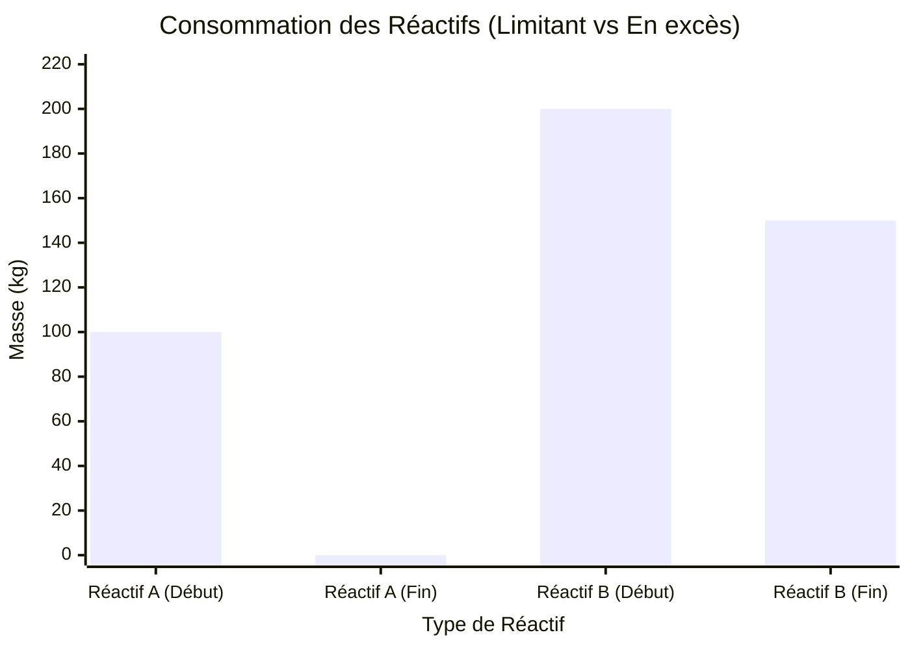
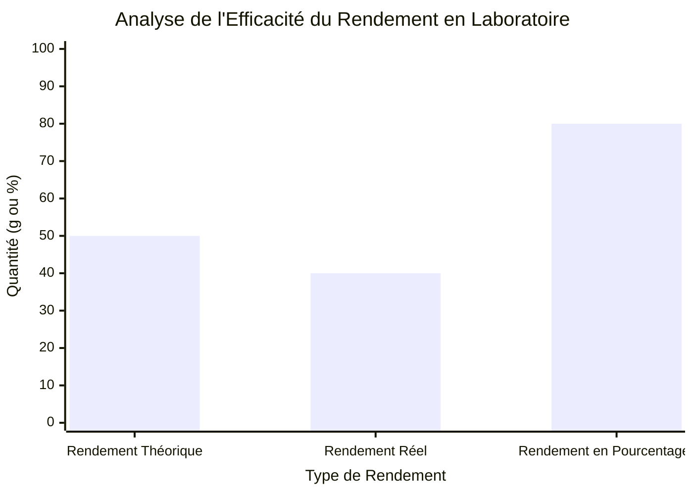
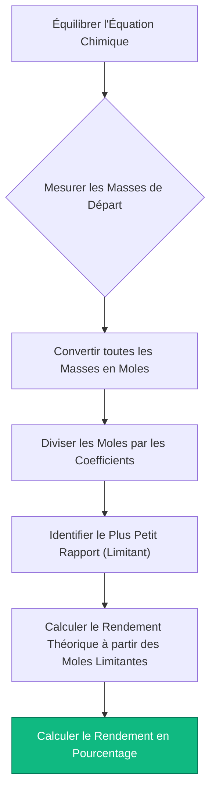
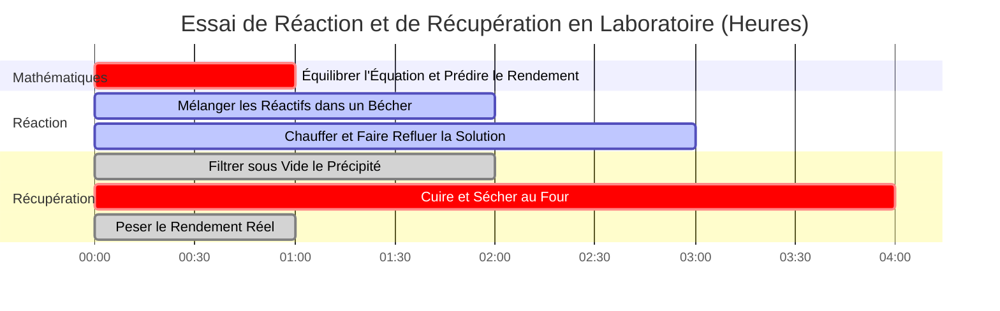

# La Calculatrice de Stœchiométrie Ultime : Équations, Rendements et Limites de Masse

Bienvenue dans la **Calculatrice de Stœchiométrie** ultime et le guide d'analyse des réactions chimiques complet. Que vous soyez un étudiant en chimie AP apprenant la feuille de route fondamentale de la conversion masse à masse, un ingénieur chimique pharmaceutique optimisant le rendement en pourcentage pour des synthèses de médicaments à plusieurs millions de dollars, ou un technicien de laboratoire calculant les volumes de titrant exacts pour la stœchiométrie des solutions, maîtriser les rapports mathématiques des réactions chimiques est le cœur absolu de la chimie quantitative.

La chimie ne consiste pas seulement à mélanger des quantités aléatoires de poudres et à espérer une réaction. C'est une discipline mathématique précise régie par les lois rigides de la thermodynamique et de la conservation de la masse. Chaque atome qui entre dans un récipient de réaction doit être parfaitement pris en compte lorsque la réaction se termine.

Dans cette masterclass SEO exhaustive de plus de 4 000 mots, nous allons déconstruire complètement les algorithmes de conversion de la stœchiométrie, prouver mathématiquement l'identification des réactifs limitants, décoder la thermodynamique des rendements théoriques et réels, et exposer les erreurs de calcul de laboratoire les plus fatales. Pour garantir une compréhension absolue, nous avons inclus cinq diagrammes interactifs Mermaid.js méticuleusement détaillés et compatibles avec les analyseurs syntaxiques.

---

## 1. La Physique Fondamentale : La Loi de la Conservation de la Masse

Avant de manipuler des rapports molaires ou de calculer des rendements de produits, vous devez comprendre la physique fondamentale d'une réaction chimique.

En 1789, Antoine Lavoisier a découvert la **Loi de la Conservation de la Masse**. Il a prouvé que la matière n'est ni créée ni détruite au cours d'une réaction chimique. Les atomes se déconnectent simplement les uns des autres et se réarrangent en de nouvelles structures moléculaires.

**La Règle d'Or de la Stœchiométrie :**
$$(\text{Masse Totale des Réactifs}) = (\text{Masse Totale des Produits})$$

Si vous brûlez exactement $16.04\text{ g}$ de méthane ($\text{CH}_4$) avec $64.00\text{ g}$ d'oxygène ($\text{O}_2$), le récipient de réaction contient exactement $80.04\text{ g}$ de matière. Lorsque la combustion est terminée, produisant du dioxyde de carbone ($\text{CO}_2$) et de l'eau ($\text{H}_2\text{O}$), la masse totale des produits gazeux doit peser *exactement* $80.04\text{ g}$. Pas un seul proton ou électron n'est perdu.

Cette réalité mathématique rigide signifie que nous pouvons parfaitement prédire exactement quelle quantité de produit une réaction générera, à condition de commencer avec une **Équation Chimique Équilibrée**.

---

## 2. L'Équation Équilibrée et les Rapports Molaires

Une équation chimique est une recette. Tout comme une recette dicte que "2 œufs + 1 tasse de farine = 4 crêpes", une équation chimique dicte les rapports moléculaires exacts nécessaires pour une réaction.

Prenons la synthèse de l'ammoniac (Le Procédé Haber) :
$$\text{N}_2 + 3\text{H}_2 \rightarrow 2\text{NH}_3$$

Les nombres devant les molécules sont les **Coefficients Stœchiométriques**. Ils dictent les **Rapports Molaires**.
- Il faut exactement $1\text{ mole}$ de gaz diazote ($\text{N}_2$) pour réagir avec exactement $3\text{ moles}$ de gaz dihydrogène ($\text{H}_2$).
- Cette réaction produira exactement $2\text{ moles}$ d'ammoniac ($\text{NH}_3$).

**Le Piège Mortel du Laboratoire :** Les rapports molaires s'appliquent *uniquement* aux moles (le nombre de particules), NON à la masse (les grammes). Vous ne pouvez pas mélanger $1\text{ gramme}$ d'azote et $3\text{ grammes}$ d'hydrogène. Parce que les atomes différents ont des masses très différentes (l'azote est 14 fois plus lourd que l'hydrogène), vous devez toujours convertir vos masses physiques de laboratoire en moles avant d'appliquer les rapports de la recette.

---

## 3. La Feuille de Route Stœchiométrique : Conversions Masse-Masse

Parce que les balances de laboratoire mesurent la masse (les grammes), mais que les équations chimiques parlent en moles, chaque chimiste analytique doit exécuter l'Algorithme de Stœchiométrie Masse-Masse en 3 étapes.

**Le Scénario :** Combien de grammes d'ammoniac ($\text{NH}_3$) peuvent être produits à partir de $28.02\text{ g}$ de gaz diazote ($\text{N}_2$) ?

### Étape 1 : Masse vers Moles (Le Portail d'Entrée)
Divisez la masse de départ par sa masse molaire.
- $\text{Masse Molaire de N}_2 = 28.02\text{ g/mol}$
- $\text{Moles de N}_2 = \frac{28.02\text{ g}}{28.02\text{ g/mol}} = \mathbf{1.00\text{ mol de N}_2}$

### Étape 2 : Moles vers Moles (Le Rapport Central)
Multipliez par le Rapport Stœchiométrique ($\frac{\text{Coefficient Cible}}{\text{Coefficient de Départ}}$).
- Rapport = $\frac{2\text{ NH}_3}{1\text{ N}_2}$
- $\text{Moles de NH}_3 = 1.00\text{ mol de N}_2 \times \frac{2}{1} = \mathbf{2.00\text{ mol de NH}_3}$

### Étape 3 : Moles vers Masse (Le Portail de Sortie)
Multipliez les nouvelles moles par la masse molaire du produit cible.
- $\text{Masse Molaire de NH}_3 = 17.03\text{ g/mol}$
- $\text{Masse de NH}_3 = 2.00\text{ mol} \times 17.03\text{ g/mol} = \mathbf{34.06\text{ g de NH}_3}$

---

## 4. Le Réactif Limitant et le Rendement Théorique

Dans le monde réel, les chimistes mélangent rarement les réactifs dans des proportions stœchiométriques exactes et parfaites. En général, un produit chimique est bon marché (comme l'oxygène dans l'air) et un autre est très cher (comme un catalyseur en platine ou un précurseur de médicament synthétisé).

**Le Réactif Limitant :** Le produit chimique qui est complètement consommé en premier. Au moment où il s'épuise, la réaction s'arrête instantanément. Il dicte la quantité maximale absolue de produit qui peut se former (le Rendement Théorique).
**Le Réactif en Excès :** Le produit chimique qui reste, flottant inutilement dans le bécher après la fin de la réaction.

### Comment Trouver le Réactif Limitant
1. Convertissez toutes les masses de départ en moles.
2. Divisez les moles de chaque réactif par son coefficient stœchiométrique dans l'équation équilibrée.
3. Le plus petit nombre résultant est votre réactif limitant.
4. *Jetez les autres nombres.* Vous devez utiliser les moles d'origine du réactif limitant pour calculer tous les rendements de produits.

### Rendement en Pourcentage vs Rendement Théorique
Vos calculs mathématiques ont déterminé que vous devriez obtenir exactement $34.06\text{ g}$ d'ammoniac. C'est votre **Rendement Théorique**—une réalité parfaite et sans défaut qui suppose une efficacité de $100\%$.

Dans un véritable laboratoire, vous renversez quelques gouttes. Un peu de gaz s'échappe de la fiole. Une partie du produit reste coincée dans le papier filtre. Vous pesez votre produit final et ne récupérez que $25.00\text{ g}$. C'est votre **Rendement Réel**.

**Équation du Rendement en Pourcentage :**
$$\text{Rendement en Pourcentage} = \left( \frac{\text{Rendement Réel}}{\text{Rendement Théorique}} \right) \times 100\%$$
$$\text{Rendement en Pourcentage} = \left( \frac{25.00}{34.06} \right) \times 100\% = \mathbf{73.4\%}$$

---

## 5. Cinq Scénarios d'Ingénierie Conceptuelle avec Visualisations 2D

Pour maîtriser pleinement les algorithmes mécaniques régissant les conversions de la matrice stœchiométrique, les limites de rendement et les protocoles de laboratoire, nous allons explorer cinq scénarios distincts de chimie analytique décomposés visuellement à l'aide de diagrammes Mermaid.js personnalisés.

### Exemple 1 : L'Organigramme de l'Algorithme Masse-Masse

**Le Scénario :**
Un étudiant en chimie AP cartographie la voie mathématique rigide et incassable en 3 étapes requise pour convertir les grammes d'un réactif de départ en grammes d'un produit final.

**Visualisation 2D :**
Cet organigramme cartographie visuellement l'obligation stricte de passer par le "Portail des Moles". La masse ne peut pas se convertir directement en masse.

---

### Exemple 2 : Réactif Limitant vs Reste en Excès

**Le Scénario :**
Un ingénieur industriel charge un réacteur avec $100\text{ kg}$ de Réactif A et $200\text{ kg}$ de Réactif B. Le Réactif A est complètement consommé (Limitant), laissant d'énormes quantités de Réactif B restantes (En excès).

**Visualisation 2D :**
Ce graphique prouve graphiquement comment le réactif limitant chute à zéro absolu, tandis que le réactif en excès conserve une masse significative non réagie.

---

### Exemple 3 : Analyse de l'Efficacité du Rendement

**Le Scénario :**
Un laboratoire pharmaceutique analyse l'efficacité de la synthèse d'un médicament onéreux. Ils ont calculé un rendement théorique de $50.0\text{ g}$, mais n'ont récupéré que $40.0\text{ g}$.

**Visualisation 2D :**
Ce tableau comparatif cartographie visuellement la différence entre la perfection mathématique (Théorique) et la réalité physique (Réel), démontrant un rendement en pourcentage de $80\%$.

---

### Exemple 4 : Le Protocole du Laboratoire de Stœchiométrie

**Le Scénario :**
Un technicien de laboratoire cartographie la procédure opératoire standard (POS) stricte requise pour certifier légalement un calcul de rendement de réaction pour les rapports industriels.

**Visualisation 2D :**
Cet organigramme descendant agit comme une recette chimique stricte, imposant la séquence absolue d'actions mathématiques nécessaires pour éviter les erreurs de calcul.

---

### Exemple 5 : Chronologie de Récupération du Rendement de la Réaction

**Le Scénario :**
Un chimiste analytique exécute un protocole de synthèse, de filtration et de séchage de plusieurs heures pour calculer correctement le rendement réel final d'un précipité solide.

**Visualisation 2D :**
Ce diagramme de Gantt visualise la séquence chronologique d'un essai physique, prouvant que les calculs de rendement ne peuvent se produire tant que le produit n'est pas physiquement purifié et séché.

---

## 6. Conclusion et Défi Stœchiométrique

La maîtrise des algorithmes de stœchiométrie est l'exigence d'entrée non négociable pour intégrer n'importe quel laboratoire industriel, biologique ou chimique. Comprendre la rigidité mathématique de la conservation de la masse, l'obligation d'acheminer tous les calculs par le "Portail des Moles", et l'identification des réactifs limitants garantira que vos mises à l'échelle industrielles et vos essais de laboratoire fonctionneront exactement comme prévu.

Si vous ne maîtrisez pas ces algorithmes, vos usines chimiques gaspilleront des millions de dollars en réactifs en excès non réagis, vos dosages pharmaceutiques seront mortellement incorrects, et vos données expérimentales seront totalement corrompues par l'erreur humaine.

Pour garantir que vous avez maîtrisé ces concepts critiques, démarrez notre simulateur interactif et essayez de résoudre ces derniers défis analytiques :
1. **Le Défi de la Combustion :** Équilibrez l'équation pour la combustion du propane ($\text{C}_3\text{H}_8 + \text{O}_2 \rightarrow \text{CO}_2 + \text{H}_2\text{O}$). Combien de grammes de dioxyde de carbone sont produits en brûlant $44.1\text{ g}$ de propane ?
2. **Le Défi Limitant :** Vous mélangez $10.0\text{ g}$ de gaz dihydrogène ($\text{H}_2$) avec $10.0\text{ g}$ de gaz dioxygène ($\text{O}_2$) pour fabriquer de l'eau. Quel gaz s'épuise en premier ? Combien de grammes d'eau se forment ?
3. **Le Défi du Rendement :** Vous calculez un rendement théorique de $120.0\text{ g}$ d'aspirine. Après la synthèse, la filtration et le séchage, vous pesez exactement $90.0\text{ g}$ d'aspirine pure. Quel est votre rendement en pourcentage, et quels facteurs chimiques pourraient expliquer la masse manquante ?

Fiez-vous à cette calculatrice de stœchiométrie universelle pour auditer vos protocoles de laboratoire, identifier instantanément les réactifs limitants et maîtriser définitivement la thermodynamique de l'analyse chimique quantitative.
