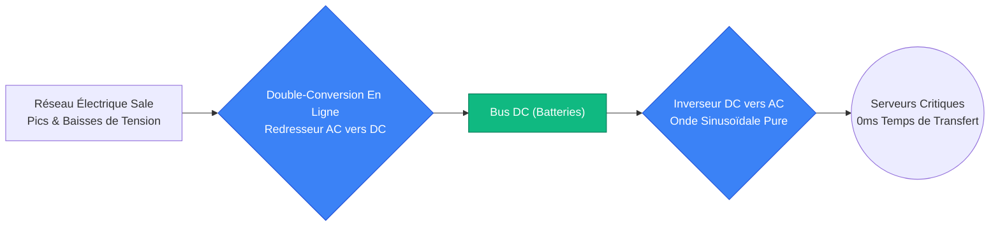
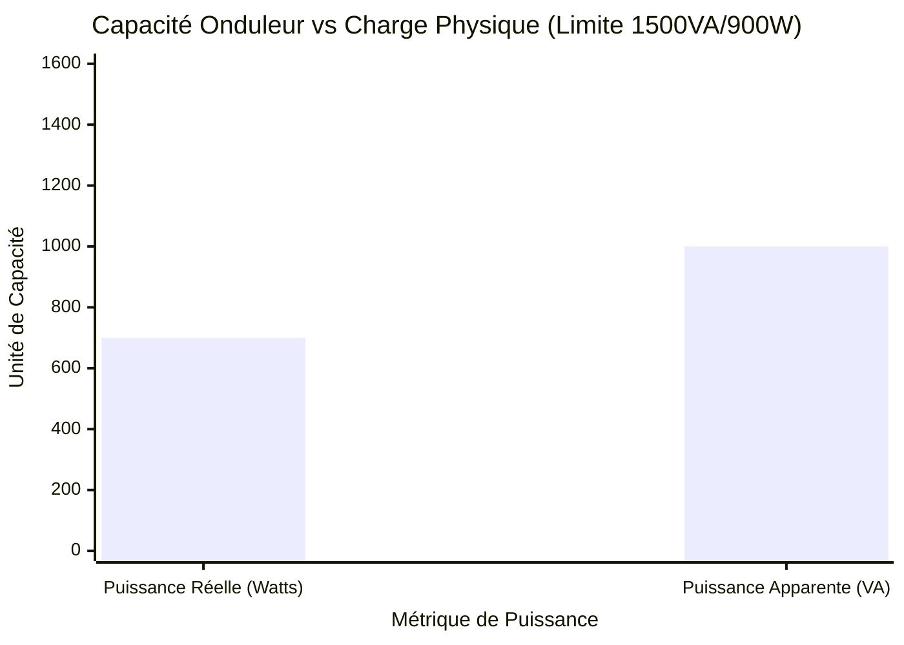
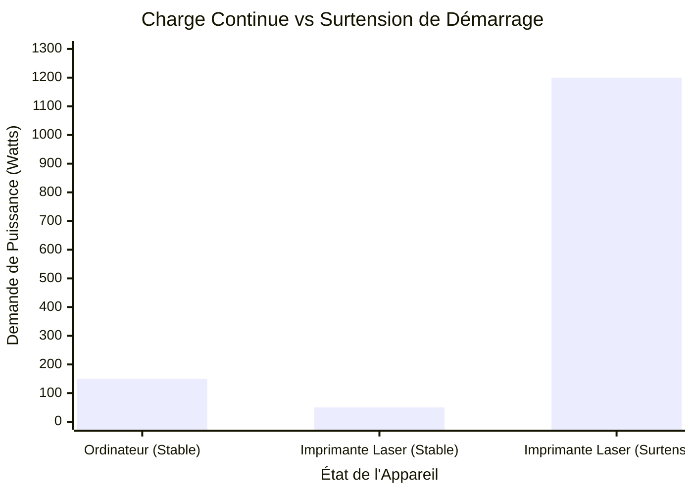
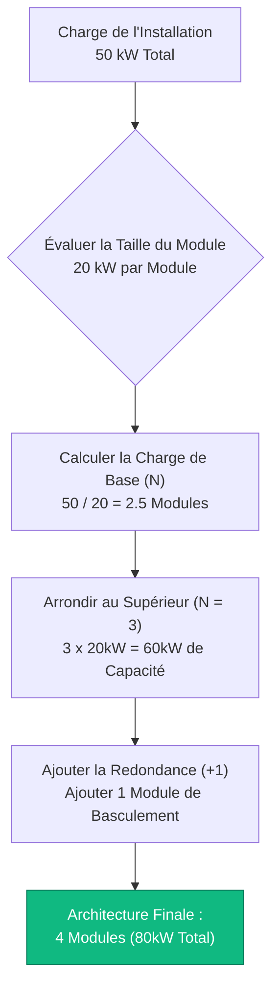
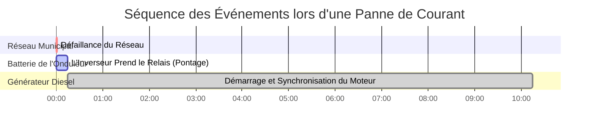

# Le Calculateur d'Onduleur Définitif : Dimensionnement, Autonomie et Redondance N+1

Bienvenue dans le guide ultime d'ingénierie des alimentations sans interruption et dans le **Calculateur d'Onduleur**. Que vous soyez un administrateur informatique dimensionnant un énorme rack modulaire N+1 de $40\text{kVA}$ pour un centre de données, un électricien évaluant la compatibilité des générateurs de secours, ou un joueur essayant de protéger un PC de $1000\text{W}$ contre les baisses de tension, la maîtrise de la physique électrique des onduleurs est absolument essentielle.

Un onduleur (Alimentation Sans Interruption) n'est pas seulement une simple batterie dans une boîte en plastique. C'est un pont électro-mécanique hautement complexe conçu pour protéger le silicium sensible des violents pics de tension, des distorsions harmoniques et des défaillances totales du réseau électrique. Si vous calculez mal la différence entre la **Puissance Réelle (Watts)** et la **Puissance Apparente (VA)**, vous surchargerez de façon permanente l'onduleur. Si vous comprenez mal la différence entre les topologies Hors Ligne et à Double-Conversion en Ligne, vos serveurs redémarreront violemment pendant le délai de transfert de $4\text{ms}$.

Dans cette masterclass SEO exhaustive de plus de 4 000 mots, nous déconstruirons la trigonométrie fondamentale des Watts par rapport aux VA, exposerons les dangers des surtensions de démarrage des imprimantes laser, décoderons les mathématiques d'ingénierie requises pour calculer des temps d'autonomie de batterie précis, et prouverons mathématiquement le concept de Redondance Tolérante aux Pannes N+1. Pour vous assurer de comprendre parfaitement ces concepts d'ingénierie, nous avons inclus cinq diagrammes interactifs Mermaid.js méticuleusement détaillés et sûrs pour les analyseurs.

---

## 1. La Physique du Dimensionnement de l'Onduleur (Watts vs VA)

Le concept absolu le plus critique en ingénierie d'onduleurs est de comprendre pourquoi les charges électriques ont deux capacités de puissance différentes : **Watts (W)** et **Volt-Ampères (VA)**.

1. **Puissance Réelle (Watts) :** Cela représente le travail réel et effectif accompli par l'équipement. Cela génère de la chaleur et du calcul.
2. **Puissance Apparente (VA) :** Cela représente la demande électrique totale placée sur l'inverseur de l'onduleur. En raison de la physique du courant alternatif (AC) et du **Facteur de Puissance (FP)**, les charges inductives et capacitives forcent l'onduleur à pousser et tirer de la puissance réactive "fantôme".

**L'Équation du Facteur de Puissance :**
$$\text{Facteur de Puissance (FP)} = \frac{\text{Puissance Réelle (Watts)}}{\text{Puissance Apparente (VA)}}$$

Par conséquent :
$$\text{Puissance Apparente (VA)} = \frac{\text{Watts}}{\text{Facteur de Puissance}}$$

**Pourquoi est-ce Important ?**
Un onduleur est strictement dimensionné pour un maximum de Watts ET un maximum de VA. Vous ne pouvez dépasser aucune de ces deux limites.
Par exemple, un onduleur de bureau courant est évalué pour $1500\text{ VA}$ et $900\text{ Watts}$.
- Si vous branchez un radiateur d'appoint de $950\text{W}$ (qui a un FP de $1.0$, donc il fait $950\text{ VA}$), vous n'avez pas dépassé la limite de $1500\text{ VA}$, mais vous AVEZ dépassé la limite de $900\text{ W}$. L'onduleur criera et s'éteindra.
- Si vous branchez plusieurs vieux néons fluorescents d'atelier tirant $800\text{W}$ avec un terrible FP de $0.50$, le VA est de $1600\text{ VA}$ ($800 / 0.50$). Vous n'avez pas dépassé la limite de $900\text{ W}$, mais vous AVEZ dépassé la limite de $1500\text{ VA}$. L'onduleur criera et s'éteindra.

*Note d'Ingénierie :* Les ordinateurs modernes équipés d'alimentations avec "PFC Active" ont un excellent Facteur de Puissance de $0.95$ à $0.99$. Cela signifie que leurs capacités en Watt et VA sont presque identiques.

---

## 2. Marge de Sécurité et Surtensions de Démarrage

Lors du calcul de votre charge d'équipement totale, vous ne pouvez pas dimensionner l'onduleur exactement à votre total mathématique. Vous devez prévoir une **Marge de Sécurité**.

1. **La Règle des $20\%$ :** Les normes industrielles dictent qu'un onduleur ne doit pas fonctionner à plus de $80\%$ de sa capacité nominale maximale. Cela fournit un tampon de $20\%$ de marge de sécurité pour tenir compte de légères fluctuations de tension du réseau, du vieillissement de la batterie et de l'ajout de petits appareils USB.
2. **Courant d'Appel de Démarrage :** Les moteurs électriques, les compresseurs de réfrigérateurs et les gros condensateurs d'alimentation tirent des pointes massives de courant à la milliseconde exacte où ils sont allumés. Un réfrigérateur de $200\text{W}$ peut tirer $1000\text{W}$ pendant une demi-seconde. Un PC de jeu de $500\text{W}$ peut tirer $650\text{W}$ au démarrage.
3. **Le Piège de l'Imprimante Laser :** Ne branchez jamais une imprimante laser sur la prise de secours sur batterie d'un onduleur. Les imprimantes laser utilisent des éléments chauffants de fixation qui tirent instantanément de $1000\text{W}$ à $1500\text{W}$ au démarrage de l'impression. Ce pic soudain surchargera et déclenchera instantanément $99\%$ des onduleurs grand public. Branchez les imprimantes laser strictement sur les prises "Surtension Uniquement" (Surge Only).

---

## 3. Démystification des Topologies d'Onduleurs : Hors Ligne vs Ligne Interactive vs En Ligne

Tous les onduleurs ne sont pas construits de la même manière. Le circuit interne (Topologie) détermine comment l'onduleur gère l'alimentation électrique du réseau, et à quelle vitesse il bascule sur la batterie lors d'une panne de courant.

### 1. Onduleur Hors Ligne / Attente (Offline / Standby)
C'est l'onduleur domestique le moins cher et le plus courant. Dans des conditions normales, il transmet simplement l'alimentation AC brute du réseau directement à votre ordinateur. Lorsque le réseau tombe en panne, un relais mécanique bascule sur l'inverseur de la batterie.
- **Temps de Transfert :** $4\text{ à }10\text{ millisecondes}$. (Assez rapide pour un PC, mais un commutateur réseau sensible pourrait redémarrer).
- **Régulation de Tension :** Aucune. Si la tension murale chute à $105\text{V}$, votre ordinateur reçoit $105\text{V}$.

### 2. Onduleur de Ligne Interactive (Line-Interactive)
La norme de milieu de gamme pour les serveurs de bureau et les PC de jeu. Il comprend un transformateur massif connu sous le nom de Régulateur Automatique de Tension (AVR). Si la tension du réseau chute (une baisse de tension), l'AVR amplifie mathématiquement la tension pour la ramener à $120\text{V}$ sans vider la batterie interne.
- **Temps de Transfert :** $2\text{ à }4\text{ millisecondes}$.
- **Régulation de Tension :** Excellente. Prolonge considérablement la durée de vie de la batterie en évitant des décharges inutiles lors de baisses de tension mineures.

### 3. Onduleur à Double-Conversion en Ligne (Online Double-Conversion)
La référence absolue pour les centres de données et les hôpitaux. L'alimentation électrique AC entrante du réseau est agressivement convertie en alimentation DC. Cette alimentation DC charge la batterie ET alimente simultanément l'inverseur. L'inverseur reconvertit le DC en une alimentation AC mathématiquement parfaite et chirurgicalement propre. Votre équipement est physiquement isolé du réseau électrique municipal.
- **Temps de Transfert :** $0\text{ millisecondes}$. (Il n'y a pas de basculement. L'inverseur fonctionne en permanence).
- **Régulation de Tension :** Parfaite.

---

## 4. Calcul de l'Autonomie de Sauvegarde de la Batterie

Un onduleur est conçu pour fournir suffisamment d'autonomie pour sauvegarder votre travail et s'éteindre en douceur, ou faire le pont jusqu'à ce qu'un générateur diesel démarre. Il n'est pas conçu pour faire fonctionner une maison pendant 12 heures.

**La Formule d'Autonomie :**
$$\text{Autonomie Estimée (Heures)} = \frac{\text{Tension de Batterie} \times \text{Ah de Batterie} \times \text{Profondeur de Décharge (DoD)}}{\frac{\text{Watts de Charge}}{\text{Efficacité de l'Inverseur}}}$$

La plupart des onduleurs grand public contiennent de petites Batteries au Plomb-Acide Scellées (SLA).
Par exemple, un onduleur standard de $1500\text{ VA}$ contient généralement deux batteries de $12\text{V}$ $9\text{Ah}$ câblées en série ($24\text{V}$).
- Énergie Totale = $24\text{V} \times 9\text{Ah} = 216\text{ Watt-heures}$.
- L'énergie Utilisable (en tenant compte de la perte de Peukert à décharge rapide et de l'efficacité de l'inverseur) est d'environ $130\text{Wh}$.
- Une charge de PC de $400\text{W}$ videra cet onduleur en environ $20\text{ minutes}$.

---

## 5. Redondance Modulaire N+1 pour Centres de Données

Dans l'informatique d'entreprise, un seul onduleur représente un Point de Défaillance Unique (SPOF). Si l'inverseur interne de l'onduleur tombe en panne, tout le rack de serveurs perd l'alimentation.

Pour résoudre ce problème, les centres de données déploient des **Matrices d'Onduleurs Modulaires Redondants N+1**.
- **N** représente le nombre minimum de modules d'onduleurs indépendants requis pour supporter la pleine charge de l'installation.
- **+1** représente un module de secours supplémentaire identique.

Si un rack de serveurs tire $30\text{ kW}$, et que vous utilisez des modules d'onduleurs de $10\text{ kW}$ :
- Vous avez besoin de $N = 3$ modules pour supporter la charge de $30\text{ kW}$.
- Vous ajoutez le module de redondance $+1$, ce qui porte le total à $4$ modules.
- Si N'IMPORTE QUEL module prend feu, les 3 modules restants absorbent de manière transparente la charge de $30\text{ kW}$ sans aucune interruption.

---

## 6. Cinq Scénarios d'Ingénierie Conceptuelle avec Visualisations 2D

Pour maîtriser pleinement les relations physiques régissant les systèmes d'onduleurs, nous explorerons cinq scénarios d'ingénierie distincts décomposés visuellement à l'aide de diagrammes Mermaid.js personnalisés.

### Exemple 1 : Les Topologies Comparées (Hors Ligne vs En Ligne)

**Le Scénario :**
Un directeur informatique doit justifier la différence de coût massive entre un Onduleur Hors Ligne et un Onduleur à Double-Conversion en Ligne.

**Visualisation 2D :**
Cet organigramme logique cartographie le flux physique de l'énergie, démontrant clairement comment un onduleur En Ligne agit comme un pare-feu entre le réseau municipal sale et les serveurs sensibles.

---

### Exemple 2 : Le Goulot d'Étranglement de Capacité (Watts vs VA)

**Le Scénario :**
Un utilisateur domestique ne comprend pas pourquoi son onduleur de $1500\text{VA} / 900\text{W}$ hurle une alerte de surcharge lorsqu'il connecte pour $1000\text{VA}$ d'appareils électroniques à faible facteur de puissance qui ne tirent que $700\text{W}$.

**Les Mathématiques :**
La charge ($700\text{W}$, $1000\text{VA}$) est dans la limite des $900\text{W}$, mais dangereusement proche de la limite de puissance apparente de $1500\text{VA}$ en tenant compte d'une marge de sécurité de $20\%$ (exigence de $1200\text{VA}$).

**Visualisation 2D :**
Ce graphique trace les limites doubles de l'onduleur par rapport à la charge physique, prouvant que la Puissance Apparente (VA) est tout aussi critique que la Puissance Réelle (Watts).

---

### Exemple 3 : Le Danger de l'Imprimante Laser

**Le Scénario :**
Une réceptionniste branche une imprimante laser de $1200\text{W}$ sur la prise batterie de l'onduleur de bureau de $600\text{W}$. L'onduleur se déclenche instantanément et éteint l'ordinateur de bureau adjacent.

**Les Mathématiques :**
La consommation continue d'une imprimante est de $50\text{W}$. Le pic de démarrage de la fixation est de $1200\text{W}$ pendant 1 seconde. L'inverseur ne peut physiquement pas fournir $1200\text{W}$.

**Visualisation 2D :**
Ce graphique trace la réalité brutale du Courant de Démarrage, prouvant pourquoi les moteurs mécaniques et les éléments chauffants doivent contourner l'inverseur de la batterie de l'onduleur.

---

### Exemple 4 : Calcul de la Redondance Modulaire N+1

**Le Scénario :**
Un architecte de centre de données doit déployer suffisamment de modules d'onduleurs de $20\text{ kW}$ pour protéger une suite de serveurs de $50\text{ kW}$ tout en maintenant une tolérance totale aux pannes face à une défaillance de module catastrophique.

**Visualisation 2D :**
Cet organigramme de haut en bas cartographie les mathématiques strictes requises pour évaluer la couverture de charge, définir l'exigence N, et ajouter le module de basculement $+1$.

---

### Exemple 5 : La Chronologie de Pontage lors de Pannes

**Le Scénario :**
Un ingénieur doit comprendre la séquence exacte d'événements lorsque le réseau municipal tombe en panne, que l'inverseur de l'onduleur prend le relais, et que le générateur diesel de secours tente de se synchroniser.

**Visualisation 2D :**
Ce diagramme de Gantt décrit brutalement la chronologie microscopique d'une panne d'électricité, démontrant comment l'onduleur agit comme le pont critique couvrant le délai de 15 secondes avant que le générateur diesel ne puisse fournir une puissance stable.

---

## 7. Conclusion et Défi d'Ingénierie

Maîtriser le dimensionnement des onduleurs est le socle fondamental de toute l'informatique d'entreprise et de l'ingénierie des installations. Comprendre la trigonométrie vectorielle séparant les Watts et les VA, respecter la réalité brutale des surtensions de démarrage, et concevoir des architectures N+1 tolérantes aux pannes garantira que vos systèmes survivront à toute panne de courant municipale.

Si vous ignorez ces principes mathématiques, vos inverseurs surchargeront et s'arrêteront lors des surtensions des imprimantes, vos serveurs redémarreront spontanément pendant les délais de transfert Ligne Interactive, et votre onduleur à module unique deviendra le point de défaillance unique qui fera tomber tout votre centre de données.

Pour garantir que vous avez maîtrisé ces concepts critiques, démarrez notre Simulateur interactif et tentez de résoudre ces derniers défis :
1. **Le Piège de la Surcharge :** Vous avez un onduleur de $2000\text{VA} / 1200\text{W}$. Vous connectez dix vieux moteurs AC de $150\text{W}$ avec un FP de $0.60$. Dépassez-vous la limite en Watt ou en VA ?
2. **Le Nombre de Modules :** Votre salle de serveurs tire $75\text{ kW}$. Vous achetez des unités d'onduleurs modulaires de $25\text{ kW}$. Exactement combien de modules au total devez-vous installer pour obtenir une redondance N+1 ?
3. **Le Pont de la Batterie :** Une charge de $1000\text{W}$ est connectée à un onduleur contenant quatre batteries de $12\text{V}$ $7\text{Ah}$ câblées en série. Supposons une efficacité d'inverseur de $85\%$ et une décharge de $100\%$. Calculez l'autonomie maximale théorique exacte en minutes avant un arrêt total.

Fiez-vous à ce calculateur pour auditer vos racks de serveurs, justifier mathématiquement les mises à niveau d'infrastructure N+1 et éliminer définitivement les temps d'arrêt.
