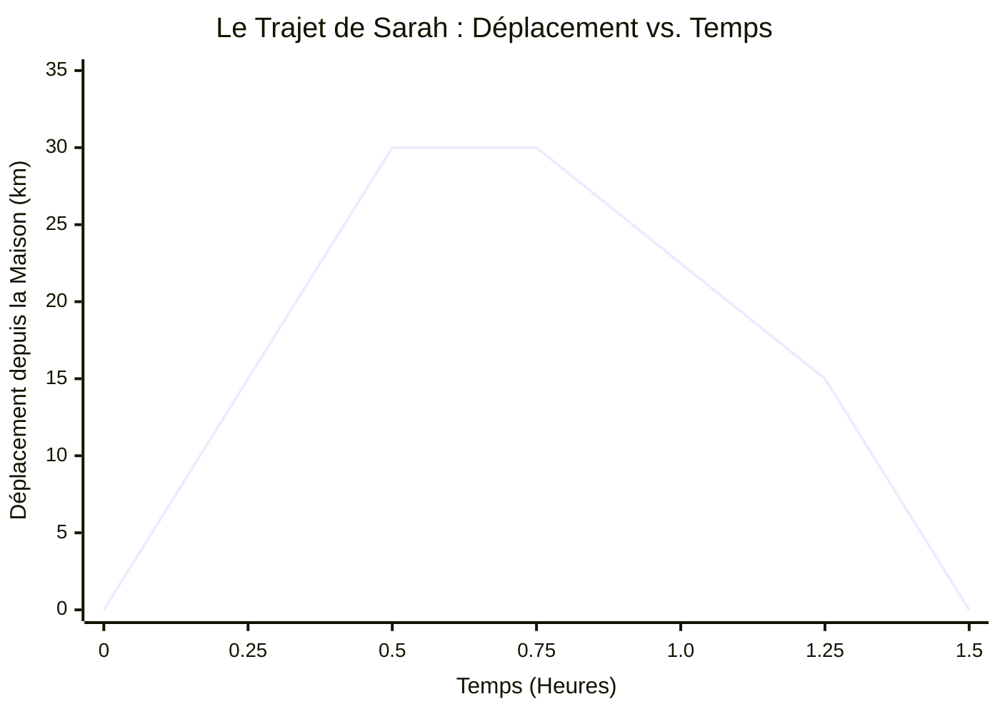
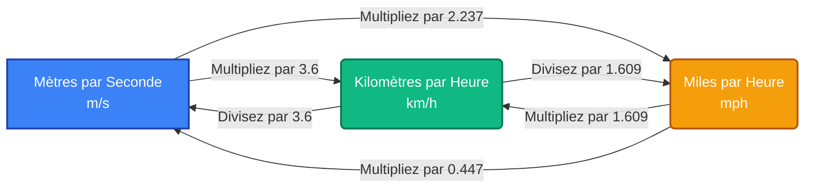
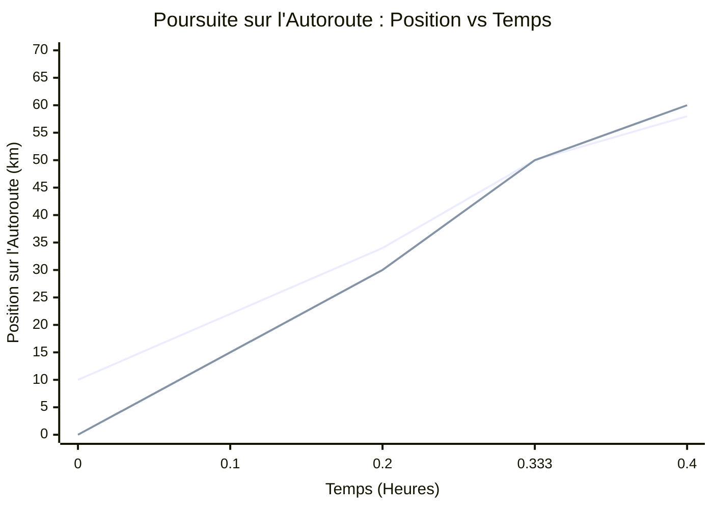
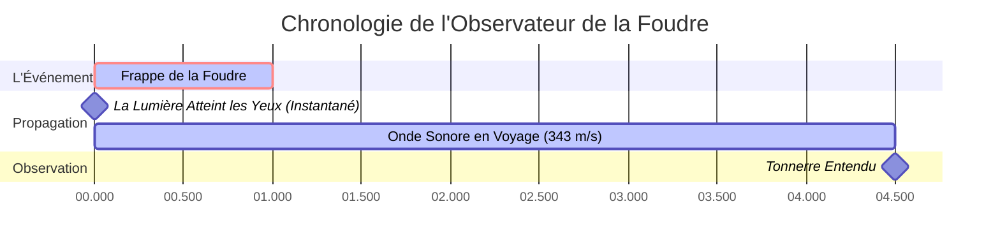
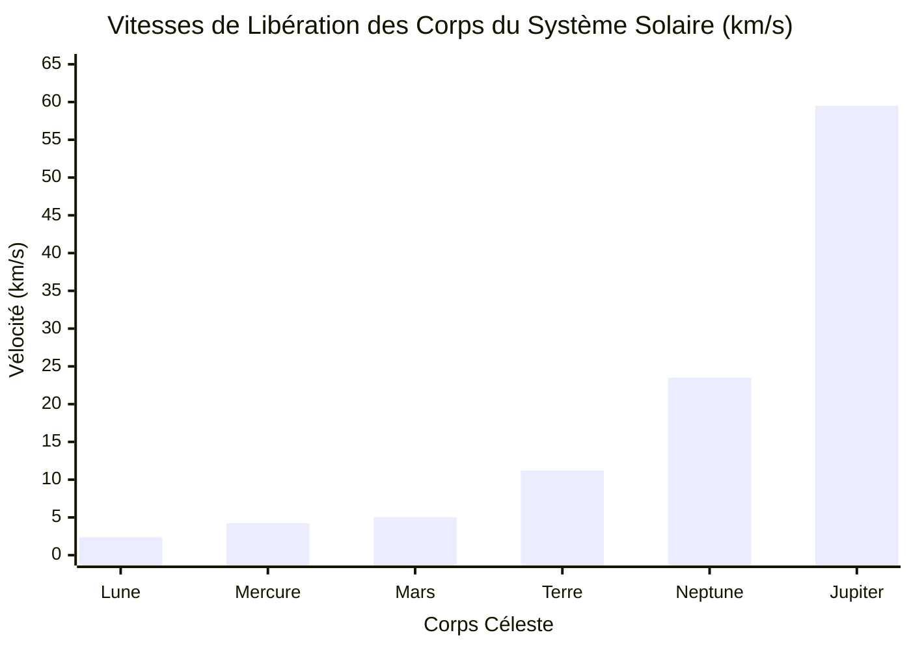

# Le Calculateur de Vélocité Ultime : Maîtriser la Vitesse, la Distance, le Temps et la Cinématique 1D

Bienvenue dans le guide et le **Calculateur de Vélocité** les plus complets, profondément interactifs et mathématiquement robustes disponibles aujourd'hui. Que vous soyez un étudiant en physique au lycée s'attaquant à ses premiers problèmes de cinématique, un ingénieur calculant les débits de transit, un athlète optimisant son rythme de sprint ou simplement un esprit curieux se demandant comment mesurer la vitesse d'un objet en chute libre, ce guide est fait pour vous. 

La vélocité est le battement de cœur même du mouvement. Elle dicte combien de temps il faut à la lumière pour nous parvenir du soleil, comment les avions naviguent dans les courants atmosphériques et comment les voitures freinent en toute sécurité aux intersections. Dans ce guide définitif de plus de 4 000 mots, nous allons décomposer les mathématiques complexes de la vélocité, explorer les différences cruciales entre la vitesse et la vélocité, fournir un guide d'utilisation complet de notre calculateur et parcourir cinq exemples conceptuels détaillés et visualisés à l'aide de diagrammes 2D. 

---

## 1. Le Concept Humain de la Vélocité : Une Explication Approfondie

Depuis l'aube de la civilisation humaine, la compréhension du mouvement a été une question de survie, d'exploration et de progrès. Les anciens chasseurs devaient estimer la vitesse de leurs proies et de leurs projectiles. Les premiers navigateurs polynésiens calculaient les vitesses moyennes à travers de vastes océans en utilisant uniquement les étoiles et le rythme des vagues. Mais ce n'est qu'avec la révolution scientifique — menée par des figures comme Galileo Galilei et Sir Isaac Newton — que le concept de vélocité a été formalisé dans le cadre mathématique strict que nous utilisons aujourd'hui.

### Vitesse vs. Vélocité : Le Grand Malentendu

Dans les conversations de tous les jours, vous pourriez entendre des gens dire « La vitesse de la voiture est de 60 miles par heure » et « La vélocité de la voiture est de 60 miles par heure » de manière interchangeable. Cependant, dans le domaine de la physique, commettre cette erreur s'apparente à confondre le poids avec la masse — ce sont des concepts fondamentalement différents.

**La Vitesse est une Grandeur Scalaire.**
Une grandeur scalaire est une mesure qui n'a qu'une magnitude (un nombre et une unité). Elle vous dit « à quelle vitesse » un objet se déplace, mais elle ne vous dit absolument rien sur l'endroit où cet objet va. Si vous avez les yeux bandés dans une voiture voyageant à 100 km/h, vous connaissez votre vitesse, mais vous ne connaissez pas votre destination. 

**La Vélocité est une Grandeur Vectorielle.**
Une grandeur vectorielle contient à la fois une magnitude *et* une direction. Elle vous dit « à quelle vitesse » ET « dans quel sens ». Si une voiture roule à 100 km/h vers le Nord, c'est sa vélocité. Si la voiture tourne à un coin de rue et commence à rouler à 100 km/h vers l'Est, sa *vitesse* est restée complètement constante, mais sa *vélocité* a fondamentalement changé car la direction a changé. 

Cette distinction devient incroyablement importante lors du calcul des moyennes. Si vous courez un tour sur une piste circulaire de 400 mètres en 60 secondes et que vous vous retrouvez exactement là où vous avez commencé :
- Votre **Vitesse Moyenne** est Distance / Temps = 400m / 60s = 6,67 m/s.
- Votre **Vélocité Moyenne** est Déplacement / Temps = 0m / 60s = 0 m/s. 

Étant donné que votre position de départ et votre position d'arrivée sont exactement les mêmes, votre déplacement net est nul, et par conséquent votre vélocité moyenne sur l'ensemble du trajet est nulle !

### Les Équations Fondamentales du Mouvement

À son niveau le plus fondamental, la vélocité moyenne ($v$) est calculée en divisant le changement de position (déplacement, $\Delta x$) par le changement de temps ($\Delta t$).

**L'Équation Fondamentale :**
$$ v = \frac{\Delta x}{\Delta t} = \frac{x_{final} - x_{initial}}{t_{final} - t_{initial}} $$

À partir de cette relation algébrique unique et élégante, nous pouvons dériver les deux autres variables principales. Si vous savez à quelle vitesse vous allez et combien de temps vous voyagez, vous pouvez trouver la distance :
**Équation de la Distance :**
$$ d = v \times t $$

Si vous savez jusqu'où vous devez aller et à quelle vitesse vous voyagez, vous pouvez trouver le temps que cela prendra :
**Équation du Temps :**
$$ t = \frac{d}{v} $$

### Vélocité Instantanée vs. Vélocité Moyenne

Si vous conduisez de New York à Boston (environ 215 miles) en 4 heures, votre vélocité moyenne est d'environ 53,75 mph vers le Nord-Est. Cependant, il est très peu probable que vous ayez conduit exactement à 53,75 mph pendant quatre heures consécutives. Vous vous êtes arrêté aux feux rouges (0 mph), avez accéléré sur l'autoroute (70 mph) et avez ralenti pour la circulation. 

Le compteur de vitesse de votre voiture n'affiche pas la vélocité moyenne ; il affiche la **vitesse instantanée** — votre vitesse à cette fraction de seconde exacte et infiniment petite. En calcul infinitésimal, la vélocité instantanée est définie comme la dérivée de la position par rapport au temps :
$$ v(t) = \lim_{\Delta t \to 0} \frac{\Delta x}{\Delta t} = \frac{dx}{dt} $$

Notre calculateur de vélocité est conçu pour gérer les vélocités moyennes et les scénarios de vélocité constante, offrant une base solide avant de passer à la cinématique accélérée.

---

## 2. Guide d'Utilisation Complet : Comment Utiliser le Calculateur de Vélocité

Notre Calculateur de Vélocité interactif est conçu pour être aussi intuitif qu'une calculatrice de poche mais aussi puissant qu'un moteur physique. Voici un guide étape par étape pour maximiser ses fonctionnalités.

### Étape 1 : Sélectionnez Votre Variable Cible
En haut du tableau de bord du calculateur, vous trouverez des options pour calculer la **Vélocité**, la **Distance**, ou le **Temps**. 
- Si vous essayez de savoir à quelle vitesse quelque chose allait, sélectionnez **Vélocité**. Vous serez invité à entrer la Distance et le Temps.
- Si vous voulez savoir quelle distance un train parcourra compte tenu de sa vitesse et de la durée de son trajet, sélectionnez **Distance**. 
- Si vous planifiez un voyage sur la route et que vous avez besoin de savoir combien de temps il faudra pour arriver à votre destination en fonction de votre vitesse moyenne, sélectionnez **Temps**.

### Étape 2 : Entrez Vos Valeurs Connues et Sélectionnez les Unités
Le calculateur dispose d'une conversion d'unités automatique et robuste. Vous n'avez pas besoin de convertir manuellement vos entrées avant d'utiliser l'outil. 
- Pour la **Distance**, vous pouvez entrer des valeurs en mètres (m), kilomètres (km), centimètres (cm), millimètres (mm), miles (mi), yards (yd), pieds (ft), pouces (in), ou même en milles marins (nmi).
- Pour le **Temps**, vous pouvez entrer des valeurs en secondes (s), millisecondes (ms), minutes (min), heures (h), jours, ou même en années.
- Pour la **Vélocité**, l'outil accepte les mètres par seconde (m/s), kilomètres par heure (km/h), miles par heure (mph), pieds par seconde (ft/s), nœuds, et Mach (vitesse du son).

Tapez simplement vos nombres dans les champs et utilisez les menus déroulants pour sélectionner vos unités. Le moteur interne convertit instantanément tout en unités SI standard (mètres et secondes) pour le calcul, garantissant une précision parfaite, puis traduit le résultat dans votre format de sortie souhaité.

### Étape 3 : Interprétez le Tableau de Bord des Résultats
Au moment où vous entrez votre deuxième variable, le calculateur met instantanément à jour le **Tableau de Bord des Résultats**. Vous n'obtiendrez pas seulement un seul chiffre ; le tableau de bord fournit :
- Le résultat principal calculé dans l'unité demandée.
- Un tableau de valeurs équivalentes (par exemple, si vous calculez 100 km/h, il vous affichera simultanément 62,1 mph, 27,7 m/s et 91,1 ft/s).
- L'énergie cinétique de l'objet (si vous passez à l'onglet avancé et entrez une masse).

### Étape 4 : Explorez les Visualisations Interactives
Faites défiler vers le bas jusqu'à la **Chronologie du Mouvement**. Ce graphique interactif trace visuellement le déplacement de l'objet dans le temps. Si vous avez calculé la vélocité, la pente de la ligne sur ce graphique représente la vitesse. Une pente plus raide signifie une vélocité plus élevée. Vous pouvez utiliser le curseur pour parcourir la chronologie et voir exactement où se trouvait l'objet à une seconde donnée.

### Étape 5 : Utilisez la Matrice de Comparaison
Vous êtes-vous déjà demandé comment votre vitesse calculée se compare à celle d'un guépard, d'un avion de ligne commercial ou à la vitesse du son ? La **Matrice de Comparaison** au bas de l'outil prend votre résultat et le trace sur une échelle logarithmique par rapport à des références connues, vous donnant un contexte tangible et concret pour les chiffres que vous calculez.

---

## 3. Cinq Exemples Conceptuels avec Visualisations 2D

Pour vraiment maîtriser la cinématique, il faut aller au-delà de l'insertion de nombres dans des équations et commencer à visualiser le mouvement. Ci-dessous, nous présentons cinq exemples conceptuels détaillés. Chaque exemple met en évidence un aspect différent de la vélocité, complet avec des décompositions mathématiques et des visualisations 2D Mermaid.js.

### Exemple 1 : Le Dilemme du Banlieusard (Calcul de la Vitesse Moyenne vs. Vélocité)

**Le Scénario :**
Sarah fait la navette pour aller au travail tous les jours. Son bureau est à 30 kilomètres à l'Est de sa maison. Le matin, la circulation est fluide et il lui faut 0,5 heure (30 minutes) pour atteindre le bureau. Le soir, la circulation aux heures de pointe est terrible et le trajet de retour lui prend 1,0 heure (60 minutes). Quelle est sa vitesse moyenne pour l'ensemble du trajet aller-retour, et quelle est sa vélocité moyenne ?

**Les Mathématiques :**
- **Trajet du Matin :** Distance = 30 km, Temps = 0,5 h. Vitesse = 30 / 0,5 = 60 km/h.
- **Trajet du Soir :** Distance = 30 km, Temps = 1,0 h. Vitesse = 30 / 1,0 = 30 km/h.
- **Distance Totale du Trajet Aller-Retour :** 30 km + 30 km = 60 km.
- **Temps Total du Trajet Aller-Retour :** 0,5 h + 1,0 h = 1,5 h.
- **Vitesse Moyenne :** Distance Totale / Temps Total = 60 km / 1,5 h = 40 km/h.

Remarquez que la vitesse moyenne (40 km/h) n'est PAS simplement la moyenne des deux vitesses ((60+30)/2 = 45 km/h) parce qu'elle a passé deux fois plus de temps à voyager à la vitesse la plus lente !

- **Vélocité Moyenne :** Déplacement Total / Temps Total.
Puisqu'elle a commencé à la maison et a fini à la maison, son déplacement total est de 0 km. 
Vélocité Moyenne = 0 km / 1,5 h = 0 km/h.

**Visualisation 2D :**
Le graphique suivant visualise le déplacement de Sarah dans le temps. Remarquez comment la pente est raide en allant au travail, et moins raide (et négative) en rentrant chez elle.

---

### Exemple 2 : Le Sprint d'Athlétisme (Conversion d'Unités pour le Contexte)

**Le Scénario :**
En 2009, Usain Bolt a établi le record du monde du 100 mètres avec un temps de 9,58 secondes. Bien que 9,58 secondes soit incroyablement rapide, les « mètres par seconde » ne se traduisent pas toujours intuitivement pour la personne moyenne qui conduit une voiture mesurée en mph ou en km/h. Calculons sa vélocité moyenne et convertissons-la.

**Les Mathématiques :**
- Distance ($d$) = 100 m
- Temps ($t$) = 9,58 s
- **Vélocité en m/s :** $v = d / t = 100 / 9,58 = 10,44 \text{ m/s}$.

Maintenant, convertissons cela en kilomètres par heure (km/h) et en miles par heure (mph).
- **En km/h :** Multipliez par 3,6. 
  $10,44 \times 3,6 = 37,58 \text{ km/h}$.
- **En mph :** Multipliez par 2,237.
  $10,44 \times 2,237 = 23,35 \text{ mph}$.

Bien que sa vitesse *moyenne* ait été de 23,35 mph, sa *vitesse de pointe instantanée* pendant la fraction de 60 à 80 mètres a en fait atteint un étonnant 27,78 mph (44,72 km/h) !

**Visualisation 2D :**
Le diagramme de flux suivant illustre le pipeline de conversion entre les unités de vélocité courantes, agissant comme une référence visuelle pour la logique interne de notre calculateur.

---

### Exemple 3 : La Poursuite sur l'Autoroute (Vélocité Relative)

**Le Scénario :**
Un braqueur de banque fuit les lieux sur une autoroute droite en direction de l'Est à une vitesse constante de 120 km/h. Une voiture de police s'engage sur l'autoroute à 10 kilomètres derrière le braqueur et le poursuit en direction de l'Est à une vitesse constante de 150 km/h. Combien de temps faudra-il à la police pour rattraper le braqueur, et quelle distance la police aura-t-elle parcourue pendant ce temps ?

**Les Mathématiques :**
Ce problème nécessite le concept de **Vélocité Relative**. Étant donné que les deux véhicules se déplacent dans la même direction, la vitesse à laquelle la voiture de police réduit l'écart est la différence entre leurs vitesses.

- $v_{braqueur} = 120 \text{ km/h}$
- $v_{police} = 150 \text{ km/h}$
- Distance de Séparation Initiale ($d$) = 10 km
- **Vélocité Relative ($v_{rel}$) :** $150 \text{ km/h} - 120 \text{ km/h} = 30 \text{ km/h}$.

La voiture de police réduit la distance à un rythme de 30 km/h. 
- **Temps pour rattraper ($t$) :** $t = d / v_{rel} = 10 \text{ km} / 30 \text{ km/h} = 0,333 \text{ heures}$ (ce qui correspond exactement à 20 minutes).

Pour savoir quelle distance la police a parcourue pendant ces 20 minutes :
- $d_{police} = v_{police} \times t = 150 \text{ km/h} \times 0,333 \text{ h} = 50 \text{ km}$.

La police rattrapera le braqueur après avoir parcouru 50 kilomètres.

**Visualisation 2D :**
Ce graphique montre la position absolue des deux véhicules au fil du temps. Le point où les deux lignes se croisent est le moment de la capture.

*(Remarque : La première ligne représente le braqueur commençant à 10km, la deuxième ligne représente la police commençant à 0km. Elles se croisent exactement à 0,333 heure à la marque des 50km).*

---

### Exemple 4 : L'Orage (Calcul de la Distance en Utilisant le Son et la Lumière)

**Le Scénario :**
Vous êtes assis sur votre porche et voyez un éclair. Exactement 4,5 secondes plus tard, vous entendez le coup de tonnerre. En supposant que la vitesse du son à la température ambiante actuelle est de 343 mètres par seconde, à quelle distance la foudre a-t-elle frappé ? 

**Les Mathématiques :**
La lumière voyage à environ $300 000 \text{ km/s}$. Pour des distances sur Terre, le temps qu'il faut à la lumière pour atteindre vos yeux est si infiniment petit que nous pouvons le considérer comme instantané (zéro seconde). Par conséquent, le délai de 4,5 secondes est entièrement dû au temps de trajet des ondes sonores.

- Vitesse du Son ($v$) = 343 m/s
- Délai de Temps ($t$) = 4,5 s
- **Distance ($d$) :** $d = v \times t = 343 \text{ m/s} \times 4,5 \text{ s} = 1543,5 \text{ mètres}$.

En convertissant en kilomètres, la foudre a frappé à environ **1,54 kilomètre** (ou un peu moins d'un mile). C'est la base scientifique de la vieille règle empirique qui consiste à « compter les secondes et diviser par 3 pour les kilomètres » ($4,5 / 3 = 1,5$).

**Visualisation 2D :**
Cette visualisation de la chronologie représente le délai entre l'événement (la frappe), l'arrivée de la lumière et la propagation de l'onde sonore.

---

### Exemple 5 : L'Exploration Spatiale et la Vitesse de Libération

**Le Scénario :**
Lorsque les ingénieurs conçoivent des fusées pour envoyer des sondes sur Mars ou dans le système solaire externe, ils ne calculent pas seulement une vélocité standard ; ils doivent atteindre la **Vitesse de Libération**. C'est la vitesse exacte requise pour qu'un objet surmonte l'attraction gravitationnelle d'une planète et s'aventure dans l'espace infini sans retomber. Si un vaisseau spatial est lancé depuis la Terre, quelle vitesse doit-il atteindre ? Et s'il était lancé depuis la Lune ?

**Les Mathématiques :**
La formule de la vitesse de libération ($v_e$) est dérivée de la conservation de l'énergie, en assimilant l'énergie cinétique à l'énergie potentielle gravitationnelle :
$$ v_e = \sqrt{\frac{2GM}{R}} $$
Où $G$ est la constante gravitationnelle universelle, $M$ est la masse de la planète, et $R$ est le rayon de la planète. 

Pour la Terre :
- Masse ($M$) $\approx 5,97 \times 10^{24} \text{ kg}$
- Rayon ($R$) $\approx 6,37 \times 10^6 \text{ m}$
- $v_e \approx 11,2 \text{ km/s}$ (environ 40 270 km/h ou 25 000 mph).

Pour la Lune :
- Masse ($M$) $\approx 7,34 \times 10^{22} \text{ kg}$
- Rayon ($R$) $\approx 1,74 \times 10^6 \text{ m}$
- $v_e \approx 2,38 \text{ km/s}$ (environ 8 500 km/h ou 5 300 mph).

Parce que la Lune est beaucoup moins massive, sa vitesse de libération est inférieure au quart de celle de la Terre. C'est pourquoi le module lunaire Apollo pouvait se relancer dans l'espace en utilisant un moteur d'ascension relativement petit, alors que la fusée Saturn V nécessaire pour quitter la Terre était un véritable monstre brûlant des milliers de gallons de carburant par seconde.

**Visualisation 2D :**
Le graphique à barres ci-dessous compare les vitesses de libération de divers corps planétaires dans le système solaire, soulignant l'immense énergie requise pour quitter des corps plus grands comme Jupiter.

---

## 4. L'Anatomie de la Cinématique : Pourquoi la Vélocité est-elle Importante ?

Comprendre la vélocité n'est pas seulement un exercice académique confiné aux salles de classe de physique ; c'est la mesure fondamentale qui dicte la logistique humaine, la sécurité et le progrès technologique. 

### Transport et Logistique
Dans la chaîne d'approvisionnement mondiale, le temps, c'est de l'argent. Les entreprises de logistique utilisent des calculs de vélocité avancés pour optimiser les itinéraires d'expédition à travers les océans et les autoroutes. Si un cargo voyage de Shanghai à Los Angeles (environ 10 400 km), une augmentation de la vitesse de 18 nœuds à 22 nœuds réduit le temps de transit de près de quatre jours. Cependant, la dynamique des fluides dicte que la résistance de l'eau augmente avec le carré de la vélocité, ce qui signifie que cette augmentation de vitesse de 22 % pourrait nécessiter une augmentation de 50 % de la consommation de carburant. L'ingénierie des transports est un casse-tête d'optimisation constant équilibrant la vélocité par rapport au coût.

### Sécurité Automobile et Énergie Cinétique
Pourquoi les zones scolaires sont-elles strictement limitées à 20 mph (32 km/h), alors que les autoroutes autorisent 70 mph (112 km/h) ? Tout se résume à la vélocité et à l'énergie cinétique. L'énergie cinétique ($E_k$) d'un objet en mouvement est calculée comme suit :
$$ E_k = \frac{1}{2} m v^2 $$
Remarquez que la vélocité ($v$) est au carré. Si vous doublez votre vitesse dans une voiture, vous ne doublez pas votre énergie cinétique — vous la **quadruplez**. 

Si une voiture roulant à 20 mph a besoin de 40 pieds pour freiner jusqu'à l'arrêt complet, cette même voiture roulant à 40 mph mettra environ 160 pieds pour s'arrêter, et une voiture à 80 mph prendra le chiffre étonnant de 640 pieds. Cette relation non linéaire est la raison pour laquelle les excès de vitesse sont extrêmement dangereux ; l'énergie qui doit être dissipée par vos freins (ou par les zones de déformation lors d'un accident) augmente de façon exponentielle avec la vélocité.

### L'Aviation et la Vitesse du Son
Les ingénieurs en aéronautique traitent la vélocité en trois dimensions, en tenant compte de la vitesse relative, de la vitesse au sol et des vents de travers. La barrière de vélocité la plus célèbre dans l'aviation est le **Mur du Son** (Mach 1). 
À mesure qu'un avion accélère vers la vitesse du son (environ 343 m/s au niveau de la mer), les molécules d'air devant lui ne peuvent pas s'écarter assez vite. Elles se compriment, formant une onde de choc massive. Lorsque Chuck Yeager a franchi le mur du son en 1947 dans le Bell X-1, ce fut un triomphe de l'ingénierie surmontant la traînée extrême et les turbulences associées aux vitesses transsoniques. Aujourd'hui, notre calculateur de vélocité inclut "Mach" comme unité pour vous permettre de comparer les vitesses quotidiennes à ce seuil historique.

### Vélocité Relativiste : La Limite de Vitesse Universelle
Dans la mécanique classique newtonienne, la vélocité s'additionne simplement. Si vous êtes dans un train se déplaçant à 100 km/h et que vous lancez une balle de baseball vers l'avant à 50 km/h, un observateur au sol voit la balle de baseball se déplacer à 150 km/h. 

Cependant, à mesure que nous approchons de la vitesse de la lumière ($c = 299 792 458 \text{ m/s}$), cette addition classique s'effondre. Selon la théorie de la relativité restreinte d'Albert Einstein, la vitesse de la lumière est absolue. Si vous êtes dans un vaisseau spatial voyageant à 99 % de la vitesse de la lumière et que vous allumez une lampe de poche pointant vers l'avant, la lumière ne voyage pas à 199 % de la vitesse de la lumière. Elle voyage exactement à la vitesse de la lumière. Pour compenser cela, le temps lui-même se dilate (ralentit) et la longueur se contracte pour l'observateur en mouvement. Bien que notre calculateur s'en tienne à la cinématique classique, il est impressionnant de savoir que la vélocité déforme fondamentalement le tissu de l'espace-temps.

---

## 5. Foire Aux Questions (FAQ) Détaillée

Nous avons compilé les questions les plus courantes concernant la vélocité, la vitesse et leurs applications. Cette section développe les brèves définitions fournies dans la zone de référence rapide du calculateur.

**Q : Peut-on avoir une vitesse négative ?**
**R :** Non. La vitesse est une grandeur scalaire, ce qui signifie qu'elle est une magnitude absolue. Vous ne pouvez pas voyager à -10 mph. Cependant, vous **pouvez** avoir une *vélocité* négative. Parce que la vélocité est un vecteur, un signe négatif indique simplement la direction par rapport à un système de coordonnées choisi. Si vous définissez le « Nord » comme positif, voyager vers le « Sud » à 10 mph serait exprimé mathématiquement par une vélocité de -10 mph.

**Q : Qu'est-ce que la vitesse terminale, et pourquoi un objet en chute libre arrête-t-il d'accélérer ?**
**R :** Si vous lâchez un centime du haut d'un gratte-ciel dans un vide parfait, il accélérera indéfiniment à 9,81 m/s² jusqu'à ce qu'il touche le sol. Cependant, sur Terre, l'atmosphère résiste. Plus un objet tombe vite, plus la résistance de l'air (la traînée) poussant vers le haut contre lui augmente. Finalement, la force ascendante de la traînée équivaut parfaitement à la force descendante de la gravité. La force nette devient nulle, ce qui signifie que l'accélération devient nulle. L'objet arrête d'accélérer et tombe à une vitesse maximale constante connue sous le nom de vitesse terminale. Pour un parachutiste humain tombant sur le ventre, cela représente environ 120 mph (193 km/h). Pour un objet lourd et compact comme une boule de bowling, la vitesse terminale est beaucoup plus élevée.

**Q : Si la Terre tourne sur elle-même et autour du soleil, pourquoi ne sentons-nous pas la vélocité ?**
**R :** Les humains ne peuvent pas sentir la vélocité ; nous ne pouvons sentir que *l'accélération* (les changements de vélocité). Lorsque vous êtes assis dans un avion commercial qui navigue en douceur à 500 mph, vous pouvez facilement vous verser une tasse d'eau parce que votre corps et l'avion se déplacent à une vélocité constante. Vous ne vous sentez poussé dans votre siège que lorsque l'avion accélère sur la piste. De même, la Terre tourne à environ 1 000 mph à l'équateur et orbite autour du soleil à une vitesse étonnante de 67 000 mph. Nous ne ressentons pas cette vitesse cosmique car il s'agit d'une vélocité presque constante, et nous nous déplaçons en même temps qu'elle.

**Q : Comment les radars de police mesurent-ils la vélocité d'une voiture ?**
**R :** Les radars de police utilisent **l'Effet Doppler**. Le radar émet un signal radio micro-ondes à une fréquence spécifique vers une voiture en mouvement. Le signal rebondit sur la voiture et revient au radar. Si la voiture se déplace vers le radar, les ondes de retour sont compressées (fréquence plus élevée). Si la voiture s'éloigne, les ondes sont étirées (fréquence plus basse). L'ordinateur interne du radar calcule la différence exacte de fréquence pour déterminer instantanément la vélocité du véhicule.

**Q : Pourquoi les astronomes utilisent-ils les « années-lumière » au lieu des kilomètres ?**
**R :** Une année-lumière est en fait une mesure de *distance*, et non de temps. Elle est définie par la vélocité : plus précisément, la distance que la lumière (voyageant à 299 792 km/s) parcourt en une année terrestre. Une année-lumière équivaut à environ 9,46 billions de kilomètres. L'univers est si incroyablement vaste que mesurer la distance qui nous sépare des autres étoiles en kilomètres donnerait des nombres trop grands pour être pratiques. L'étoile la plus proche de notre système solaire, Proxima Centauri, est à 4,24 années-lumière. Lorsque nous la regardons à travers un télescope, nous voyons la lumière qui l'a quittée il y a 4,24 ans ; nous regardons littéralement en arrière dans le temps, tout cela grâce à la vélocité finie de la lumière.

---

## 6. Utilisation du Calculateur de Vélocité pour l'Éducation

Pour les éducateurs et les étudiants, ce calculateur sert de bac à sable interactif. Voici quelques exercices à essayer :
1. **Le Lièvre et la Tortue :** Entrez une vélocité très lente (comme 0,05 m/s pour une tortue) et calculez combien de temps il lui faut pour parcourir 1 kilomètre. Calculez ensuite le temps pour un lièvre (15 m/s). 
2. **Géographie Mondiale :** La circonférence de la Terre est d'environ 40 075 km. Utilisez le calculateur pour déterminer combien de temps il faudrait pour faire le tour de l'équateur à une vitesse constante de 100 km/h (en supposant qu'un pont magique existe). 
3. **Son vs. Lumière :** Fixez la distance à 5 000 mètres. Calculez le temps qu'il faut à la lumière pour parcourir cette distance (v = 300 000 000 m/s), puis calculez le temps pour le son (v = 343 m/s). Cette différence flagrante illustre de manière frappante le délai entre l'éclair et le tonnerre.

En maîtrisant les relations entre la distance, le temps et la vitesse, vous gagnez une boîte à outils fondamentale pour déchiffrer le monde physique. Que vous cherchiez à réussir un examen de physique ou simplement à prédire votre heure d'arrivée prévue lors d'un voyage sur la route, la vélocité est la clé qui ouvre la mécanique de notre univers en mouvement. Utilisez ce calculateur fréquemment, expérimentez avec les conversions, et observez les chronologies visuelles pour construire une compréhension intuitive et durable de la cinématique.
