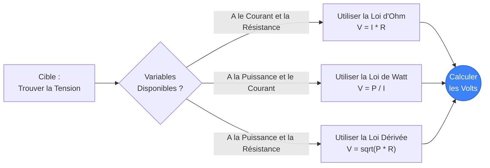
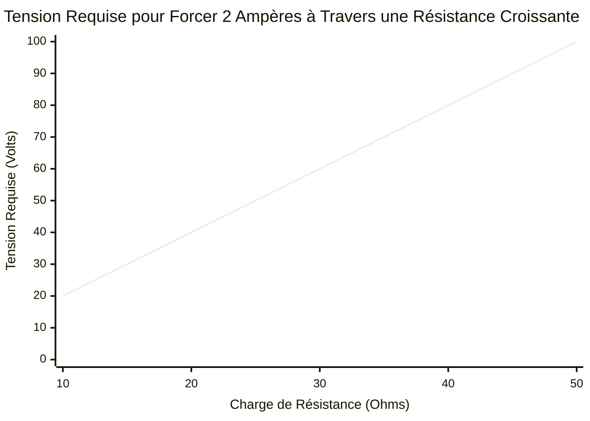
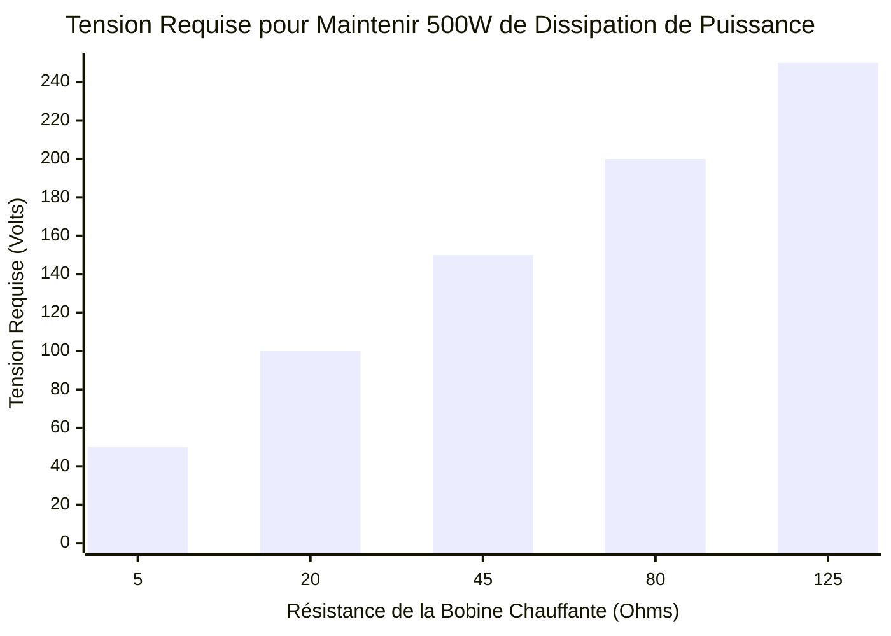
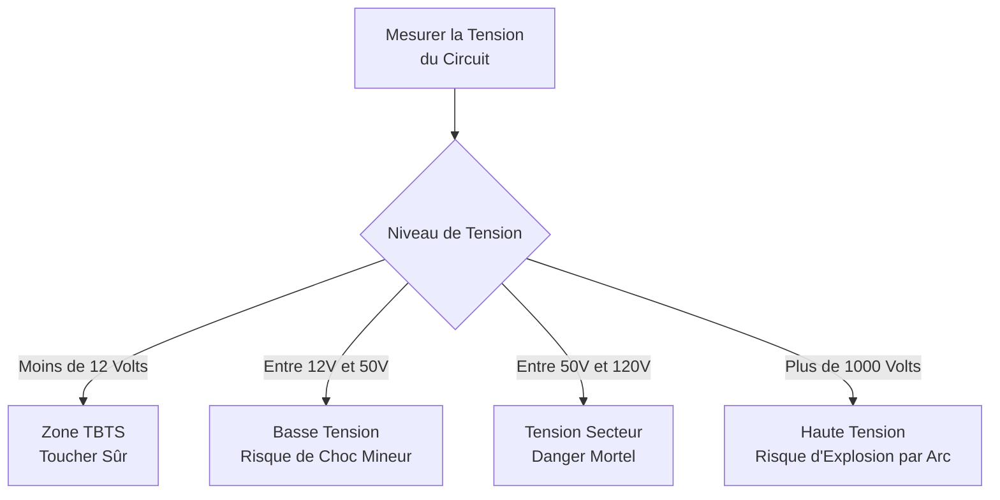

# Le Calculateur de Tension Définitif : Maîtriser le Potentiel Électrique et la Pression du Circuit

Bienvenue dans l'ultime **Calculateur de Tension** et guide complet de physique. Que vous soyez un ingénieur en systèmes embarqués essayant d'abaisser une alimentation industrielle bruitée de $24\text{V}$ pour un microcontrôleur sensible de $5\text{V}$, un maître électricien vérifiant la chute de tension du réseau résidentiel de $120\text{V}$, ou un amateur vérifiant l'état de charge d'une batterie LiPo, cette suite interactive fournit les dérivations mathématiques exactes dont vous avez besoin.

La tension est la force motrice fondamentale de toute l'électronique. Sans tension, les électrons ne bougent pas, le courant ne circule pas et la puissance n'est jamais transférée.

Dans ce guide SEO exhaustif de plus de 4 000 mots, nous allons déconstruire agressivement la physique de la Différence de Potentiel Électrique, explorer les limites mathématiques de la Loi d'Ohm ($V = R \cdot I$) et de la Loi de Watt ($V = P/I$), décoder les normes de sécurité internationales pour la Haute Tension (HT) et analyser cinq scénarios électriques détaillés représentés visuellement par des diagrammes Mermaid.js interactifs.

---

## 1. Qu'est-ce qu'exactement la Tension ? (La Définition Physique)

La **Tension**, scientifiquement appelée *Différence de Potentiel Électrique* ou *Force Électromotrice (FEM)*, est la "pression" fondamentale qui pousse la charge électrique à travers une boucle conductrice.

Pour comprendre intuitivement la Tension, les ingénieurs électriciens s'appuient universellement sur l'**Analogie de la Conduite d'Eau** :
- Imaginez un château d'eau massif. La hauteur physique du château d'eau dicte la pression d'eau gravitationnelle au fond.
- **La Tension est la Pression de l'Eau.**
- Si vous avez une ligne de transmission massive de $500 000\text{V}$, vous avez une quantité stupéfiante de "pression" électrique essayant violemment de pousser des électrons à travers tout chemin disponible vers la terre.
- Si vous avez une petite pile AA de $1,5\text{V}$, vous avez une pression très faible, capable seulement de pousser un filet d'électrons à travers une petite LED.

L'unité SI officielle pour la Tension est le **Volt ($\text{V}$)**, nommé d'après le physicien italien pionnier Alessandro Volta. En termes thermodynamiques stricts, $1\text{ Volt}$ est défini comme la quantité de potentiel électrique qui exige exactement $1\text{ Joule}$ de travail pour déplacer exactement $1\text{ Coulomb}$ de charge électrique. ($1\text{V} = 1\text{J} / 1\text{C}$).

---

## 2. Dériver la Tension à partir de la Loi d'Ohm ($V = I \cdot R$)

Georg Simon Ohm a prouvé que la Tension est mathématiquement verrouillée dans une relation à trois avec le Courant ($I$) et la Résistance ($R$).

$$V = I \cdot R$$

Cela signifie que vous pouvez facilement calculer la chute de tension aux bornes de n'importe quel composant si vous connaissez le courant qui le traverse et sa résistance inhérente.
- **Si la Résistance augmente** mais que le Courant reste le même, la Chute de Tension aux bornes de ce composant doit avoir augmenté.
- **Si le Courant augmente** mais que la Résistance reste la même, la Chute de Tension doit augmenter proportionnellement.

Cette relation mathématique exacte est le fonctionnement des "Diviseurs de Tension". En plaçant deux résistances en série, vous pouvez intentionnellement faire "chuter" une quantité spécifique de tension aux bornes de la première résistance, laissant une tension parfaitement inférieure et abaissée disponible pour le reste de votre circuit.

---

## 3. Dériver la Tension à partir de la Loi de Watt ($V = P / I$)

Alors que la Loi d'Ohm dicte le flux d'électrons, la Loi de Watt dicte la puissance thermodynamique de sortie.

$$P = V \cdot I$$

En isolant algébriquement la Tension ($V$), nous obtenons deux formules d'ingénierie incroyablement puissantes :
1. **Tension dérivée de la Puissance et du Courant :** $V = \frac{P}{I}$
2. **Tension dérivée de la Puissance et de la Résistance :** $V = \sqrt{P \cdot R}$

Ces formules sont essentielles pour calculer la tension de fonctionnement des appareils lorsque vous ne connaissez que leur Puissance en Watts. Par exemple, si vous savez qu'un énorme radiateur industriel dissipe $4 600\text{ Watts}$ de chaleur, et que sa bobine de chauffage interne a exactement $50\ \Omega$ de résistance, vous pouvez instantanément calculer qu'il nécessite un réseau industriel de $480\text{V}$ pour fonctionner : $V = \sqrt{4600 \cdot 50} = \sqrt{230000} \approx 480\text{V}$.

---

## 4. Comprendre la Tension AC vs DC

La Tension se manifeste dans deux formats complètement distincts en fonction de la source de génération d'énergie :

### Courant Continu (DC)
Dans les systèmes DC (batteries, panneaux solaires, chargeurs USB), la Tension est constante. Elle agit comme une pompe à eau poussant régulièrement dans une seule direction. Une batterie de voiture de $12\text{V}$ poussera continuellement $12\text{V}$ sur une ligne parfaitement plate jusqu'à ce que la chimie de la batterie s'épuise physiquement.

### Courant Alternatif (AC)
Dans les systèmes AC (prises murales, pylônes de réseau, alternateurs), la Tension est hautement dynamique. Elle agit comme un piston, poussant et tirant. La Tension monte continuellement jusqu'à un pic positif, tombe à zéro, puis s'inverse vers un pic négatif, généralement $50$ à $60$ fois par seconde ($50\text{Hz}$ / $60\text{Hz}$).
Parce que la Tension AC change constamment, les ingénieurs utilisent **RMS (Root Mean Square ou Valeur Efficace)** pour la décrire. Lorsque vous branchez une lampe dans une prise américaine standard de "$120\text{V}$", $120\text{V}$ n'est que la moyenne RMS. L'onde de tension AC réelle grimpe constamment jusqu'à un pic violent de près de $170\text{V}$ !

---

## 5. Les Niveaux de Sécurité de Tension Internationaux

La tension est ce qui brise la résistance électrique naturelle de la peau humaine. Plus la tension est élevée, plus il est facile pour un courant mortel de transpercer votre épiderme et d'arrêter votre cœur. C'est pourquoi les organismes de réglementation internationaux classent strictement les niveaux de tension :

1. **TBTS (Très Basse Tension de Sécurité - Moins de $12\text{V}$) :** Cette tension manque de pression pour pénétrer la peau humaine. Vous pouvez toucher physiquement les bornes d'une pile $9\text{V}$ ou d'un câble USB $5\text{V}$ avec un risque d'électrocution nul.
2. **Basse Tension ($50\text{V}$ à $1 000\text{V}$) :** Cela couvre vos prises murales résidentielles standard de $120\text{V}$ et $230\text{V}$. Elle a absolument assez de pression pour pénétrer la peau et délivrer des courants mortels. Une épaisse isolation en caoutchouc est imposée par la loi.
3. **Haute Tension ($1 000\text{V}$ à $35 000\text{V}$) :** Utilisée dans les lignes de distribution de quartier. Cette tension est si élevée qu'elle peut réellement "former un arc" ou sauter dans l'air. Vous n'avez même pas besoin de toucher le fil ; si vous vous approchez à quelques centimètres, la tension ionisera l'air et vous frappera comme un éclair.
4. **Très Haute Tension (Plus de $35 000\text{V}$) :** Utilisée dans les pylônes de transmission massifs à travers le pays (souvent $500 000\text{V}$). La distance d'arc est terrifiante, nécessitant d'énormes isolateurs en verre et des hauteurs de pylônes extrêmes pour empêcher la tension de sauter directement dans le sol.

---

## 6. Guide d'Utilisation Complet : Maximiser le Calculateur

Notre Calculateur de Tension interactif fonctionne comme un multimètre numérique avancé, vous permettant de basculer de manière fluide entre les dérivées de la Loi d'Ohm et de la Loi de Watt.

### Étape 1 : Sélectionnez Vos Variables Connues
Utilisez les onglets de navigation supérieurs pour sélectionner les variables que vous possédez actuellement :
- **Courant & Résistance Donnés ($V = I \cdot R$) :** Parfait pour la conception standard de cartes de circuits imprimés.
- **Puissance & Courant Donnés ($V = P / I$) :** Parfait pour dimensionner les alimentations électriques.
- **Puissance & Résistance Données ($V = \sqrt{P \cdot R}$) :** Idéal pour l'analyse des éléments chauffants.

### Étape 2 : Utilisez les Préréglages de Batteries & Systèmes
Si vous concevez un circuit autour d'une source d'alimentation réelle standard, cliquez simplement sur l'un de nos 13 préréglages. La sélection de la **Batterie de Voiture $12\text{V}$** ou du **Chargeur USB-C PD $20\text{V}$** préchargera instantanément les paramètres de tension exacts et cartographiera automatiquement les courbes de sortie dynamiques pour votre référence.

### Étape 3 : Surveillez le Voltmètre Numérique Animé
Au fur et à mesure que vous ajustez les entrées, regardez l'écran LCD du multimètre numérique réagir de manière dynamique. La jauge à aiguille intégrée est fortement codée par couleur en fonction des Niveaux de Sécurité Internationaux. Si votre tension calculée dépasse $50\text{V}$, la jauge passera dans les zones de danger Orange/Rouge, vous avertissant visuellement que le circuit nécessite une stricte conformité de sécurité OSHA et une forte isolation des fils.

---

## 7. Cinq Scénarios d'Ingénierie Conceptuels avec Visualisations 2D

Pour maîtriser pleinement les relations mathématiques de la Tension, nous allons explorer cinq scénarios physiques distincts, décomposés visuellement à l'aide de diagrammes Mermaid.js personnalisés.

### Exemple 1 : Les Dérivations Algébriques de la Tension

**Le Scénario :**
Un étudiant en ingénierie a besoin d'une visualisation rapide de la manière dont la Tension peut être mathématiquement extraite du Courant ($I$), de la Résistance ($R$) et de la Puissance ($P$) à travers différents ensembles de problèmes.

**Visualisation 2D :**
Cet organigramme logique cartographie les trois voies mathématiques distinctes pour calculer la Tension en fonction des variables connues fournies lors d'un examen.

---

### Exemple 2 : Tension Linéaire vs Résistance (Courant Constant)

**Le Scénario :**
Vous avez un pilote de LED à courant constant qui force exactement $2\text{A}$ de courant à travers un circuit, quelle que soit la charge. Si vous remplacez différentes résistances, quelle pression de Tension l'alimentation doit-elle générer pour maintenir ce flux de $2\text{A}$ ?

**Les Mathématiques :**
Puisque $I = 2$, $V = 2 \cdot R$.
- À $10\ \Omega$ : $V = 2 \cdot 10 = 20\text{V}$
- À $50\ \Omega$ : $V = 2 \cdot 50 = 100\text{V}$

**Visualisation 2D :**
Ce graphique trace la ligne caractéristique parfaitement droite d'une source de courant constant augmentant de force la tension pour surmonter la résistance croissante.

---

### Exemple 3 : La Courbe de Tension Racine Carrée (Puissance Constante)

**Le Scénario :**
Vous concevez un radiateur industriel qui doit produire exactement $500\text{W}$ de puissance thermique. Vous testez différentes bobines de chauffage à résistance. Quelle tension est requise pour chaque bobine afin d'atteindre exactement $500\text{W}$ ?

**Les Mathématiques :**
Nous utilisons la formule dérivée $V = \sqrt{P \cdot R}$. Puisque $P = 500$, $V = \sqrt{500 \cdot R}$.
- À $5\ \Omega$ : $V = \sqrt{2500} = 50\text{V}$
- À $20\ \Omega$ : $V = \sqrt{10000} = 100\text{V}$

**Visualisation 2D :**
Contrairement au graphique linéaire de la Loi d'Ohm, ce graphique à barres démontre la courbe racine carrée agressive requise pour maintenir une puissance constante lorsque la résistance change.

---

### Exemple 4 : Sécurité de la Tension et Classification de l'Isolation

**Le Scénario :**
Un inspecteur de la sécurité industrielle catégorise divers systèmes électriques à l'intérieur d'une usine pour déterminer quels fils nécessitent une forte isolation en caoutchouc et des plaques d'avertissement.

**Visualisation 2D :**
Cet organigramme descendant catégorise strictement les systèmes électriques courants en fonction de leur potentiel de risque d'électrocution.

---

### Exemple 5 : Calendrier d'Audit de Chute de Tension en Usine

**Le Scénario :**
Un maître électricien a été engagé pour auditer une usine massive pour "Chute de Tension". Lorsque des fils sont tirés sur des centaines de pieds, la résistance interne du fil de cuivre lui-même fait chuter la tension avant même qu'elle n'atteigne les machines.

**Visualisation 2D :**
Ce diagramme de Gantt décrit le programme de tests rigoureux sur le terrain pour mesurer la chute de tension depuis le panneau de disjoncteurs principal jusqu'au bras robotique le plus éloigné sur la chaîne de montage.

```mermaid
gantt
    title Calendrier d'Audit de Chute de Tension en Usine
    dateFormat  HH:mm:ss
    axisFormat  %H:%M:%S
    
    section Audit du Panneau
    Mesurer Tension du Disjoncteur Principal :done, 00:00:00, 30s
    Enregistrer Base à 480V :active, 00:00:30, 15s
    
    section Audit Terrain
    Marcher vers le Robot le plus Éloigné :active, 00:00:45, 45s
    Mesurer la Tension à l'Entrée du Robot :crit, 00:01:30, 30s
    
    section Analyse
    Calculer la Résistance Totale du Câble :active, 00:02:00, 30s
    Déterminer si la Chute est sous 3 Pourcent :milestone, 00:02:30, 10s
```

---

## 8. Conclusion et Défi d'Ingénierie

La maîtrise de la Tension est la première étape obligatoire vers la domination de l'ingénierie électrique. Chaque batterie que vous utilisez, chaque câble USB que vous branchez, et chaque prise murale avec laquelle vous interagissez fonctionne selon les lois mathématiques strictes et impitoyables de la Différence de Potentiel Électrique.

Si vous respectez la Tension et calculez vos paramètres avec précision, vos circuits fonctionneront parfaitement à froid et efficacement. Si vous sous-estimez la Tension, vous risquez des condensateurs grillés, du silicium fondu et un emballement thermique catastrophique.

Pour garantir que vous avez maîtrisé ces concepts, lancez notre Simulateur interactif et tentez de résoudre ces défis finaux :
1. **La Longue Rallonge :** Un entrepreneur utilise une rallonge massive de $300\text{ pieds}$ avec une résistance interne totale du fil de $4\ \Omega$. Sa scie circulaire tire un courant lourd de $15\text{A}$. Calculez la Chute de Tension exacte perdue dans le cordon ($V = I \cdot R$). Sa scie aura-t-elle assez de tension restante de la prise de $120\text{V}$ pour fonctionner ?
2. **Le Radiateur :** Un radiateur d'appoint industriel de $4 600\text{W}$ a une bobine chauffante avec exactement $50\ \Omega$ de résistance. Calculez la Tension requise pour l'alimenter en utilisant $V = \sqrt{P \cdot R}$.
3. **Le Microcontrôleur :** Vous avez un microcontrôleur Arduino de $5\text{V}$ qui consomme $0,25\text{W}$ de puissance. Calculez exactement combien de Courant ($I$) il tire du port USB.

Fiez-vous à ce calculateur pour vérifier vos calculs, respectez les limites de sécurité internationales et rappelez-vous toujours : la Tension est la pression qui donne vie à vos circuits.
