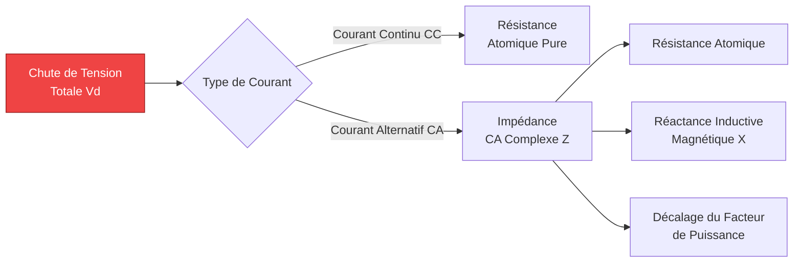
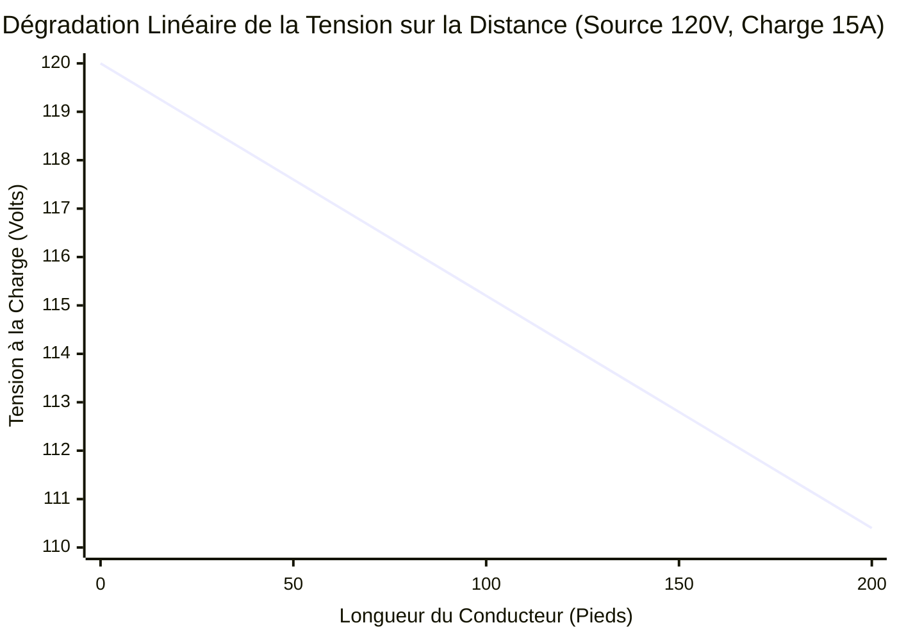
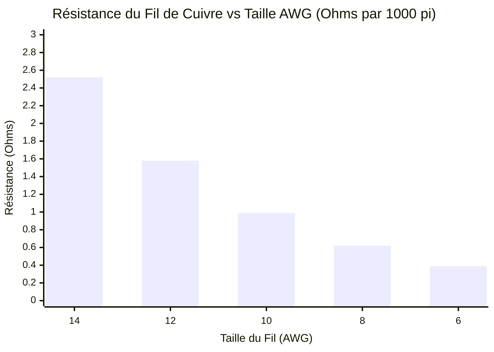
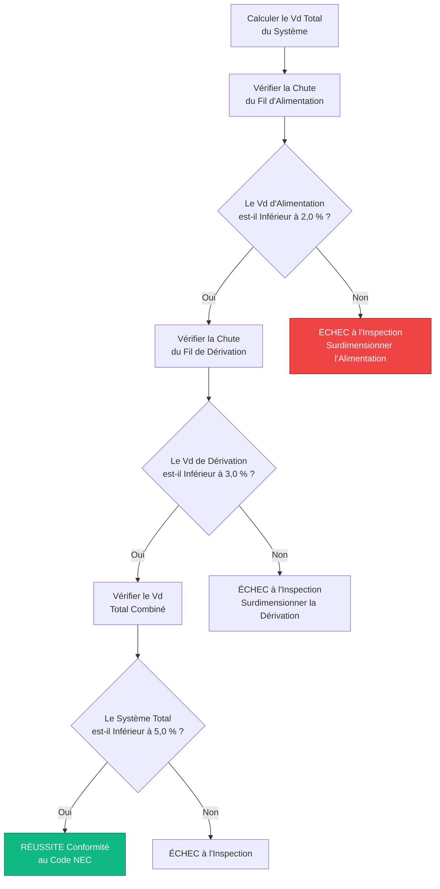
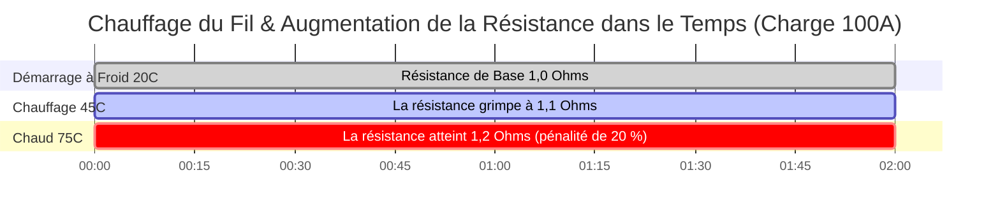

# Le Calculateur Ultime de Chute de Tension : Dimensionnement des Fils, Conformité NEC et Physique CA/CC

Bienvenue dans le **Calculateur de Chute de Tension** définitif et la classe de maître en ingénierie. Que vous soyez un électricien tentant de dimensionner correctement les câbles d'alimentation pour satisfaire aux strictes limitations de l'article 210 du National Electrical Code (NEC), un ingénieur solaire photovoltaïque concevant de longs câblages en chaîne CC pour minimiser les pertes des contrôleurs de charge, ou un technicien automobile dépannant un câblage de treuil 12 V défaillant, maîtriser la physique de la chute de tension est obligatoire.

La chute de tension est le tueur silencieux des systèmes électriques. Elle étouffe les démarreurs, déclenche des arrêts d'onduleurs pour basse tension, crée une chaleur thermique dangereuse à l'intérieur des murs et réduit agressivement l'efficacité des systèmes d'éclairage. 

Dans ce guide SEO exhaustif de plus de 4 000 mots, nous allons déconstruire agressivement la physique de $V_{drop}$, explorer les graves différences entre la résistance CC et la réactance inductive CA, détailler les effets mathématiques de la température des conducteurs ($75^\circ\text{C}$ contre $90^\circ\text{C}$) et décoder la logique exacte derrière les seuils de conformité NEC de 3 % et 5 %. Pour cimenter ces concepts, nous avons inclus cinq diagrammes interactifs Mermaid.js méticuleusement détaillés et compatibles avec les analyseurs syntaxiques.

---

## 1. Qu'est-ce que la Chute de Tension Exactement ?

La **Chute de tension** ($V_{drop}$) est la perte mesurable de potentiel électrique (Volts) lorsque le courant se déplace d'une source d'alimentation vers une charge. 

Selon la physique fondamentale, aucun fil n'est un conducteur parfait. Même le cuivre pur et l'argent possèdent une résistance atomique interne. Lorsque le courant électrique (Ampères) est forcé à travers cette résistance interne (Ohms), la loi d'Ohm dicte qu'une tension est consommée :
$$V = I \cdot R$$

Si votre source d'alimentation produit $120\text{V}$, et que les $100\text{ pieds}$ de fil de cuivre la reliant à votre charge consomment $4\text{V}$ de potentiel pour pousser les électrons, votre appareil ne recevra que $116\text{V}$. 

L'énergie perdue dans le fil ne disparaît pas ; elle est violemment convertie en énergie thermique (chaleur) selon la physique de l'effet Joule ($P_{loss} = I^2 \cdot R$). Si la chute de tension est trop importante, le fil fera fondre sa propre isolation et déclenchera un incendie électrique.

---

## 2. Les Formules Universelles de Chute de Tension

Les mathématiques requises pour calculer la perte de fil dépendent entièrement du type de circuit électrique. Les circuits à courant continu (CC) ne luttent que contre la résistance atomique, tandis que les circuits à courant alternatif (CA) doivent également combattre la réactance inductive électromagnétique ($X$) et les déphasages du facteur de puissance ($\cos\phi$).

### Circuits CC à 2 Fils
Pour les câbles de batterie, les panneaux solaires et le câblage automobile, le circuit se compose de deux fils (positif et négatif). Par conséquent, le courant doit parcourir la distance complète *deux fois* (aller et retour).
$$V_{drop} = 2 \cdot I \cdot R_{\text{one-way}}$$

### Circuits CA Monophasés (120 V / 240 V)
Pour les prises murales et les appareils résidentiels, nous devons tenir compte de l'impédance CA du fil ($Z$), qui combine la résistance CC avec la résistance magnétique du courant alternatif alternant $60\text{ fois}$ par seconde.
$$V_{drop} = 2 \cdot I \cdot L \cdot (R \cos\phi + X \sin\phi)$$

### Circuits CA Triphasés (480 V L-L)
Pour les charges massives de moteurs commerciaux et industriels, les mathématiques triphasées introduisent la constante de la racine carrée de 3.
$$V_{drop} = \sqrt{3} \cdot I \cdot L \cdot (R \cos\phi + X \sin\phi)$$

*(Où $L$ est la distance, $R$ est la Résistance par unité de longueur, $X$ est la Réactance par unité de longueur, et $\cos\phi$ est le Facteur de Puissance de la charge).*

---

## 3. Les Limites de Conformité du National Electrical Code (NEC)

Le NEC n'exige pas légalement des limites strictes de chute de tension pour des raisons de sécurité (les règles de capacité de courant des fils gèrent la sécurité incendie), mais il *recommande* agressivement des limites strictes pour l'efficacité et la longévité des équipements.

### La Règle des 3 % / 5 % du NEC (Note d'information 210.19)
- **Circuits de dérivation :** La chute de tension maximale autorisée pour le circuit de dérivation (le fil allant du panneau de disjoncteurs à la prise murale) ne doit pas dépasser **3,0 %**.
- **Système Total (Alimentation + Dérivation) :** La chute de tension totale depuis le compteur de service principal, à travers les alimentations du sous-panneau, et jusqu'à la prise finale ne doit pas dépasser **5,0 %**.

**Exemple :**
Pour une prise résidentielle standard de $120\text{V}$, une limite de chute de tension de $3\%$ signifie que le fil ne peut pas perdre plus de $3,6\text{V}$. L'appareil doit recevoir au moins $116,4\text{V}$ pour fonctionner efficacement. 

Si vous installez un circuit de $20\text{A}$ vers un garage détaché situé à $150\text{ pieds}$, un fil standard 12 AWG échouera lamentablement à ce test. Vous serez mathématiquement contraint de surdimensionner le fil pour un gros 10 AWG ou même 8 AWG juste pour satisfaire à la limite de chute de tension de 3 %.

---

## 4. Le Danger Extrême des Systèmes 12 V Automobiles et Solaires

La chute de tension est considérablement plus dangereuse dans les systèmes CC basse tension (comme les batteries de VR 12 V et le câblage automobile) que dans les systèmes résidentiels haute tension de 120 V. 

**Les Mathématiques de la Perte Proportionnelle :**
Perdre $3\text{V}$ de potentiel sur une ligne de $120\text{V}$ est une perte microscopique de **2,5 %**. Les lumières baisseront à peine.
Perdre $3\text{V}$ de potentiel sur un treuil automobile de $12\text{V}$ est une perte massive de **25,0 %** ! 

Si un démarreur 12 V ne reçoit que $9\text{V}$, il perdra son couple magnétique, tirera des ampères exponentiellement plus élevés pour compenser et brûlera rapidement ses enroulements de cuivre internes. C'est pourquoi les câbles de démarrage de batterie automobile sont si incroyablement épais (2 AWG ou 0 AWG) ; ils doivent minimiser la résistance avec $300\text{ Ampères}$ de courant.

---

## 5. Facteur de Correction de Température du Conducteur ($\alpha$)

Les électriciens ignorent couramment la température, en supposant que la résistance du fil est statique. C'est un échec d'ingénierie critique. 
À mesure que le fil de cuivre chauffe sous une forte charge ou dans un grenier chaud ($90^\circ\text{C}$), les vibrations atomiques à l'intérieur du métal entravent physiquement le flux d'électrons, augmentant radicalement la résistance du fil.

**La Formule de la Résistance Thermique :**
$$R_{hot} = R_{cold} \cdot [1 + \alpha (T_{hot} - T_{cold})]$$
Pour le cuivre, le coefficient de température ($\alpha$) est de $0,00393$.

Un fil de cuivre fonctionnant à une température torride de $75^\circ\text{C}$ à l'intérieur d'un conduit a une **résistance 21 % plus élevée** qu'un fil situé à une température ambiante fraîche de $20^\circ\text{C}$. Notre calculateur avancé intègre agressivement cette pénalité thermique pour s'assurer que vos câbles ne tombent pas en panne sous les pics de charge estivaux.

---

## 6. Cinq Scénarios d'Ingénierie Conceptuelle avec Visualisations 2D

Pour maîtriser pleinement les relations mathématiques régissant la perte de tension, nous allons explorer cinq scénarios électriques distincts décomposés visuellement à l'aide de diagrammes personnalisés Mermaid.js.

### Exemple 1 : La Physique de la Chute de Tension

**Le Scénario :**
Un apprenti électricien a besoin de comprendre exactement comment le potentiel électrique est détruit par les phénomènes physiques à l'intérieur du fil.

**Visualisation 2D :**
Cet organigramme logique sépare la résistance atomique CC de la réactance électromagnétique CA plus complexe et des pénalités de facteur de puissance.

---

### Exemple 2 : Dégradation de la Tension sur la Distance

**Le Scénario :**
Un installateur solaire pose $200\text{ pieds}$ de fil 10 AWG vers une pompe de puits éloignée. Il a besoin de visualiser la rapidité avec laquelle la tension chute à mesure que le fil s'allonge.

**Les Mathématiques :**
Parce que $V_{drop} = I \cdot R$ et que la résistance est directement proportionnelle à la longueur, la tension chute de manière parfaitement linéaire sur la distance.

**Visualisation 2D :**
Ce graphique trace la ligne parfaitement droite de la dégradation de la tension à mesure que la longueur du fil s'étend de $0$ à $200\text{ pieds}$.

---

### Exemple 3 : Taille AWG vs Résistance du Conducteur

**Le Scénario :**
Un ingénieur essaie de convaincre un client de passer d'un fil 12 AWG à un fil beaucoup plus épais de 8 AWG pour résoudre un grave problème de chute de tension.

**Les Mathématiques :**
Le système American Wire Gauge (AWG) est logarithmique. Des nombres inférieurs signifient un fil radicalement plus épais et une résistance agressivement plus faible.

**Visualisation 2D :**
Ce graphique à barres démontre la chute massive et inverse des Ohms par $1000\text{ pieds}$ au fur et à mesure que vous augmentez l'épaisseur du fil, d'un fin 14 AWG jusqu'à un épais 6 AWG.

---

### Exemple 4 : Logique de Conformité au Code NEC

**Le Scénario :**
Un inspecteur en électricité examine des plans pour s'assurer qu'un nouveau circuit de dérivation commercial et l'alimentation d'un sous-panneau satisfont aux strictes limites du NEC $210.19$.

**Visualisation 2D :**
Cet organigramme descendant cartographie les vérifications mathématiques exactes requises pour réussir une inspection électrique pour une efficacité maximale.

---

### Exemple 5 : Accumulation de la Résistance Thermique

**Le Scénario :**
Un moteur à fort ampérage tire un courant important, chauffant lentement le fil de cuivre à l'intérieur d'un conduit scellé d'un froid $20^\circ\text{C}$ jusqu'à un torride $75^\circ\text{C}$.

**Visualisation 2D :**
Ce diagramme de Gantt décrit l'augmentation régulière et terrifiante de la chute de tension à mesure que la chaleur thermique augmente la résistance atomique du cuivre sur plusieurs heures de charge continue.

---

## 7. Conclusion et Défi d'Ingénierie

Maîtriser la physique de la Chute de Tension est la clé absolue pour concevoir des systèmes électriques sûrs, conformes aux codes et hautement efficaces. Si vous ignorez les mathématiques de la résistance des fils, vos moteurs surchaufferont, vos lumières LED scintilleront, vos panneaux solaires gaspilleront leur récolte et vos panneaux de disjoncteurs agiront comme d'énormes radiateurs.

N'oubliez jamais : surdimensionner le calibre de votre fil est une dépense initiale qui rapporte d'énormes dividendes en termes d'efficacité énergétique à long terme et de longévité des équipements.

Pour garantir que vous avez maîtrisé ces concepts, lancez notre Simulateur interactif et tentez de résoudre ces derniers défis :
1. **La Longue Course :** Vous devez pousser $15\text{A}$ à $120\text{V}$ vers un cabanon situé à $250\text{ pieds}$. Calculez le Pourcentage de Chute de Tension exact en utilisant un fil 10 AWG. Cela passe-t-il la règle des 3 % du NEC ?
2. **Le Treuil :** Un treuil de Jeep 12 V tire $400\text{A}$ à charge maximale. Si la batterie est à $6\text{ pieds}$ ($12\text{ pieds}$ de boucle totale), quel câble AWG est requis pour maintenir la chute de tension en dessous de $0,5\text{V}$ ?
3. **La Pénalité Thermique :** Un câble d'alimentation commercial en cuivre chute de $4,0\text{V}$ à température ambiante ($20^\circ\text{C}$). Recalculez la chute lorsque le fil atteint sa température nominale maximale de $90^\circ\text{C}$.

Fiez-vous à ce calculateur pour revérifier vos calculs, auditer le dimensionnement de vos fils et vous assurer en tout temps que vos charges électriques reçoivent l'énergie qu'elles méritent mathématiquement.
