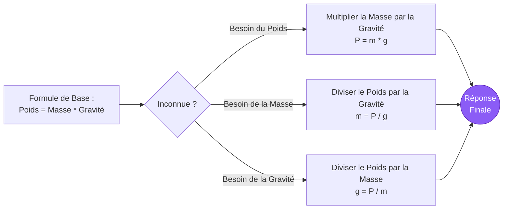
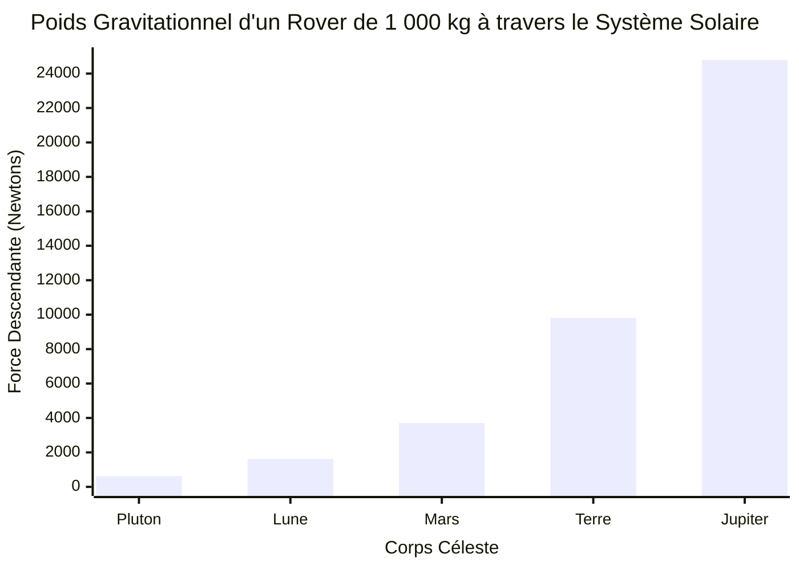
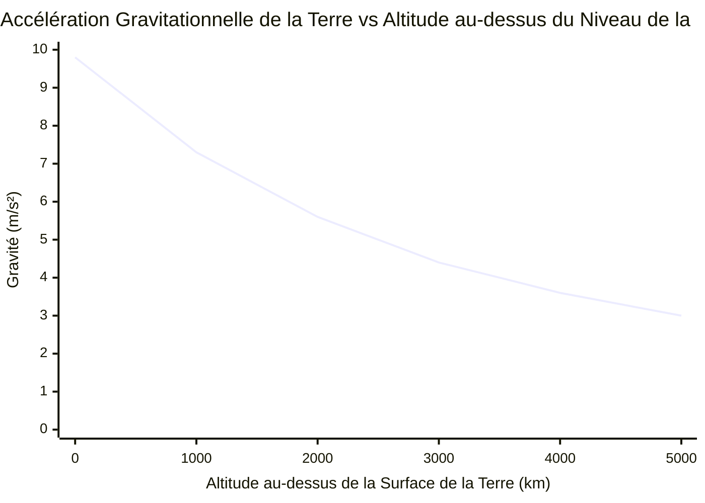

# Le Calculateur de Poids Définitif : Maîtriser la Gravité, la Masse et les Forces Planétaires

Bienvenue dans l'ultime **Calculateur de Poids** et guide d'astrophysique complet. Que vous soyez un lycéen en physique essayant de comprendre la différence fondamentale entre la masse et le poids, un ingénieur en aérospatiale calculant les rapports de poussée de charge utile pour un atterrissage lunaire, ou un passionné d'astronomie se demandant quelle serait la sensation de lourdeur en marchant sur Jupiter, cet outil fournit les conversions physiques absolument exactes dont vous avez besoin.

Le poids ($P$) est l'un des concepts les plus universellement mal compris dans la vie de tous les jours. Lorsque nous montons sur un pèse-personne, nous disons que nous mesurons notre "poids" en kilogrammes. Mais dans le domaine rigide et impitoyable de la physique classique, c'est totalement faux. La Masse et le Poids sont deux propriétés physiques radicalement différentes.

Dans ce guide SEO exhaustif de plus de 4 000 mots, nous allons déconstruire violemment la formule du poids ($P = mg$). Nous explorerons la nature invariante de la masse, démêlerons la loi universelle de la gravitation de Newton, calculerons la gravité écrasante de Jupiter et du Soleil, et analyserons cinq scénarios de physique conceptuelle détaillés représentés visuellement par des diagrammes interactifs Mermaid.js.

---

## 1. Définition du Poids : La Force Descendante de la Gravité

En mécanique classique newtonienne, le **Poids** ($P$) est strictement défini comme la force vectorielle descendante exercée sur la masse d'un objet par un champ gravitationnel local. 

$$ P = m \cdot g $$

### Masse vs. Poids : La Distinction Ultime
Pour le saisir intuitivement, vous devez séparer la "quantité de matière" de l'"attraction sur la matière".
- **Masse ($m$) :** Une propriété scalaire intrinsèque mesurant la quantité totale de matière dans un objet. Elle ne change jamais, peu importe où vous vous trouvez dans l'univers. Un humain de $70\text{ kg}$ fait exactement $70\text{ kg}$ sur Terre, sur Mars, sur la Lune, et flottant dans l'espace interstellaire profond.
- **Poids ($P$) :** Une force vectorielle variable. Il dépend entièrement de l'accélération gravitationnelle ($g$) de la planète sur laquelle vous vous trouvez. Le poids change instantanément au fur et à mesure que vous voyagez entre les corps célestes.

### Unités SI Standard du Poids
Étant donné que le poids est une *force*, son unité SI standard appropriée est le **Newton** ($\text{N}$), nommé d'après Sir Isaac Newton.
$$ 1\text{ Newton} = 1\text{ kg} \cdot 1\text{ m/s}^2 $$

Lorsque vous montez sur un pèse-personne étalonné en Kilogrammes, la balance mesure en réalité la force descendante (Newtons) que votre corps applique à ses ressorts internes. Elle divise ensuite secrètement cette force par la gravité standard de la Terre ($9,81\text{ m/s}^2$) pour afficher votre masse en Kilogrammes sur l'écran numérique.
Si vous preniez ce même pèse-personne sur la Lune, il vous dirait que vous "pesez" environ $11\text{ kg}$ — ce qui est physiquement incorrect. Votre masse est toujours de $70\text{ kg}$ ; la force gravitationnelle qui vous tire sur la balance est simplement six fois plus faible !

---

## 2. Gravité Terrestre vs Gravité Planétaire

La gravité standard à la surface de la Terre ($g_0$) est convenue internationalement comme étant :
$$ g = 9,80665\text{ m/s}^2 $$
Pour la quasi-totalité des applications en ingénierie et des devoirs de physique, ceci est arrondi à **$9,81\text{ m/s}^2$**.

### Calculer la Gravité Planétaire
D'où vient ce $9,81$ ? Il est dérivé directement de la **loi universelle de la gravitation de Newton**. La gravité à la surface de tout corps céleste sphérique dépend entièrement de deux facteurs : la Masse de la planète ($M$) et le Rayon de la planète ($r$).

$$ g = \frac{G \cdot M}{r^2} $$
*(Où $G = 6,674 \times 10^{-11}\text{ N}\cdot\text{m}^2/\text{kg}^2$)*

Parce que Jupiter est incroyablement massive, la gravité à sa surface est d'environ $24,79\text{ m/s}^2$ ($2,5\times$ celle de la Terre). Parce que la Lune est petite et relativement légère, sa gravité de surface n'est que de $1,62\text{ m/s}^2$ ($1/6^{\text{ème}}$ de celle de la Terre).

---

## 3. Poids Apparent et Physique des Ascenseurs

Votre "Poids Réel" ($P = mg$) ne change jamais tant que vous restez à la surface de la Terre. Cependant, votre **Poids Apparent** — la façon dont vous vous sentez lourd — peut changer considérablement en fonction de votre accélération verticale.

Le poids apparent est simplement la *Force Normale* ($F_N$) repoussant vers le haut contre vos pieds. 
- **Debout Immobile :** $F_N = m \cdot g$. Vous vous sentez normal.
- **Ascenseur Accélérant vers le Haut :** Le plancher pousse plus fort dans vos pieds pour accélérer votre masse vers le haut. $F_N = m(g + a)$. Vous vous sentez temporairement plus lourd.
- **Ascenseur Accélérant vers le Bas :** Le plancher se dérobe sous vos pieds. $F_N = m(g - a)$. Vous vous sentez temporairement plus léger.
- **Chute Libre (Rupture de Câbles) :** L'ascenseur tombe à $g$. $F_N = m(g - g) = 0$. Vous expérimentez l'apesanteur à Zéro-G, bien que la gravité tire toujours sur vous !

C'est exactement la raison pour laquelle les astronautes sur la Station Spatiale Internationale se sentent en apesanteur. Ils ne sont pas en "gravité zéro" — la gravité de la Terre à cette altitude est encore $90\%$ aussi forte qu'au niveau de la mer ! Ils se déplacent simplement sur le côté si vite ($17 500\text{ mph}$) que lorsqu'ils tombent vers la Terre, celle-ci s'incurve en dessous d'eux. Ils sont dans un état de chute libre perpétuelle et continue.

---

## 4. Guide d'Utilisation Complet : Maximiser le Calculateur

Notre Calculateur de Poids interactif fonctionne comme un simulateur d'astrophysique robuste.

### Étape 1 : Sélectionnez Votre Cible de Calcul
Utilisez la navigation supérieure pour sélectionner votre variable inconnue :
- **Poids ($P$) :** Vous connaissez la Masse et la Gravité. (Mécanique newtonienne standard).
- **Masse ($m$) :** Vous connaissez le Poids et la Gravité. (Déterminer la masse à partir d'une charge de force).
- **Gravité ($g$) :** Vous connaissez la Masse et le Poids. (Calculer le champ gravitationnel d'une planète inconnue).

### Étape 2 : Utilisez le Mode Préréglage de Planète Astronaute
Évitez la saisie manuelle de la gravité en sélectionnant parmi nos 10 préréglages intégrés du Système Solaire. Vous voulez savoir exactement combien pèsera un rover martien de $5 000\text{ kg}$ lorsqu'il atterrira dans le cratère Jezero ? Sélectionnez 'Mars' dans le menu déroulant, et le calculateur remplit instantanément $g = 3,71\text{ m/s}^2$ pour calculer la force martienne.

### Étape 3 : Interpréter la Jauge de Poids Logarithmique
Notre échelle de force radiale contextualise instantanément votre résultat :
- **Micro-Forces :** $0\text{N}$ à $1 000\text{N}$ (Humains, sacs à dos, petits appareils ménagers).
- **Macro-Forces :** $1\text{kN}$ à $1 000\text{kN}$ (Voitures, camions, éléphants, petits avions).
- **Méga-Forces :** $1\text{MN}$ à $100\text{MN}$+ (Gratte-ciel, navires de croisière, fusées Saturn V).

---

## 5. Cinq Scénarios Conceptuels d'Ingénierie avec des Visualisations 2D

Pour maîtriser pleinement les relations entre la Masse, la Force, la Gravité et la Cinématique, nous allons explorer cinq scénarios de physique distincts, décomposés visuellement en utilisant des diagrammes Mermaid.js personnalisés.

### Exemple 1 : La Logique de la Formule P=mg (Résolution de Variables)

**Le Scénario :**
Un étudiant de première année en physique doit visualiser rapidement les permutations algébriques de la formule du poids ($P = mg$) pour résoudre trois questions de test différentes.

**Visualisation 2D :**
Cet organigramme logique illustre la technique classique d'isolation des variables.



---

### Exemple 2 : Le Spectre de Poids Interplanétaire

**Le Scénario :**
Vous concevez un rover pressurisé. Il possède une masse invariante statique de $1 000\text{ kg}$. Vous devez concevoir les ressorts de suspension. Quelle force gravitationnelle ces ressorts subiront-ils sur différentes planètes de notre Système Solaire ?

**Visualisation 2D :**
Ce graphique à barres trace les variations extrêmes de la Force de Poids à travers cinq corps célestes pour ce même rover de $1 000\text{ kg}$. Remarquez le poids écrasant sur Jupiter par rapport à la présence légère comme une plume sur Pluton !



---

### Exemple 3 : Physique du Poids Apparent dans un Ascenseur

**Le Scénario :**
Une personne de $80\text{ kg}$ se tient sur une balance à l'intérieur de l'ascenseur d'un gratte-ciel. Nous devons cartographier exactement ce que la balance indique (son Poids Apparent) en fonction de l'état d'accélération de la cabine d'ascenseur.

**Visualisation 2D :**
Cet organigramme visualise l'addition vectorielle de la gravité et de l'accélération de l'ascenseur pour déterminer la Force Normale finale ($F_N$) ressentie par la personne.

```mermaid
flowchart TD
    A[Personne de 80 kg dans<br/>un Ascenseur] --> B{État de<br/>l'Ascenseur}
    
    B -->|Accélère vers le Haut (+a)| C[F_N = m(g + a)<br/>La Balance Indique > 784 N]
    B -->|Vitesse Constante| D[F_N = m(g)<br/>La Balance Indique = 784 N]
    B -->|Accélère vers le Bas (-a)| E[F_N = m(g - a)<br/>La Balance Indique < 784 N]
    B -->|Rupture de Câbles (a = -g)| F[F_N = m(g - g)<br/>La Balance Indique = 0 N]
    
    C --> G((Se sent<br/>Lourd))
    D --> H((Se sent<br/>Normal))
    E --> I((Se sent<br/>Léger))
    F --> J((Apesanteur<br/>Chute Libre))
    
    style G fill:#ef4444,color:#fff
    style H fill:#10b981,color:#fff
    style I fill:#f59e0b,color:#fff
    style J fill:#6366f1,color:#fff
```

---

### Exemple 4 : Courbe d'Atténuation Gravitationnelle (Orbite vs Surface)

**Le Scénario :**
De nombreuses personnes croient à tort qu'il n'y a "pas de gravité" dans l'espace. Selon la loi de Newton ($g \propto 1/r^2$), la gravité s'estompe doucement au fur et à mesure que vous vous éloignez du centre de la Terre ; elle ne s'éteint pas simplement. Regardons la gravité terrestre à la surface ($r = 6 371\text{ km}$) par rapport à l'altitude.

**Les Mathématiques :**
- Surface ($0\text{ km}$) : $g = 9,81\text{ m/s}^2$
- Orbite de l'ISS ($400\text{ km}$) : $g = 8,69\text{ m/s}^2$ (encore $89\%$ de la gravité de surface !)
- Orbite Haute ($5 000\text{ km}$) : $g = 3,08\text{ m/s}^2$

**Visualisation 2D :**
Ce graphique illustre la décroissance en carré inverse de l'accélération gravitationnelle de la Terre à mesure que vous prenez de l'altitude.



---

### Exemple 5 : Séquence de Lancement de Fusée Spatiale (Poussée vs Poids)

**Le Scénario :**
Une énorme fusée SpaceX repose sur la rampe de lancement. Elle a une masse de $1 000 000\text{ kg}$, ce qui lui donne un poids gravitationnel de $9 810 000\text{ Newtons}$. Pour quitter le sol, les moteurs doivent générer une force de Poussée qui dépasse strictement cet énorme vecteur de poids. Au fur et à mesure que le carburant brûle, la masse diminue, ce qui entraîne une réduction du vecteur Poids, augmentant de manière exponentielle l'accélération.

**Visualisation 2D :**
Ce diagramme de Gantt décrit la chronologie physique d'une fusée se dégageant de la tour de lancement et poussant jusqu'à Max-Q.

```mermaid
gantt
    title Lancement de Fusée Orbitale : Séquence Poussée vs Poids
    dateFormat s
    axisFormat %S
    section Pré-Lancement
    Séquence d'Allumage des Moteurs :active, 0, 5s
    La Poussée Augmente mais Poussée < Poids :active, 5s, 8s
    section Décollage
    La Poussée Dépasse le Poids (P/P > 1) :crit, done, 8s, 10s
    Tour Dégagée (En Accélération) :done, 10s, 15s
    section Vol
    Combustion du Carburant (Le Poids diminue rapidement) :active, 15s, 40s
    Pression Aérodynamique Maximale (Max-Q) :milestone, 40s, 45s
```

---

## 6. Plongée dans la Foire Aux Questions (FAQ)

**Q : Pourquoi les objets tombent-ils à la même vitesse quel que soit leur poids ?**
**R :** Cela a été prouvé de manière célèbre par Galilée et plus tard par l'astronaute d'Apollo 15 David Scott en lâchant un marteau et une plume sur la Lune. Bien que la gravité tire *plus fort* sur une lourde boule de bowling que sur une bille légère, la boule de bowling a aussi beaucoup plus de *masse* (inertie), la rendant plus difficile à accélérer. La proportion exacte de la Force sur la Masse équivaut toujours à $9,81\text{ m/s}^2$. Par conséquent, dans un vide sans résistance de l'air, tous les objets tombent exactement à la même vitesse !

**Q : Comment pèse-t-on la Terre ?**
**R :** Nous ne "pesons" pas la Terre (car il n'y a rien sur quoi la poser), mais nous pouvons calculer sa *masse*. En utilisant la formule $g = GM/r^2$, puisque nous connaissons la gravité de la Terre ($9,81$), le rayon de la Terre ($6 371\text{ km}$), et la Constante Gravitationnelle ($G$), nous pouvons résoudre algébriquement pour $M$. La masse de la Terre est un faramineux $5,972 \times 10^{24}\text{ kg}$ !

**Q : Si Jupiter est entièrement constituée de gaz, comment a-t-elle une gravité ?**
**R :** La gravité est générée par la *masse*, que cette masse soit de la roche solide, de l'eau liquide ou de l'hydrogène gazeux. Jupiter contient tellement de gaz hydrogène et hélium hautement comprimés que sa masse totale est $318$ fois supérieure à celle de la Terre, générant une immense attraction gravitationnelle.

**Q : La gravité peut-elle jamais être négative ?**
**R :** En physique classique standard, non. La gravité est strictement une force d'attraction générée par une masse positive. Cependant, en cosmologie moderne, le concept d'"Énergie Sombre" agit comme une force de répulsion entraînant l'expansion accélérée de l'univers, fonctionnant mathématiquement comme une anti-gravité à l'échelle galactique.

**Q : Qu'est-ce qu'un Kilogramme-Force (kgf) ?**
**R :** C'est une unité de force obsolète et non-SI. Un kilogramme-force est défini comme la force gravitationnelle exercée par la gravité standard terrestre sur un kilogramme de masse. Par conséquent, $1\text{ kgf} = 9,80665\text{ Newtons}$. L'ingénierie moderne utilise strictement les Newtons pour éviter de confondre la masse et la force.

---

## 7. Conclusion et Défi d'Ingénierie

Le poids est le câble invisible qui nous enchaîne à la Terre. Il régit la conception structurelle de chaque bâtiment, le dimensionnement des moteurs de chaque aéronef, et la mécanique orbitale du cosmos.

Pour maîtriser véritablement ces concepts de physique, utilisez notre Calculateur de Poids pour relever les défis conceptuels suivants :
1. **Le Touriste Interplanétaire :** Vous montez sur un pèse-personne sur Terre, et il indique $80\text{ kg}$. Vous voyagez sur Mars ($g = 3,71\text{ m/s}^2$). Qu'affichera ce même pèse-personne lorsque vous monterez dessus dans le désert martien ?
2. **Le Saut sur l'Astéroïde :** Vous posez votre vaisseau spatial sur l'astéroïde Cérès ($g = 0,28\text{ m/s}^2$). Votre combinaison spatiale et votre corps ont une masse combinée de $150\text{ kg}$. Quelle est votre force de poids descendante totale en Newtons sur Cérès ?
3. **La Chute de l'Ascenseur :** Les câbles d'une cabine d'ascenseur vide de $500\text{ kg}$ se rompent, et elle entre en chute libre. Quelle est la Force Normale totale agissant entre le plancher de l'ascenseur et une boîte de $10\text{ kg}$ reposant à l'intérieur ?

Expérimentez avec le simulateur, analysez les variations planétaires, et fiez-vous à ce calculateur pour clarifier définitivement la distinction cruciale entre la masse invariante et la puissante force vectorielle du poids.
