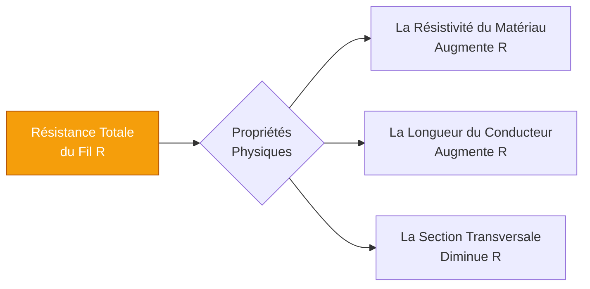
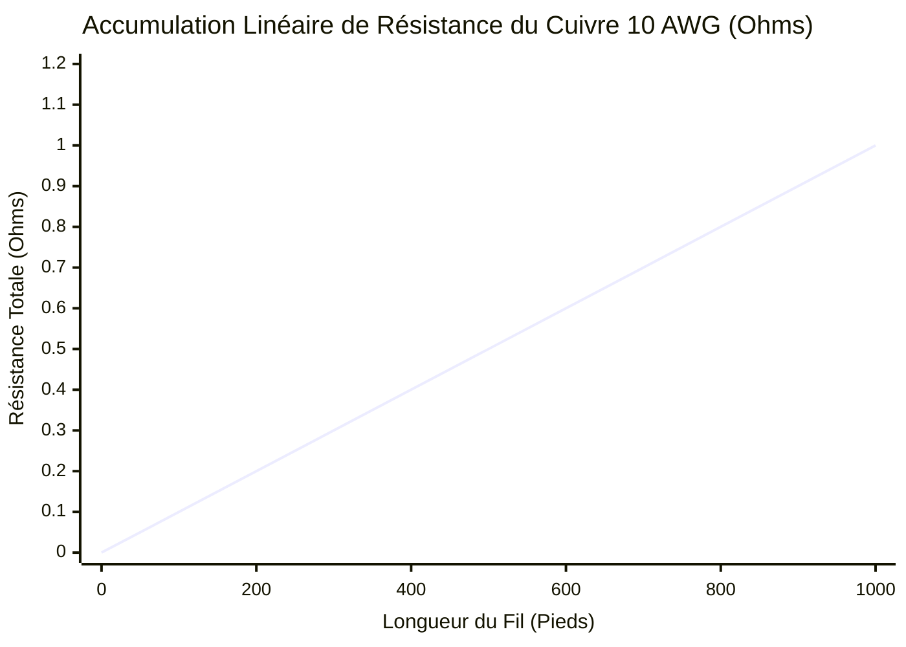
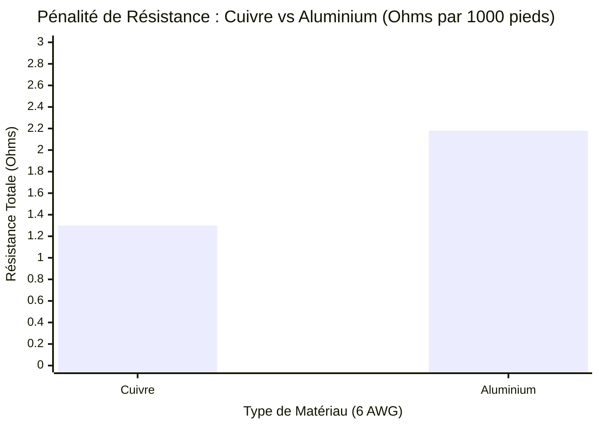
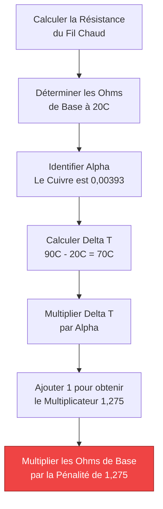
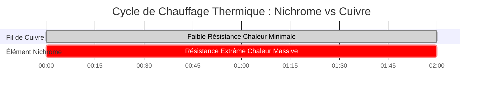

# Le Calculateur Définitif de Résistance de Fil : R = ρL/A, Mathématiques AWG et Pénalités Thermiques

Bienvenue dans l'ultime **Calculateur de Résistance de Fil** et guide de physique complet. Que vous soyez un ingénieur électricien dimensionnant des câbles d'alimentation en cuivre $4/0$ AWG pour un moteur industriel, un technicien solaire calculant les pertes de ligne CC dévastatrices dans de longs tronçons de chaîne, ou un étudiant en science des matériaux enquêtant sur la dégradation thermique des conducteurs en aluminium, la maîtrise de la physique de la résistance des fils est non négociable.

La résistance électrique n'est pas un concept théorique ; c'est une barrière physique. Elle convertit votre coûteuse énergie électrique en chaleur thermique gaspillée ($P = I^2 \cdot R$), détruisant l'efficacité du système, provoquant des chutes de tension catastrophiques et, si elle est ignorée, déclenchant des incendies électriques.

Dans cette masterclass SEO exhaustive de plus de 4 000 mots, nous allons déconstruire l'équation fondamentale $R = \rho L/A$, exposer mathématiquement les différences sévères entre le cuivre et l'aluminium, décoder le système logarithmique de calibre de fil américain (AWG) et analyser en profondeur les effets terrifiants de l'échauffement des conducteurs (le coefficient de température $\alpha$). Pour consolider ces concepts critiques d'ingénierie, nous avons inclus cinq diagrammes interactifs Mermaid.js méticuleusement détaillés et compatibles avec les analyseurs.

---

## 1. Qu'est-ce que la Résistance d'un Fil Exactement ?

La **Résistance d'un Fil** ($R$, mesurée mathématiquement en Ohms $\Omega$) est l'opposition physique stricte présentée par un conducteur métallique à la circulation du courant électrique (électrons).

Même les métaux les plus hautement conducteurs sur Terre — l'argent et le cuivre — ne sont pas parfaits. Alors que des billions d'électrons sont poussés avec force à travers un fil de cuivre par une source de tension, ils entrent violemment en collision avec les atomes de cuivre vibrants du réseau métallique. Chaque collision détruit une infime fraction de la quantité de mouvement vers l'avant de l'électron, convertissant directement cette énergie cinétique en chaleur thermique.

Cette friction collective et microscopique est ce que nous mesurons comme la **Résistance Électrique**.

---

## 2. L'Équation Universelle de la Résistance ($R = \rho L / A$)

La résistance de tout objet physique est régie par trois facteurs géométriques et matériels immuables, parfaitement résumés par l'équation fondamentale de la physique électrique :

$$R = \frac{\rho \cdot L}{A}$$

### Les Trois Facteurs :
1. **Résistivité du Matériau ($\rho$) :** La résistance chimique intrinsèque du métal lui-même. L'argent a la résistivité la plus faible, ce qui en fait le meilleur conducteur. Le cuivre est deuxième. L'aluminium est un lointain troisième et le fer est terrible. La résistivité se mesure en Ohm-mètres ($\Omega\cdot m$).
2. **Longueur du Conducteur ($L$) :** La résistance est strictement proportionnelle à la distance. Si vous doublez la longueur d'un fil, vous forcez les électrons à subir deux fois plus de collisions atomiques. Par conséquent, la résistance double exactement.
3. **Surface de Section Transversale ($A$) :** La résistance est strictement *inversement* proportionnelle à l'épaisseur du fil. Si vous doublez la surface physique du fil, vous offrez deux fois plus de chemins pour le déplacement des électrons, ce qui réduit effectivement la résistance de moitié.

---

## 3. Le Débat d'Ingénierie Cuivre vs Aluminium

Lors de la conception de réseaux électriques massifs, les ingénieurs sont contraints de choisir entre les deux principaux conducteurs : **Le Cuivre (Cu)** et **L'Aluminium (Al)**.

### La Physique du Cuivre
Le cuivre est la référence en matière de câblage électrique (ironiquement, c'est en fait un meilleur conducteur que l'or). Sa résistivité ($\rho$) est incroyablement basse, à $1,68 \times 10^{-8} \ \Omega\cdot m$. Il est physiquement solide, très résistant à l'oxydation et se plie sans se casser.

### La Physique de l'Aluminium
L'aluminium est le roi des lignes de transmission des services publics. Sa résistivité est de $2,82 \times 10^{-8} \ \Omega\cdot m$. En raison de sa résistivité nettement supérieure, **le fil d'aluminium a une résistance électrique environ 68 % supérieure à celle d'un fil de cuivre de taille exactement identique.**

Alors pourquoi le réseau électrique utilise-t-il de l'aluminium ? **Le poids et le coût.**
L'aluminium est radicalement moins cher que le cuivre et exponentiellement plus léger ($2,70 \text{ g/cm}^3$ contre $8,96 \text{ g/cm}^3$). Pour les pylônes de services publics à haute tension s'étendant sur des kilomètres, un câble en cuivre serait si lourd qu'il briserait physiquement les pylônes en acier qui le soutiennent.

*Règle empirique de l'ingénierie :* Pour obtenir exactement la même résistance électrique qu'un fil de cuivre, un fil d'aluminium doit être augmenté de deux tailles AWG plus épaisses (par ex., remplacer du Cuivre 10 AWG par de l'Aluminium 8 AWG).

---

## 4. Les Mathématiques Logarithmiques du Système AWG

Le système **American Wire Gauge (AWG)** est profondément déroutant pour les nouveaux ingénieurs car il est mathématiquement inversé et strictement logarithmique.

Dans le système AWG, un nombre **plus petit** représente un fil **plus épais** avec une résistance **plus faible**.
- Le 14 AWG est un fil fin utilisé pour les circuits d'éclairage de faible puissance de $15\text{A}$.
- Le 4 AWG est un câble massif et épais utilisé pour les chargeurs lourds de véhicules électriques de $60\text{A}$.

Parce que le système est logarithmique, chaque fois que le nombre AWG diminue de 3 (par exemple, de 10 AWG à 7 AWG), la surface de la section transversale du fil double exactement, et sa résistance électrique est strictement réduite de moitié.

---

## 5. La Pénalité Thermique de la Température ($\alpha$)

C'est ici que les ingénieurs amateurs échouent. La résistance électrique n'est **pas statique**. Elle change violemment en fonction de la température du fil.

Lorsqu'un fil de cuivre chauffe (soit à cause du soleil chaud de l'été, soit à cause de la friction thermique interne due au transport d'un courant important), les atomes de cuivre vibrent beaucoup plus agressivement. Ces vibrations agressives font que les électrons entrent en collision beaucoup plus fréquemment, augmentant encore la résistance électrique du fil.

### La Formule de Correction Thermique :
$$R_{\text{chaud}} = R_{\text{froid}} \cdot [1 + \alpha (T_{\text{chaud}} - T_{\text{froid}})]$$

Où $\alpha$ est le Coefficient de Température de la Résistance. Pour le Cuivre, $\alpha = 0,00393 \ /^\circ\text{C}$.

**Le Danger :**
Si vous calculez la résistance de votre fil dans une pièce confortable et climatisée à $20^\circ\text{C}$, mais que vous installez ce fil dans un grenier étouffant à $75^\circ\text{C}$, le fil possèdera **une résistance 21 % plus élevée** que ce que vos plans prévoyaient. Cette pénalité massive déclenchera une chute de tension sévère et des déclenchements inattendus des disjoncteurs.

---

## 6. Cinq Scénarios Conceptuels d'Ingénierie avec des Visualisations 2D

Pour maîtriser pleinement les relations physiques régissant la résistance des fils, nous allons explorer cinq scénarios d'ingénierie distincts, décomposés visuellement à l'aide de diagrammes interactifs Mermaid.js personnalisés.

### Exemple 1 : La Physique de la Résistance

**Le Scénario :**
Un étudiant en ingénierie doit visualiser comment les trois propriétés physiques (Longueur, Surface, Matériau) interagissent mathématiquement pour générer la résistance ohmique totale.

**Visualisation 2D :**
Cet organigramme logique sépare les composants fondamentaux de l'équation $R = \rho L / A$, démontrant quels éléments augmentent ou diminuent la résistance totale.

---

### Exemple 2 : Résistance vs Longueur de Fil (Accumulation Linéaire)

**Le Scénario :**
Un technicien déroule $1000\text{ pieds}$ de fil de cuivre 10 AWG et a besoin de comprendre comment la résistance s'accumule sur des distances extrêmes.

**Les Mathématiques :**
Parce que $R$ est strictement proportionnelle à $L$, chaque pied de fil ajoute exactement la même quantité microscopique de résistance, formant une pente linéaire parfaite.

**Visualisation 2D :**
Ce graphique trace la ligne parfaitement droite de la résistance qui s'accumule à mesure que le fil de cuivre 10 AWG s'étend de $0$ à $1000\text{ pieds}$.

---

### Exemple 3 : Pénalité de Résistance Cuivre vs Aluminium

**Le Scénario :**
Un entrepreneur souhaite économiser de l'argent en remplaçant des câbles d'alimentation en cuivre 6 AWG par des câbles d'alimentation en aluminium 6 AWG moins chers. Il a besoin de voir la pénalité de résistance exacte de cette décision.

**Les Mathématiques :**
L'aluminium a une résistivité de $2,82 \times 10^{-8} \ \Omega\cdot m$ par rapport à celle du cuivre de $1,68 \times 10^{-8} \ \Omega\cdot m$. Cela entraîne un pic massif de résistance de 68 % pour la même épaisseur physique.

**Visualisation 2D :**
Ce graphique à barres démontre de manière agressive la grave pénalité de résistance de tailles AWG identiques lors de la comparaison du cuivre à l'aluminium.

---

### Exemple 4 : Logique de Pénalité Thermique de la Résistance

**Le Scénario :**
Un moteur industriel à fort ampérage fonctionne dans un conduit scellé, chauffant le fil de cuivre de $20^\circ\text{C}$ jusqu'à $90^\circ\text{C}$. L'inspecteur doit calculer la pénalité thermique de la résistance.

**Visualisation 2D :**
Cet organigramme de haut en bas mappe les étapes mathématiques exactes requises pour calculer le multiplicateur de résistance thermique sévère à l'aide du coefficient de température ($\alpha$).

---

### Exemple 5 : Cycle de Chauffage Nichrome vs Cuivre

**Le Scénario :**
Comparaison de la résistance chauffante délibérée d'un élément de grille-pain en Nichrome par rapport au chauffage accidentel de la résistance d'une rallonge en Cuivre sur un cycle de charge lourde de 2 heures.

**Visualisation 2D :**
Ce diagramme de Gantt décrit les comportements thermiques très différents du Nichrome à haute résistivité (conçu pour générer une chaleur extrême) par rapport au cuivre à faible résistivité.

---

## 7. Conclusion et Défi d'Ingénierie

La maîtrise des paramètres physiques de la Résistance des Fils ($R = \rho L / A$) est le fondement de toute ingénierie électrique. Si vous respectez la résistivité des matériaux, augmentez agressivement votre calibre AWG pour les longues distances, et calculez toujours mathématiquement vos pénalités thermiques, vos circuits fonctionneront à froid et avec une efficacité sans fin.

Si vous ignorez cette physique, vos fils généreront violemment un échauffement par effet Joule ($I^2 \cdot R$), détruisant le potentiel de tension et faisant fondre l'isolation.

Pour garantir que vous avez maîtrisé ces concepts, lancez notre Simulateur interactif et tentez de relever ces derniers défis :
1. **Le Remplacement de l'Aluminium :** Vous avez $500\text{ pieds}$ de fil de cuivre 8 AWG. Si vous l'échangez contre du fil d'aluminium 8 AWG, quelle est l'augmentation numérique exacte de la résistance ohmique ?
2. **La Fusion Thermique :** Un fil de cuivre 4 AWG a une résistance de base de $0,815 \ \Omega$ à $20^\circ\text{C}$. Calculez sa résistance exacte lorsqu'il chauffe à $75^\circ\text{C}$ dans un grenier.
3. **Les Mathématiques de Surface :** Si vous passez de 12 AWG à 9 AWG, qu'arrive-t-il exactement à la surface de section transversale physique, et qu'arrive-t-il exactement à la résistance ?

Fiez-vous à cette calculatrice pour vérifier vos mathématiques, auditer le dimensionnement de vos fils et toujours vous assurer que vos conducteurs électriques survivent à leurs environnements thermiques.
