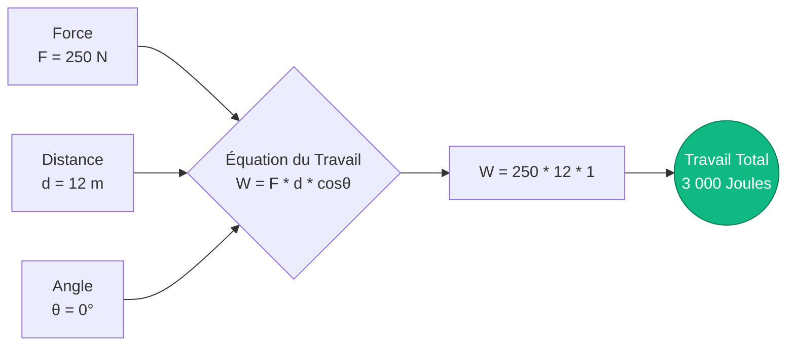
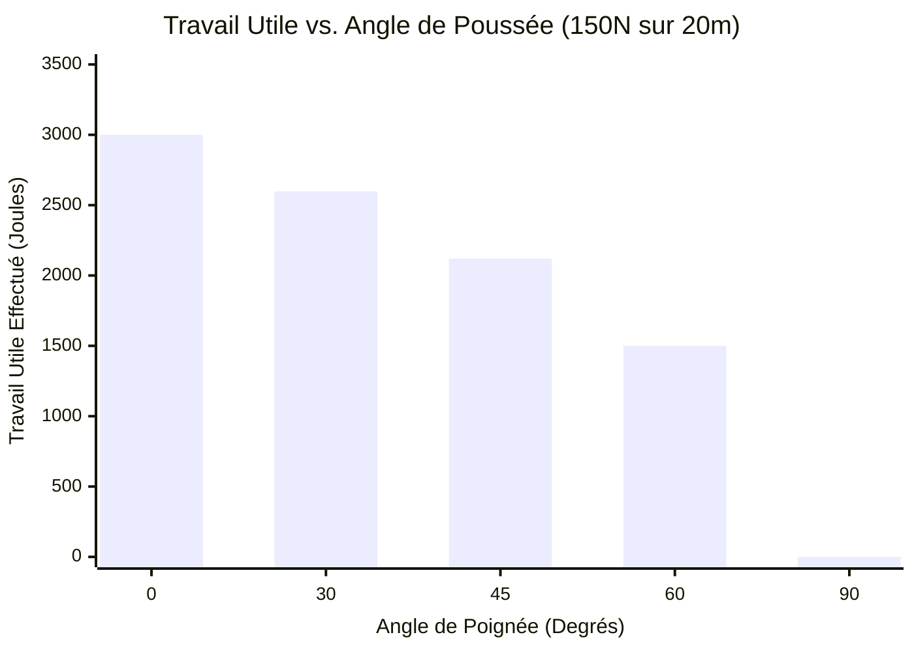
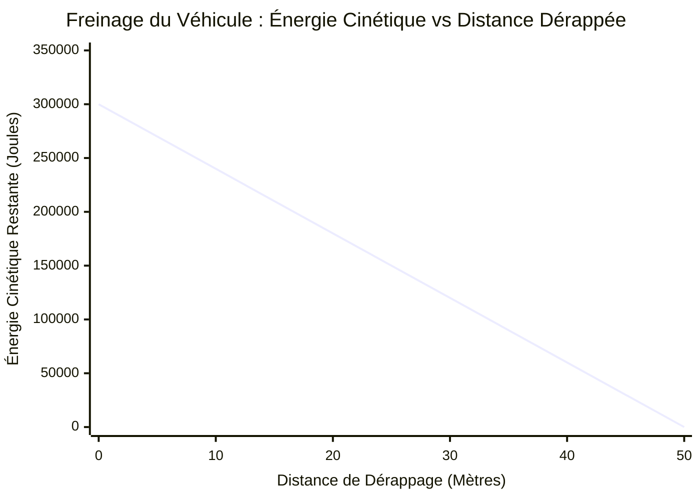

# Le Calculateur de Travail Définitif : Maîtriser le Transfert d'Énergie Mécanique et les Vecteurs de Force

Bienvenue dans l'ultime **Calculateur de Travail Mécanique** et guide de physique complet. Que vous soyez un ingénieur civil évaluant la capacité de charge d'une grue de construction, un étudiant en physique au lycée étudiant le théorème de l'énergie cinétique, ou un thermodynamicien analysant l'expansion d'une bouteille de gaz, ce calculateur est conçu pour vous.

En physique, le "travail" n'est pas l'effort physiologique que vous ressentez lorsque vous maintenez un haltère lourd immobile. En physique, le Travail ($W$) est la mesure mathématique rigoureuse de la quantité d'énergie transférée vers ou hors d'un objet par une force externe provoquant un déplacement physique.

Dans ce guide technique massif de plus de 4 000 mots, nous allons complètement déconstruire l'équation principale du travail mécanique ($W = F \cdot d \cdot \cos\theta$). Nous explorerons les nuances critiques des angles de vecteurs de force, définirons la différence entre le travail positif, négatif et nul, et passerons en revue cinq scénarios d'ingénierie et de cinématique du monde réel en utilisant des visualisations détaillées Mermaid.js.

---

## 1. Qu'est-ce que le Travail Mécanique ? (La Définition en Physique)

Dans la mécanique classique newtonienne, le Travail est le produit scalaire du vecteur Force ($\vec{F}$) et du vecteur Déplacement ($\vec{d}$). 

Parce que ce sont des vecteurs (ils ont à la fois une amplitude et une direction spécifique), nous ne pouvons pas simplement multiplier leurs nombres bruts ensemble. Nous devons tenir compte de l'angle entre eux en utilisant la trigonométrie, en particulier la fonction cosinus.

La formule fondamentale est :
$$W = F \cdot d \cdot \cos\theta$$

Où :
- **$W$ (Travail) :** Mesuré en Joules ($\text{J}$). Un Joule équivaut à un Newton-mètre ($\text{N}\cdot\text{m}$).
- **$F$ (Force) :** L'amplitude de la poussée ou de la traction, mesurée en Newtons ($\text{N}$).
- **$d$ (Déplacement) :** La distance en ligne droite parcourue par l'objet, mesurée en mètres ($\text{m}$).
- **$\theta$ (Thêta) :** L'angle entre la direction de poussée de la force et la direction dans laquelle l'objet se déplace réellement.

### Le Joule : L'Unité SI d'Énergie
Le travail est une mesure du transfert d'énergie. Par conséquent, il partage son unité avec l'énergie : le Joule ($\text{J}$).
$$ 1\text{ Joule} = 1\text{ Newton} \times 1\text{ mètre} = 1\text{ kg} \cdot \text{m}^2/\text{s}^2 $$
Si vous appliquez exactement $1\text{ Newton}$ de force (environ le poids d'une petite pomme) pour pousser un bloc avec précision sur $1\text{ mètre}$ à travers une table sans friction, vous avez effectué exactement $1\text{ Joule}$ de travail mécanique.

---

## 2. Le Rôle Critique de l'Angle Cosinus ($\cos\theta$)

L'angle $\theta$ est la variable la plus incomprise de la physique 101. Pour comprendre le travail, vous devez comprendre comment le $\cos\theta$ modifie le vecteur force.

### Travail Positif ($0^\circ \le \theta < 90^\circ$)
Si vous poussez un caddie horizontalement vers l'avant ($0^\circ$), toute votre force va dans le mouvement vers l'avant.
- $\cos(0^\circ) = 1$
- **Résultat :** $W = F \cdot d$. Vous avez effectué le Travail Positif Maximum. Vous avez ajouté de l'énergie cinétique au chariot.

### Travail Nul ($\theta = 90^\circ$)
Si vous soulevez une lourde boîte de $50\text{ kg}$ et que vous la transportez horizontalement à travers une pièce à une vitesse constante, votre force de levage pointe directement vers le HAUT ($90^\circ$ par rapport au mouvement de marche vers l'avant).
- $\cos(90^\circ) = 0$
- **Résultat :** $W = 0$. Bien que vos muscles brûlent et consomment des calories physiologiques (travail métabolique), d'un point de vue strictement physique, vous avez effectué exactement ZÉRO travail mécanique sur la boîte car vous n'avez pas modifié son énergie cinétique ou sa hauteur.

### Travail Négatif ($90^\circ < \theta \le 180^\circ$)
Si une voiture en mouvement freine brusquement, la force de frottement des pneus pousse vers l'arrière ($180^\circ$) pendant que la voiture continue de glisser vers l'avant. 
- $\cos(180^\circ) = -1$
- **Résultat :** $W = -F \cdot d$. La route a effectué le Travail Négatif Maximum. Le travail négatif signifie que l'énergie est *retirée* de l'objet (dans ce cas, l'énergie cinétique est drainée et convertie en chaleur et en son).

---

## 3. Le Théorème de l'Énergie Cinétique

Le concept de travail mécanique est intrinsèquement lié au **Théorème de l'Énergie Cinétique** (Théorème du travail-énergie), qui stipule :
*Le travail net effectué sur un objet par toutes les forces combinées est précisément égal au changement de son énergie cinétique.*

$$ W_{net} = \Delta KE = \frac{1}{2} m v_f^2 - \frac{1}{2} m v_i^2 $$

Si vous calculez le travail net effectué sur un objet et que le résultat est de $+500\text{ J}$, cela signifie que l'objet a gagné exactement $500\text{ J}$ d'énergie cinétique (il a accéléré). Si le travail net est de $-500\text{ J}$, l'objet a perdu $500\text{ J}$ d'énergie cinétique (il a ralenti). Si le travail net est de $0$, l'objet a conservé une vitesse constante.

---

## 4. Guide d'Utilisation Complet : Maximiser le Calculateur

Notre Calculateur de Travail interactif vous permet de résoudre dynamiquement toute variable manquante dans l'équation du travail mécanique.

### Étape 1 : Sélectionnez Votre Cible de Calcul
Utilisez les onglets de navigation supérieurs pour sélectionner ce que vous voulez calculer :
- **Travail ($W$) :** Calculez l'énergie totale transférée compte tenu de la force, de la distance et de l'angle.
- **Force ($F$) :** Déterminez la force requise par ingénierie inverse pour atteindre un objectif de travail spécifique sur une distance.
- **Distance ($d$) :** Déterminez jusqu'où un objet se déplacera compte tenu d'un budget d'énergie défini et d'une limite de force.
- **Angle ($\theta$) :** Calculez l'angle géométrique du vecteur force en fonction de la sortie d'énergie.

### Étape 2 : Utilisez le Simulateur de Direction de Force
Lors du calcul du Travail, utilisez le curseur d'angle interactif (de $0^\circ$ à $180^\circ$). Observez comment le travail résultant passe de $100\%$ d'efficacité à $0^\circ$, à $0\%$ à $90^\circ$, et plonge en territoire négatif à mesure que vous approchez de $180^\circ$. 

### Étape 3 : Gérez les Conversions d'Unités Avancées
Le calculateur gère automatiquement la mise à l'échelle métrique complexe :
- **Énergie :** Joules ($\text{J}$), Kilojoules ($\text{kJ}$), Mégajoules ($\text{MJ}$), Watt-heures ($\text{Wh}$), Kilowatt-heures ($\text{kWh}$).
- **Force :** Newtons ($\text{N}$), Kilonewtons ($\text{kN}$).
- **Distance :** Mètres ($\text{m}$), Kilomètres ($\text{km}$), Pieds ($\text{ft}$).

---

## 5. Cinq Scénarios Conceptuels d'Ingénierie avec des Visualisations 2D

Pour bien saisir la cinématique du travail mécanique, nous allons explorer cinq scénarios de physique détaillés, en utilisant Mermaid.js pour déconstruire visuellement les mathématiques et les courbes de mouvement.

### Exemple 1 : L'Équation Physique de Base (Flux Logique Cinématique)

**Le Scénario :**
Un ouvrier du bâtiment pousse une lourde caisse à travers le sol d'un entrepôt. Il pousse avec une force de $250\text{ N}$ directement vers l'avant. Il déplace la caisse sur $12\text{ mètres}$. Combien de travail mécanique a-t-il effectué ?

**Les Mathématiques :**
Nous utilisons l'équation fondamentale $W = F \cdot d \cdot \cos\theta$.
Parce qu'il pousse directement vers l'avant, $\theta = 0^\circ$, et $\cos(0^\circ) = 1$.
$$ W = 250\text{ N} \cdot 12\text{ m} \cdot 1 $$
$$ W = 3 000\text{ Joules} = 3\text{ kJ} $$

**Visualisation 2D :**
L'arbre logique ci-dessous illustre la multiplication directe des trois variables fondamentales.



---

### Exemple 2 : La Tondeuse à Gazon (Courbe d'Efficacité Angulaire)

**Le Scénario :**
Un propriétaire pousse une tondeuse à gazon dans sa cour avec $150\text{ N}$ de force sur une distance de $20\text{ mètres}$. Cependant, il pousse *vers le bas* sur la poignée selon un certain angle. Analysons comment l'angle de la poignée affecte le travail horizontal *utile* réellement effectué.

**Les Mathématiques :**
- Si la poignée était plate ($0^\circ$) : $W = 150 \cdot 20 \cdot 1 = 3 000\text{ J}$
- Si la poignée est à $30^\circ$ : $W = 150 \cdot 20 \cdot \cos(30^\circ) = 3 000 \cdot 0,866 = 2 598\text{ J}$
- Si la poignée est à $45^\circ$ : $W = 150 \cdot 20 \cdot \cos(45^\circ) = 3 000 \cdot 0,707 = 2 121\text{ J}$
- Si la poignée est à $60^\circ$ : $W = 150 \cdot 20 \cdot \cos(60^\circ) = 3 000 \cdot 0,500 = 1 500\text{ J}$
- Si la poignée est droite vers le bas ($90^\circ$) : $W = 150 \cdot 20 \cdot 0 = 0\text{ J}$ (La tondeuse ne bougerait pas vers l'avant).

**Visualisation 2D :**
Ce diagramme à barres montre visuellement comment les angles abrupts gaspillent de manière dramatique la force appliquée, réduisant le travail mécanique utile transféré à la tondeuse.



---

### Exemple 3 : Le Test de Freinage de Voiture (Théorème de l'Énergie Cinétique)

**Le Scénario :**
Une voiture de $1 500\text{ kg}$ roule à $20\text{ m/s}$ ($72\text{ km/h}$). Le conducteur freine brusquement. Le frottement de la route exerce une force constante vers l'arrière de $-6 000\text{ N}$. Sur quelle distance la voiture va-t-elle déraper avant de s'arrêter complètement ?

**Les Mathématiques :**
D'abord, nous trouvons l'Énergie Cinétique initiale de la voiture :
$$ KE = 0,5 \cdot 1 500\text{ kg} \cdot (20\text{ m/s})^2 = 300 000\text{ Joules} $$

Pour arrêter la voiture ($KE = 0$), les freins doivent effectuer exactement $-300 000\text{ J}$ de travail négatif.
La force de frottement est exactement opposée au mouvement, donc $\theta = 180^\circ$ ($\cos180^\circ = -1$).
$$ W = F \cdot d \cdot \cos\theta $$
$$ -300 000 = 6 000 \cdot d \cdot (-1) $$
$$ -300 000 = -6 000 \cdot d $$
$$ d = 50\text{ mètres} $$

La voiture dérapera exactement sur $50\text{ mètres}$ avant de s'arrêter.

**Visualisation 2D :**
Ce graphique montre la relation linéaire entre le travail négatif effectué par les freins et l'énergie cinétique restante du véhicule sur la distance.



---

### Exemple 4 : Le Théorème de l'Énergie Cinétique (Décomposition Logique)

**Le Scénario :**
Le théorème de l'énergie cinétique (travail-énergie) est primordial en génie mécanique. Visualisons le flux logique de la façon dont le Travail se connecte à la Vitesse. Si une force nette effectue un travail sur un objet, l'énergie cinétique de cet objet change, ce qui mathématiquement force sa vitesse à changer.

**Visualisation 2D :**
Cet organigramme de haut en bas déconstruit la chaîne conceptuelle reliant la force appliquée jusqu'à la vitesse finale.

```mermaid
flowchart TD
    A[Appliquer la Force Nette F sur la Distance d] --> B(Calculer le Travail Net : W = F * d)
    B --> C{Théorème de l'Énergie Cinétique}
    C -->|W = ΔKE| D(Variation de l'Énergie Cinétique)
    D --> E[KE Finale = KE Initiale + W]
    E --> F[Extraire la Vitesse : v_f = sqrt(2 * KE / m)]
```

---

### Exemple 5 : Le Moteur Thermodynamique (Diagramme de Gantt du Travail P-V)

**Le Scénario :**
Le travail mécanique ne consiste pas seulement à pousser des boîtes ; c'est ainsi que fonctionnent les moteurs de voiture et les centrales électriques ! En thermodynamique, un gaz en expansion à l'intérieur d'un cylindre pousse un piston. C'est ce qu'on appelle le travail Pression-Volume ($P-V$) ($W = P \cdot \Delta V$). Cartographions le cycle à 4 temps d'un moteur à combustion interne pour voir exactement quand le travail utile est généré.

**Les Mathématiques :**
Dans un moteur de voiture, les temps d'Admission, de Compression et d'Échappement *consomment* en fait de petites quantités de travail de l'élan du moteur. Toute la puissance de sortie de la voiture provient strictement de l'expansion violente pendant le **Temps Moteur** (Combustion/Détente), qui effectue un travail positif massif sur le piston.

**Visualisation 2D :**
Ce diagramme de Gantt cartographie les millisecondes d'un cycle de moteur à 4 temps, soulignant le moment critique où l'énergie chimique est convertie en travail mécanique.

```mermaid
gantt
    title Cycle de Moteur à 4 Temps (Génération de Travail Mécanique)
    dateFormat s
    axisFormat %S
    section Cycle du Moteur
    Temps d'Admission (Travail Négatif) :active, 0, 1s
    Temps de Compression (Travail Négatif) :active, 1s, 2s
    Allumage & Temps Moteur (Travail Positif Massif) :crit, done, 2s, 3s
    Temps d'Échappement (Travail Négatif) :active, 3s, 4s
```
*(Remarque : Les délais sont illustratifs. Dans un moteur réel à 3 000 tr/min, ce cycle entier à 4 temps se produit en 0,04 seconde !)*

---

## 6. Foire Aux Questions (FAQ) Détaillée

**Q : Le travail peut-il être négatif ?**
**R :** Oui ! Le travail négatif signifie simplement que la force agit dans la direction opposée au mouvement. La force *extrait* de l'énergie de l'objet. Le frottement effectue toujours un travail négatif, drainant l'énergie cinétique et la transformant en chaleur.

**Q : Si je tiens un poids lourd de $50\text{ kg}$ au-dessus de ma tête pendant 5 minutes, est-ce que j'effectue un travail ?**
**R :** Dans un sens strictement physique, non. Parce que le déplacement ($d$) est nul, le travail mécanique ($W = F \cdot 0$) est de zéro Joule. Vos muscles brûlent de l'énergie parce que les fibres musculaires humaines se contractent constamment et consomment de l'ATP (travail métabolique), mais vous ne transférez aucune énergie mécanique à l'haltère.

**Q : Comment un système de poulies réduit-il la force ?**
**R :** Une poulie est une machine simple qui repose sur l'équation du travail ($W = F \cdot d$). Le travail total requis pour soulever une boîte de $1\text{ mètre}$ ne peut pas changer. Cependant, un système de poulies peut vous obliger à tirer $4\text{ mètres}$ de corde ($d$ augmente de $4\times$). Parce que $W$ est constant et que $d$ a augmenté, la force requise ($F$) chute de $75\%$. Vous échangez de la distance contre de la force !

**Q : Le Travail est-il un Vecteur ou un Scalaire ?**
**R :** Le travail est un **Scalaire**. Il a une amplitude (comme $500\text{ J}$ ou $-200\text{ J}$) mais il n'a pas de direction. La force et le déplacement sont des vecteurs, mais leur produit scalaire donne une valeur énergétique scalaire.

**Q : Quelle est la différence entre le Travail et la Puissance ?**
**R :** Le travail est la quantité totale d'énergie transférée (Joules). La puissance est la *vitesse* à laquelle ce travail a été effectué (Watts). Si vous montez un escalier en marchant ou en courant, vous avez effectué exactement la même quantité de travail mécanique ($W = mgh$). Cependant, courir a pris moins de temps, ce qui signifie que vous avez généré beaucoup plus de Puissance ($P = W / t$).

---

## 7. Conclusion et Défi d'Ingénierie

Le travail mécanique est la monnaie universelle du transfert d'énergie. Du freinage par friction d'un train à grande vitesse à l'expansion thermodynamique de la tuyère d'un moteur de fusée, l'équation $W = F \cdot d \cdot \cos\theta$ régit l'univers mécanique.

Pour vraiment maîtriser ces concepts, utilisez notre Calculateur de Travail Mécanique pour résoudre les défis de physique conceptuelle suivants :
1. **La Corde de Téléski :** Un téléski tire un skieur de $80\text{ kg}$ sur $200\text{ mètres}$ sur une pente enneigée de $15^\circ$ à vitesse constante. En ignorant les frottements, quel travail mécanique le moteur du téléski a-t-il effectué contre la gravité ?
2. **L'Arc et la Flèche :** Un archer tire la corde d'un arc vers l'arrière de $0,6\text{ mètre}$ avec une force moyenne de $150\text{ N}$. Quelle quantité de travail a été stockée sous forme d'énergie potentielle élastique dans les branches de l'arc ?
3. **La Traînée de l'Avion :** Un avion à réaction commercial en vol de croisière à vitesse constante parcourt $10\text{ km}$ ($10 000\text{ m}$) tout en subissant $50 000\text{ N}$ de traînée aérodynamique. Combien de travail négatif l'atmosphère a-t-elle effectué sur l'avion, et combien de travail positif les moteurs ont-ils dû fournir pour maintenir la vitesse ?

Expérimentez avec le simulateur, analysez les courbes d'efficacité d'angle agressives et fiez-vous à ce calculateur pour illuminer les transferts massifs d'énergie mécanique qui se produisent tout autour de vous.
