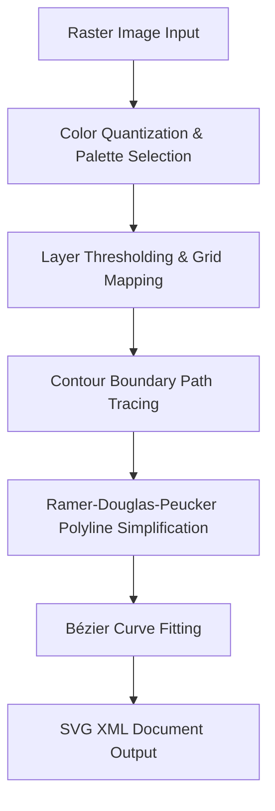

## Ultimate Guide to Image Vectorization: Converting Raster Images to SVG

In the modern digital landscape, graphic assets must adapt fluidly to a wide variety of resolutions, viewport sizes, and print layouts. Traditional raster graphics, while excellent for capturing complex photographic details, fail to scale dynamically, leading to pixelation and visual degradation. This comprehensive guide explores the science, mathematics, and practical workflows behind converting raster images into Scalable Vector Graphics (SVG). 

Whether you are trying to clean up a pixelated company logo or prepare flat illustrations for high-resolution printing, understanding how a **raster to vector converter online** operates will dramatically improve your design output. If you only need to optimize existing vectors without tracing new ones, try our dedicated [SVG Optimizer](/en/tools/svg-optimizer).

---

### 1. Understanding the Divide: Raster vs. Vector Graphics

To appreciate the necessity of vector conversion, we must examine how digital images are represented:

#### 1.1 Raster Graphics (Bitmaps)
Formats like `.png`, `.jpg`, `.webp`, `.bmp`, and `.gif` represent images as fixed grids of individual pixels, each assigned a specific color value. The file size of a raster image is directly tied to its resolution (dimensions in pixels). If you need to convert between these formats before vectorizing, you can use our [comprehensive image converter](/en/tools/image-converter).

Key characteristics of raster graphics include:
*   **Resolution Dependence**: Scaling up a bitmap image requires the rendering engine to interpolate or stretch existing pixels, causing blurriness, jagged edges (aliasing), and visual noise.
*   **Color Complexity**: Ideal for photographs, where subtle gradients and lighting variations are captured on a pixel-by-pixel basis.
*   **Fixed Geometry**: The layout is locked into a coordinate grid, making it difficult to isolate individual shapes or elements.

#### 1.2 Vector Graphics (SVG, EPS, PDF)
Formats like `.svg`, `.eps`, `.pdf`, and `.dxf` represent images as a collection of geometric primitives (points, lines, curves, polygons, and circles) defined by mathematical equations. 

Key characteristics of vector graphics include:
*   **Infinite Scalability**: Since shapes are described mathematically, they can be scaled up or down infinitely without any loss in clarity, sharp borders, or detail. An SVG rendering at `16x16` pixels uses the exact same geometry definition when rendered on a `10,000x10,000` pixel screen.
*   **Lightweight File Size**: For logos, icons, line art, and flat illustrations, vector files are significantly smaller than their raster counterparts because they store coordinates instead of pixel grids.
*   **Resolution Independence**: Vector assets render at the native DPI of the display or printing device, ensuring crisp lines on standard screens, high-density Retina displays, and large-format print setups.

---

### 2. The Mathematics of Tracing: How Vectorization Works

Converting a raster grid of pixels into a set of vector paths is a multi-step mathematical process that occurs locally in your browser when you use our tool.

#### Step 1: Color Quantization (K-Means Clustering)
Bitmaps can contain millions of unique colors. To trace vector paths, we must compress these colors into a manageable palette. The algorithm samples pixels from the image and clusters them using the **K-Means algorithm**:
1.  Select initial color centroids randomly or based on color popularity.
2.  Assign each pixel color to its nearest centroid using squared Euclidean distance.
3.  Re-calculate the centroids by taking the mean color values of all pixels assigned to each cluster.
4.  Repeat the process until the centroids stabilize (usually 3 to 5 iterations).

This results in a clean, quantized image where every pixel belongs to one of the indexing layers.

#### Step 2: Boundary Contour Tracing
For each color layer, the engine traces the contours (outer borders and internal holes) of the colored regions:
*   It checks adjacent pixels in four directions to build directed edge segments.
*   Segments are linked sequentially to form closed loops of coordinate polylines.
*   The algorithm distinguishes between outer boundaries and inner cutout holes to apply appropriate vector filling rules (such as `fill-rule="evenodd"`).

#### Step 3: Polyline Simplification (Ramer-Douglas-Peucker Algorithm)
The raw traced boundaries contain thousands of tiny step-like nodes matching the pixel grid, creating a jagged outline. To smooth these paths, we apply the **Ramer-Douglas-Peucker (RDP) algorithm**:
1.  Identify the line segment between the start and end points of a path.
2.  Find the point on the path that is furthest from this line segment.
3.  If the perpendicular distance to this point is greater than a specified tolerance, split the path at this point and recursively simplify the two sub-sections.
4.  If the furthest point is closer than the tolerance, discard all intermediate points, keeping only the endpoints of the segment.

Increasing the simplification tolerance significantly reduces the node count, which is crucial for clean vector outputs and small file sizes.

#### Step 4: Bézier Curve Fitting
To convert the simplified polygonal paths into smooth, organic shapes, the engine fits **Bézier curves** to the coordinate points. A cubic Bézier curve is defined by four points: a start point, an end point, and two control points. Our tracing engine calculates tangent vectors at each node point based on neighbor coordinates, scaling control handles (tangent weights) relative to segment lengths to generate smooth, natural curves without introducing sharp corners.

---

### 3. Step-by-Step Guide: How to Vectorize Images Like a Pro

Follow these expert steps to **create SVG paths from PNG** and convert your raster files into production-grade vector graphics.

#### 3.1 Choose the Right Source Image
Vectorization works best with high-contrast, flat graphics. If you upload a complex photograph, the SVG will contain thousands of tiny shapes that inflate the file size. For photographic assets, it is better to [convert your file to a JPG](/en/tools/convert-to-jpg) rather than vectorize it. Ensure your starting PNG or WEBP has a high resolution (at least `800px` wide) so the edge tracing algorithms have enough pixel data to generate smooth curves.

#### 3.2 Select the Vectorization Preset
Our tracing engine offers specialized presets for different visual requirements:
*   **Logo Mode**: Perfect for **converting JPG logos to vector SVG**. It prioritizes sharp corners, straight lines, and flat colors.
*   **Icon Mode**: Focuses on maximum shape simplification and path smoothing to generate incredibly lightweight files.
*   **Illustration**: Best for multi-colored graphic illustrations requiring a higher color count.
*   **Line Art Mode**: Instead of tracing solid shapes, this mode traces the edges of drawings as stroked lines, generating a wireframe outline.
*   **Monochrome / B&W**: Forces the output into a single-color silhouette, stripping out all gradient data.

#### 3.3 Configure the Color Palette
Set the **Color Count** slider based on your design. Flat icons usually look best with 2 to 8 colors. Increasing the color count to 16 or 32 adds depth but dramatically increases path complexity. Using K-Means clustering, the engine will automatically select the most dominant colors in your image. 

#### 3.4 Fine-Tune Simplification and Smoothing
This is where the magic happens:
*   **Simplify (RDP Tolerance)**: Increase this value to remove unnecessary nodes. If a straight line has 50 nodes along it, high simplification will reduce it to just 2 nodes. Be careful not to set it too high, or you will lose fine structural details like text serifs.
*   **Smoothing (Bézier Tension)**: Increase this value to convert jagged, stair-step pixel lines into smooth, sweeping curves. A value of `0` creates sharp polygonal segments, while higher values create organic, rounded shapes.

---

### 4. Advanced Use Cases for Image Vectorization

Vectorizing raster images unlocks new possibilities across design, manufacturing, and web development.

#### 4.1 Responsive Web Development
Instead of serving multiple sizes of a PNG logo (`logo-sm.png`, `logo-md.png`, `logo-lg.png`) to support different screen sizes and retina displays, developers can serve a single SVG file. Because SVGs are text-based XML, they can be minified, compressed with GZIP, and embedded directly into HTML using `<svg>` tags. This eliminates HTTP requests and allows developers to style the logo dynamically using CSS (e.g., changing colors on hover or for dark mode).

#### 4.2 Print Production and Large-Format Displays
A 500-pixel wide JPG logo might look fine on a phone screen, but if you attempt to print it on a large billboard, exhibition banner, or t-shirt, it will look blurry and pixelated. By converting that JPG into a vector SVG, print shops can scale the graphic to any physical dimension with razor-sharp clarity.

#### 4.3 Laser Engraving and Vinyl Cutting (CNC)
Manufacturing machines—such as Cricut vinyl cutters, CNC routers, and laser engravers—cannot read pixels. They require geometric coordinate paths (vectors) to guide their cutting heads or lasers. By using our **Line Art** or **Black & White** preset, you can extract clean, connected stroke paths from a flat drawing, generating an SVG file that cutting software can directly import and process.

#### 4.4 Recovering Lost Master Files
It is a common scenario in graphic design: a client provides a low-resolution, pixelated PNG logo because they lost the original Adobe Illustrator master file. By running the pixelated PNG through our engine with high smoothing and simplification settings, designers can automatically recreate the missing vector master file, saving hours of manual pen-tool tracing.

---

### 5. Client-Side Processing for Total Privacy

Unlike traditional online converters that force you to upload your sensitive corporate assets to a remote server, our **raster to vector converter online** operates 100% locally in your web browser. 

Using HTML5 Canvas, Web Workers, and advanced JavaScript clustering algorithms, the image processing and vector mathematical calculations happen directly on your CPU. This architecture ensures that your files are never transmitted across the internet, guaranteeing absolute security and data privacy while delivering lightning-fast results without any queue wait times.
